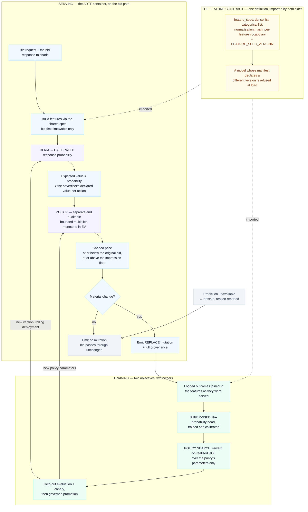

# DLRM Bid Shading

How the Deep Learning Recommendation Model is applied to bid shading in this guidance: what the model
predicts, how that prediction becomes a price, and how the two are trained and kept honest.

## What bid shading is, and why a model is involved

In a first-price auction the buyer pays exactly what it bids. A bid at the full value of an
impression wins often and returns nothing; a bid far below it returns well on the few it wins and
loses the rest. Shading is the act of choosing where between those to bid — and it is a per-request
decision, because the right answer depends on what this impression is likely to be worth and on how
contested it is.

That makes it two questions, not one:

1. **How likely is the response the advertiser is paying for?** A prediction about the world.
2. **Given that, how much of its value should we bid?** A decision about strategy.

This guidance answers the first with DLRM and the second with an explicit policy, and keeps them
separate. The rest of this document is mostly the consequences of that separation.

## The flow



---

## Why DLRM

DLRM — the Deep Learning Recommendation Model of
[Naumov et al., 2019](https://arxiv.org/abs/1906.00091), following
[NVIDIA's DeepLearningExamples](https://github.com/NVIDIA/DeepLearningExamples/tree/master/PyTorch/Recommendation/DLRM)
implementation. Three parts:

1. **A bottom MLP** over the continuous features, projecting them to the embedding width.
2. **Embedding tables**, one per categorical feature, each sized to its own cardinality.
3. **An explicit second-order interaction** — the pairwise dot products between the projected dense
   vector and every categorical embedding — concatenated with the dense vector and passed to a
   **top MLP** ending in a single output.

The architecture suits this problem for three reasons.

**The signal lives in combinations.** A domain that converts on one device type and not another, a
daypart that matters for one inventory type only. DLRM computes those pairwise interactions
explicitly rather than relying on a deep MLP to discover them, which is what makes it sample
efficient on exactly the mixed numeric-and-high-cardinality-categorical data a bid request provides.

**It is the right size for the bid path.** The embedding lookups are gathers and the MLPs are small.
Inference fits comfortably inside an RTB budget, and it batches well when several impressions are
scored for one request.

**The interaction terms are addressable.** Because the pairwise products are computed rather than
implied, a surprising prediction can be attributed to a feature pair. That matters when a trading
team asks why a bid moved.

DLRM here names an architecture and a training recipe. The weights come from this guidance's own
training pipeline, on the platform's own logged outcomes — embedding tables are keyed to a specific
feature vocabulary, so weights are not portable between deployments with different vocabularies.

## The feature contract

**One definition, imported by both the training job and the serving container.** A single module
declares the continuous features and their normalisation, the categorical features, the hash, and a
per-feature vocabulary size. Neither side restates the list.

The specification carries a `FEATURE_SPEC_VERSION`. A trained model's manifest records the version it
was built against, and the serving container loads only a model whose version it recognises. Matching
widths are not treated as sufficient agreement: two vectors of the same width with different meanings
in a position load cleanly and predict confidently, so the version is what establishes that both
sides mean the same thing by position three.

Features are **knowable at bid time**. Three categories are held out by design:

- **The shader's own decisions** — the multiplier applied, the resulting price, the ratio between
  them. A prediction conditioned on the policy that produced its training data cannot be used to
  evaluate a change to that policy.
- **Post-outcome quantities** — realised ROI, price paid. These are consequences of the bid, so a
  model with access to them at training time has access to its own answer.
- **Raw user identifiers.** Hashed into a bounded table they carry little signal, and they carry
  privacy obligations that the signal does not justify. Audience membership is expressed as segment
  membership.

Categorical vocabularies are sized per feature. A domain space and a device-type space have different
cardinalities, so the collision rate of each is a chosen property rather than a consequence of a
single shared constant.

Derived features — a historical win rate binned by daypart and device is the useful example — are
computed in the batch pipeline and published as a lookup the container carries. A feature is in the
specification only if the serving path can obtain it for the request in hand.

## Separating the prediction from the policy

| | The probability head | The policy |
|---|---|---|
| Answers | how likely is the response | how much of the expected value to bid |
| Output | a calibrated probability | a bounded multiplier |
| Trained by | supervised learning on logged outcomes | search against realised ROI |
| Changes when | response behaviour changes | strategy or margin target changes |
| Audited by | calibration measurement | monotonicity and bounds |

The shading arithmetic multiplies the model's output by a currency amount, which is meaningful only
while that output is a probability. An objective defined on bidding outcomes — ROI, revenue, win rate
— has no term that rewards calibration, so optimising it directly over the same parameters moves the
output off the probability scale. Both objectives are worth pursuing; they are pursued in different
parameters so that neither erodes the other.

The division also gives each half an independent test. A probability is checkable against realised
frequencies. A policy is checkable for monotonicity and for staying inside its bounds. A single
network optimised for both has neither test available.

## The shading arithmetic

With a calibrated probability `p` and the advertiser's declared value per action `v`:

1. **Expected value** — `ev = p × v`. The currency amount is the advertiser's declared figure, carried
   on its campaign configuration.
2. **Policy** — a bounded, monotone transform of `ev` gives the price the shader is willing to bid.
   Monotone by construction: a higher expected value never yields a lower bid. The transform is a
   three-coefficient curve, defined once in `source/shared/shading_policy.py`:

   ```
   price = clamp(base + slope × ev ^ curvature, floor, incoming_bid)
   ```

   `slope` scales expected value into price and is the single knob the closed-loop optimiser moves.
   `curvature` bends the response: above 1 the shader bids proportionally less on low-value
   impressions and more on high-value ones, below 1 the reverse. `base` is a price the policy will
   not shade beneath. Each is bounded, and a value outside its bounds is rejected where it is
   constructed rather than quietly clamped — a caller that supplies an impossible coefficient is a
   caller worth hearing about.

   The shipped coefficients are `base=0.0, slope=0.65, curvature=1.0`, which collapse the curve to
   `min(incoming_bid, ev × 0.65)` floored at the impression floor. That is the straight line through
   the origin, and it is why `slope` and the older single shade factor are the same number: the
   parametric form generalises the original arithmetic rather than replacing it, so a deployment that
   never touches `base` or `curvature` behaves exactly as before.
3. **At or below the incoming bid.** This component reduces bids. Raising one is outside its mandate.
4. **At or above the impression floor.** A price below the floor forfeits a winnable impression, so
   the floor is the binding lower bound.
5. **Material change only.** An adjustment smaller than the minimum meaningful price increment
   emits no mutation, which keeps the audit trail to decisions that changed something.

## Parameters

The policy's parameters resolve in a fixed order, and the response names the source of each:

1. An explicit override on the request — the operator console and scenario runs.
2. The parameter store, which is how the closed-loop optimiser adjusts bidding behaviour without
   redeploying a container. Read through a short-TTL cache.
3. A declared default.

Naming the source is load-bearing: an override and a learned value populate the same field, and an
operator reconstructing a shading decision needs to know which applied.

## Training data

**Every shading decision emits an outcome event.** One per request, fire-and-forget, off the critical
path: the original and shaded price, the floor, the features as built, the parameters applied, the
model version that served, and a marker naming the event's origin. Decision and consequence are
recorded together, so a training row traces back to the bid that produced it.

**Outcomes arrive on different timescales.** A win resolves in seconds; an impression, a click and a
conversion do not. Events are keyed by request id and updated as signals land, and the batch pipeline
de-duplicates by request id keeping the most recent version of each. The training window is set from
the conversion lag of the objective being modelled — a window shorter than that lag under-counts the
positives it has not waited for.

**Origin is recorded.** The marker distinguishes production traffic from load-test and scenario
traffic. Both are useful: generated traffic is how the retraining path is exercised before live spend
exists. A model trained on generated outcomes records that in its manifest, and the response reports
it, so the provenance of a figure travels with the figure.

**The label is the response the advertiser pays for** — the conversion for a CPA objective, the click
for a CPC objective. The label is chosen per objective and recorded in the manifest alongside it.
Profitability is deliberately not the label: it already contains the price paid and the conversion
value, so a model predicting it cannot then be multiplied by a conversion value without counting the
same quantity twice.

**Feature variation is checked before a run.** Each categorical is tested for usable variation across
the window. A column that is constant, or unique on every row, gives an embedding table nothing to
learn, and a run in that state ends with a clear diagnosis rather than with weights. Synthetic traffic
that stamps a fixed marker into a categorical column is the common way to arrive there, so the check
runs on every dataset regardless of origin.

## Training procedure

1. **Assemble** logged outcomes joined to the features as they were served, through the shared
   specification. Validate feature variation and the label's positive rate.
2. **Fit the probability head** by supervised learning on the objective's label against raw logits,
   then measure and record calibration on held-out data. Calibration is a published property of the
   artifact.
3. **Search the policy** against realised ROI — profitable wins rewarded, overpaid wins penalised,
   lost high-value opportunities penalised in proportion. The probability head is frozen.
4. **Evaluate** on held-out periods and unseen keys, export to ONNX, and register.
5. **Canary** against the incumbent on live traffic, and promote under governance.

Promotion is a rolling deployment. The model version that served each request is reported per
request, so a comparison between versions is attributable rather than inferred from timing.

## What the response carries

- The mutation, or its absence with the reason.
- `model_version`, resolved per request — the version that actually served.
- `feature_spec_version`.
- The calibration state of the serving model.
- The probability, the expected value, and the policy output both before and after bounding, so a
  constrained bid reads as constrained rather than as a preference.
- The source of each policy parameter.

## Abstention

When a prediction is unavailable — the inference service is unreachable, or no model is loaded — the
shader emits no mutation and reports why. The bid proceeds at the price the bidder set.

This is the conservative direction. Shading requires an estimate of value; without one there is no
basis for moving a price, and a substituted value would produce a real price change from a number
that was never a prediction. An abstention is visible in the response and in the metrics, so the rate
of abstention is itself an operational signal.

## References

- Naumov et al., *Deep Learning Recommendation Model for Personalization and Recommendation Systems*,
  [arXiv:1906.00091](https://arxiv.org/abs/1906.00091)
- [NVIDIA DeepLearningExamples — DLRM for PyTorch](https://github.com/NVIDIA/DeepLearningExamples/tree/master/PyTorch/Recommendation/DLRM)
- ###### [torchrec](https://github.com/pytorch/torchrec) — `torchrec.models.dlrm.DLRM`
