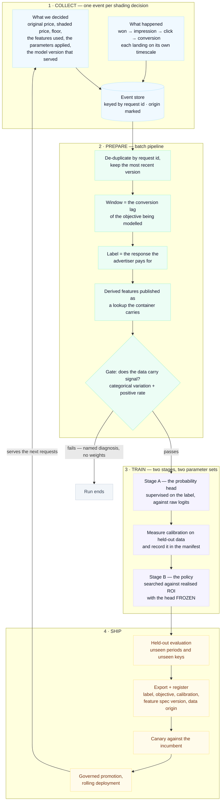

# Training the Bid Shading Model

A bid shader is trained on data it generated. It chose a price, the auction resolved, and a response
either followed or did not — so every training row is the consequence of a decision the model made.
That has two implications the pipeline is built around.

**The decision has to be recorded with the outcome.** Knowing an impression converted is not enough;
you need the price that was bid, the features that produced it, and the model version that served.
Otherwise the row cannot be attributed to anything.

**Outcomes arrive later than decisions, and at different speeds.** A win resolves in seconds. A
conversion can take days. A pipeline that reads too early sees the absence of a conversion and records
it as a negative.

## The loop

