# Guidance for Accelerator-Optimized Agentic Bidding on AWS, Part 2

**Category:** Advertising &amp; Marketing Technology
**Industry:** Advertising, Media &amp; Entertainment
**Products:** Amazon Bedrock AgentCore, Amazon SageMaker, AWS Glue, Amazon EventBridge, Amazon DynamoDB, NVIDIA TensorRT, NVIDIA NeMo-RL
**Published:** June 2026

## Overview

Part 1 of this Guidance demonstrates ARTF-compliant containers that make real-time bidding decisions using deep learning models on NVIDIA Triton Inference Server. Those models ship with seeded random weights and never improve — every bid uses the same static logic.

Part 2 closes the loop. It observes the outcome of every bid, uses that feedback to retrain and validate new model versions, and rolls the winners into production without touching the real-time bidstream. It also introduces an AI agent that continuously tunes bidding parameters from live market signals. Three feedback mechanisms work together:

1. **A batch retraining loop.** Bid outcomes (wins, losses, prices, CTR) are captured, transformed into labeled training data by AWS Glue, and used by NVIDIA NeMo-RL to retrain the bid pricer's and deal scorer's models (DLRM and NCF, respectively) on Amazon SageMaker. The yield optimizer's two XGBoost models (floor, margin) go through the same batch retraining loop via a separate Glue ETL job and SageMaker's built-in XGBoost training container, rather than NeMo-RL — a tree model has no reinforcement-learning loss to compute. Each retrained version is registered in the SageMaker Model Registry with full lineage.
2. **A governance loop.** Every new model version is compiled from ONNX to a TensorRT engine, deployed as a live canary behind the same model name the ARTF containers already call, and evaluated with a statistically rigorous A/B test (Welch's t-test + SPRT). A promotion, rejection, or automatic guardrail rollback follows — every decision is written to an append-only audit trail.
3. **An agentic parameter-tuning loop.** A Bedrock reasoning agent reads real CloudWatch bid-outcome metrics every five minutes and decides whether to adjust bidding parameters (`shade_factor`, `conversion_value`), subject to hard safety bounds enforced by the parameter store, not the agent.

> **Note for the reader:** This document covers Part 2 only. See [GUIDANCE.md](GUIDANCE.md) for Part 1 — the ARTF containers, orchestrator, and Triton serving layer that Part 2 builds on. Part 2 is a progression of Part 1, not a separate stack: deploying it upgrades Part 1's Triton serving path from ONNX Runtime to compiled TensorRT engines and adds the infrastructure described here alongside the existing real-time bidding path, which is never modified. For the practical how-to — deploying, trying it out, and disabling scheduled components — see [CLOSED_LOOP.md](CLOSED_LOOP.md).

## Use Cases

1. **Continuous model improvement from real outcomes:** Retrain the bid pricer's and deal scorer's models on actual bid win/loss/price/CTR data rather than a static, one-time export.
2. **Safe model promotion:** Validate every retrained model version against the incumbent with a live canary and a statistical A/B test before it ever serves 100% of production traffic, with automatic rollback on latency or error-rate regression.
3. **Adaptive bid pricing:** Continuously tune the bid-shading parameters that convert a predicted CTR into a shaded bid price, based on the platform's actual win rate and ROI rather than a value set once at deployment time.
4. **Governed, auditable ML operations:** Give every model promotion, rejection, and parameter change a durable, queryable audit record — including the reasoning an AI agent used to reach its decision.
5. **Zero-downtime model rollout:** Roll out a new model version to production without a deployment, a restart, or any change to the ARTF containers or their real-time bidstream dependencies.

## Business Benefits

| Benefit | Description |
|---------|-------------|
| Models improve over time | Bidding accuracy compounds as real outcomes retrain the models, instead of degrading as market conditions drift away from a static model |
| Reduced operational risk | Every model promotion goes through an automated statistical gate and guardrail monitoring before it can affect live spend |
| Faster response to market shifts | An agent re-tunes bid pricing every five minutes from live signals, instead of waiting for a manual review cycle |
| Full auditability | Every parameter change and model promotion/rejection decision is permanently recorded with its rationale, supporting compliance and post-incident review |

## Technical Benefits

| Benefit | Description |
|---------|-------------|
| No new dependency in the bidstream | Canary routing and parameter reads add zero external calls to the ARTF containers' request path — routing is in-process on Triton, and parameters are read from a low-latency store the container already calls |
| Statistically rigorous promotion gate | Welch's t-test and sequential probability ratio testing (SPRT) replace ad hoc thresholds for deciding whether a challenger model actually outperforms the incumbent |
| Automatic guardrail rollback | A canary that regresses p99 latency by more than 20% or exceeds a 1% error rate is rolled back automatically, within a 60-second detection-to-rollback budget |
| On-demand GPU utilization for optimization | TensorRT engine compilation runs as one-shot Kubernetes Jobs, not an always-on service, so Triton remains the only steady-state GPU consumer |
| Reasoning grounded in real telemetry | The bidding-parameter agent and the governance agent's explanatory layer reason only over real CloudWatch metrics and real audit records — never fabricated or simulated data |
| Least-privilege agent execution | Each AgentCore runtime has its own IAM execution role scoped to exactly the resources it needs, with trust policies scoped to the runtime's name prefix |

## How It Works

### The Three Feedback Loops

**1. Batch retraining loop.** The real-time bidding path (Part 1) emits bid outcome events, which are captured by a Kinesis Data Stream, buffered and partitioned by Kinesis Data Firehose, and land as raw Parquet in an S3 "raw outcomes" bucket cataloged in the Glue Data Catalog (`feedback_pipeline.raw_bid_outcomes`). An AWS Glue ETL job runs on a schedule (every 6 hours by default) against that catalog table and performs real feature engineering, not a pass-through copy: it de-duplicates records by `request_id`, engineers derived features (ROI, `shade_ratio`, a bucketed win-rate), and writes the labeled result as Parquet to a separate, KMS-encrypted training-data S3 bucket. Every 6 hours, Amazon EventBridge Scheduler resolves the latest **Approved** model version in the SageMaker Model Registry and starts a SageMaker training job running NVIDIA NeMo-RL (combined supervised + reinforcement learning loss, using auction-outcome signals as the reward) against that labeled dataset. On completion, the trained model is registered as a new version in the Model Registry and an event is emitted to trigger governance review.

The yield optimizer's floor and margin models run the same loop through a
**separate** pipeline path, since a deal floor/margin adjustment has no bid price
to shade and produces a genuinely different event shape: a dedicated Kinesis
stream/Firehose/S3 prefix/Glue table (`feedback_pipeline.raw_deal_yield_outcomes`)
carries `DealYieldOutcomeEvent`s, and a dedicated Glue ETL job de-duplicates by
`(request_id, deal_id, intent)` — a single deal can carry both a floor and a
margin mutation, which are independent, not duplicates — and writes **two**
independently labeled datasets, since Triton's FIL backend doesn't support
multi-output regression and floor/margin are trained as separate single-target
XGBoost models. Retraining then uses SageMaker's built-in XGBoost training
container rather than NeMo-RL. Because no downstream win/loss signal path exists
yet for live deal-level outcomes, this pipeline currently learns from two
disclosed, non-fabricated sources rather than live traffic: outcome events
emitted from **load-test traffic** (tagged `source=load_test`, using the load
test's own known synthetic outcome rather than an unknown one), and the
container's own **bounded exploration** — an opt-in, epsilon-greedy perturbation
of its prediction (disabled by default) that breaks the cold-start deadlock a
model converged to a constant "no change" recommendation would otherwise create,
since a constant recommendation never emits a mutation for an outcome event to
attach to. Every exploratory response is disclosed via a `:explore` suffix on the
returned model version, so training data never mistakes an exploratory probe for
a confident recommendation. Extending this pipeline to learn from real live-traffic
outcomes is a natural next step once a downstream win/loss signal exists.

**2. Governance loop.** A new model version registration triggers the Model Promotion Governance Agent (an Amazon Bedrock AgentCore runtime). The agent orchestrates: (a) TensorRT engine compilation via the on-demand Model Optimizer, (b) canary deployment at 5% initial traffic via the Triton-side canary router, (c) a live A/B test comparing the canary against the incumbent using real per-variant metrics, and (d) a promote, reject, or inconclusive decision. A promotion publishes the canary as the new stable version; a rejection or guardrail breach rolls back to the incumbent. Every decision, with its supporting metrics, is written to an append-only DynamoDB audit trail.

**3. Agentic parameter-tuning loop.** Every five minutes, Amazon EventBridge Scheduler invokes the Adaptive Bidding Strategy Agent (also an AgentCore runtime). The agent reads real market metrics from CloudWatch (win rate, ROI, prices paid, sample counts), reads the current bidding parameters from a DynamoDB parameter store, and reasons — using a Bedrock model, with no hardcoded formula — about whether an adjustment is warranted. Any write is subject to hard bounds, a maximum per-update delta, and optimistic-concurrency locking enforced by the parameter store itself, not by the agent. The bid pricer container reads the current parameters at inference time.

### Architecture



### Model Serving Upgrade: TensorRT Engines and Live Canary Routing

Part 2 upgrades the Part 1 Triton serving path from ONNX Runtime to compiled `tensorrt_plan` engines, and introduces zero-downtime rollout of new model versions.

**Model Optimizer (on-demand, not a stock NIM).** Engine compilation is performed by an in-cluster Model Optimizer microservice (`nvcr.io/nvidia/tensorrt:24.08-py3`) that runs `trtexec` on a GPU node to compile an ONNX artifact into a `model.plan`. Rather than an always-on GPU service, it runs on demand as one-shot Kubernetes Jobs: a deploy-time bootstrap Job builds the base engines and exits, and each promotion launches a dedicated optimize Job. This keeps Triton as the only steady-state GPU consumer, so the reference deployment still runs on a single GPU node. FP16 is the default precision; INT8 is refused with an honest HTTP 400 unless a real calibration cache is supplied — the service never emits a silently uncalibrated engine. This is deliberately not called a NIM: no stock NVIDIA NIM container exists for these custom DLRM/NCF architectures, and TensorRT is the same engine a NIM is built on.

**Live canary via the Triton router.** Each recommender model name the ARTF containers already call (for example, `dlrm_bid_shader`) is a lightweight Triton Python-backend router model. It forwards each inference request to either `<model>_stable` or `<model>_canary` — two separate `tensorrt_plan` models — based on an in-memory traffic-split percentage read once at model load time. Changing the split is a control-plane action (the Governance Agent edits the router's configuration and Triton reloads it); it is never a per-request external lookup. This means the real-time ARTF bidstream gains no new dependency, and none of the five ARTF containers or their entrypoints are ever modified. Staging a canary writes its engine to the S3 model repository and sets the router split; promotion publishes a new stable version and zeroes the split; rollback zeroes the split and removes the canary, restoring 100% traffic to the incumbent. The router pattern currently covers the bid pricer's and deal scorer's TensorRT-served models; the yield optimizer's FIL-served XGBoost models are retrained and re-registered through the same governance/registry flow but don't yet have a canary router of their own.

**Governance runtime networking.** The Model Promotion Governance Agent runs as a public AgentCore runtime and reaches the cluster through a small VPC-attached proxy Lambda rather than entering VPC mode itself. Triton readiness and model-control calls are forwarded to an internal Network Load Balancer; a request to optimize a model instead causes the Lambda to launch a one-shot optimizer Job through the Kubernetes API and return the resulting engine URI. The Lambda's IAM role is mapped into the cluster's RBAC with access scoped to creating and reading Jobs only — no cluster-wide access.

### Governance Decision Pipeline

| Stage | Action | Outcome on failure |
|-------|--------|---------------------|
| 1. Model optimization | Compile the new ONNX model version to a TensorRT engine | Reject with reason; no canary is deployed |
| 2. Canary deployment | Stage the engine, confirm Triton loads and serves it, route initial traffic (default 5%) | Reject with reason; canary removed |
| 3. A/B evaluation | Collect per-variant metrics; evaluate with Welch's t-test and SPRT against a significance threshold and guardrail metrics | Continue evaluating until promote, reject, or max duration reached |
| 4a. Promote | Publish the canary as the new stable version; confirm it is ready; zero the traffic split; remove the canary label | — |
| 4b. Reject | Guardrail breach or the challenger significantly underperforms the incumbent; roll back | — |
| 4c. Inconclusive | Maximum evaluation duration reached without statistical significance; roll back | — |
| 5. Registry update | Update the SageMaker Model Registry approval status (`Approved` / `Rejected`) | — |
| 6. Audit record | Write the decision, reason, and full metrics snapshot to the append-only audit trail | — |

### Guardrail Monitoring

While a canary is serving live traffic, a guardrail monitor independently polls CloudWatch every 10 seconds and compares the canary's serving metrics against the stable version's:

| Guardrail | Threshold | Action on breach |
|-----------|-----------|-------------------|
| p99 latency | Canary p99 exceeds 1.2× the stable version's p99 | Automatic rollback within a 60-second detection-to-rollback budget; audit record written; re-optimization flagged |
| Error rate | Canary error rate exceeds 1% | Automatic rollback within a 60-second detection-to-rollback budget; audit record written |

### AWS Services in This Guidance (Part 2)

| AWS Service | Role in This Guidance |
|-------------|------------------------|
| Amazon Bedrock AgentCore | Hosts the Adaptive Bidding Strategy Agent and Model Promotion Governance Agent as managed reasoning-agent runtimes |
| Amazon Bedrock | Provides the foundation model (default: a Claude Opus 4.8 cross-region inference profile) used by both agents' reasoning layers |
| Amazon SageMaker | Runs NeMo-RL training jobs for DLRM/NCF and built-in XGBoost training jobs for the yield optimizer's floor/margin models; hosts the versioned Model Registry with an approval workflow for all four model types |
| AWS Glue | Two scheduled ETL jobs: one de-duplicates bid outcomes by request ID and engineers features (ROI, shade ratio, bucketed win rate) for DLRM/NCF; a second de-duplicates deal-yield outcomes by (request ID, deal ID, intent) and writes two independently labeled datasets (floor, margin) for the yield optimizer's XGBoost models |
| Amazon EventBridge (Scheduler + Rules) | Drives the five-minute agentic tuning cadence, the six-hour retraining cadence, and event-driven governance review on model registration and training completion |
| AWS Lambda | Invocation shims between EventBridge and AgentCore, and a VPC-attached proxy bridging the public Governance runtime to cluster-internal endpoints |
| Amazon DynamoDB | Stores the bidding parameter store, the append-only audit trail, and per-user feature vectors, all encrypted at rest with AWS KMS |
| AWS KMS | Encrypts all DynamoDB tables, the SNS alerts topic, and the S3 training-data bucket at rest |
| Amazon CloudWatch | Source of truth for bid-outcome metrics, per-variant inference metrics, and guardrail queries |
| Amazon S3 | Stores raw and labeled training data, ONNX source artifacts, and staged/served TensorRT engines |
| Amazon EKS | Hosts the on-demand Model Optimizer Jobs and the Triton canary router, on the same cluster as Part 1 |
| Amazon VPC | Provides the private subnets the proxy Lambda attaches to for reaching cluster-internal endpoints |
| AWS IAM | Least-privilege execution roles per agent, scoped by runtime-name-prefix trust policies, plus namespaced RBAC for the proxy Lambda |
| Amazon SNS | Delivers training-failure alerts over a KMS-encrypted, TLS-enforced topic |
| Amazon ECR | Stores the NeMo-RL training container image and both agent runtime images |

### NVIDIA Acceleration and Integration Components (Part 2)

| Component | Version | Purpose |
|-----------|---------|---------|
| NVIDIA TensorRT (Model Optimizer) | `nvcr.io/nvidia/tensorrt:24.08-py3`, `trtexec` | Compiles ONNX artifacts into optimized `tensorrt_plan` engines, on demand |
| NVIDIA NeMo-RL | `nvcr.io/nvidia/nemo:24.07` base image | Two-phase (supervised + reinforcement learning) retraining using bid-outcome rewards |
| NVIDIA Triton canary router | Python backend, in-cluster | Splits live inference traffic between stable and canary model versions with zero added latency dependency |

## Well-Architected Pillars

### Operational Excellence

- **Infrastructure as code:** The entire closed-loop stack deploys via `deploy_closed_loop.sh` (invoked automatically by `deploy.sh --with-retraining`), provisioning DynamoDB tables, Glue jobs, EventBridge schedules, IAM roles, and both AgentCore runtimes in dependency order
- **Idempotent deployment:** Re-running the deployment script reuses existing stacks, seeds the parameter store and genesis model versions only if absent, and skips container rebuilds when source content is unchanged
- **Observability:** Every governance decision and parameter change produces a structured audit record; Triton exposes per-variant Prometheus metrics; CloudWatch captures agent invocation and bid-outcome telemetry
- **Independent scheduling control:** The retraining and agentic-tuning schedules can be disabled independently of the underlying infrastructure through a dedicated API endpoint, without a teardown

### Security

- **Least privilege:** Each AgentCore runtime has its own IAM execution role, scoped to exactly the DynamoDB tables, S3 prefixes, and CloudWatch namespaces it needs; trust policies are scoped by runtime-name prefix so roles can be created before the runtime exists
- **No direct network exposure for cluster internals:** The Governance Agent runtime is public but never enters the cluster network directly — it reaches internal endpoints only through a narrowly scoped, VPC-attached proxy Lambda
- **Encryption at rest:** Every DynamoDB table, the SNS alerts topic, and the training-data S3 bucket are encrypted with AWS KMS
- **Manual override gating:** Human promotion overrides require a dedicated IAM permission (`governance:ApproveModel`) and assume a separate role with an external ID condition

### Reliability

- **Automatic rollback:** A canary that breaches latency or error-rate guardrails is rolled back automatically within a 60-second budget, with no human intervention required
- **No serving gap during promotion:** The incumbent model version stays loaded and serving until the new version is confirmed ready, so there is never a window with zero healthy versions
- **Honest failure modes:** Every component (Model Optimizer, Adaptive Bidding Agent, Governance Agent) fails loudly and explicitly rather than fabricating a result — for example, INT8 compilation without a calibration cache is refused outright, and a Bedrock model that is unreachable raises rather than falling back to a static formula
- **At-most-one training job per model type:** The training pipeline enforces this to prevent concurrent retraining jobs from racing on the same model type

### Performance Efficiency

- **On-demand GPU use for optimization:** TensorRT compilation runs as one-shot Jobs rather than an always-on service, so the GPU node group's steady-state footprint is unchanged from Part 1
- **In-process canary routing:** The Triton router performs traffic splitting inside the GPU node's process space, adding no measurable latency to the real-time bidding path
- **Sub-5ms parameter reads:** The bidding parameter store is designed for low-latency reads at inference time, optionally fronted by DynamoDB Accelerator (DAX) for high request volumes

### Cost Optimization

- **No always-on optimizer GPU:** The Model Optimizer's on-demand Job model avoids paying for a permanently GPU-resident optimization service
- **Serverless agent invocation:** Both AgentCore runtimes and the EventBridge-driven Lambda shims incur cost only when invoked
- **Independently toggleable schedules:** The retraining and agentic-tuning cadences can be paused via a single API call to eliminate their ongoing cost without tearing down infrastructure

### Sustainability

- **Shared GPU capacity:** The Model Optimizer's on-demand Jobs share the same GPU node group Triton uses, avoiding dedicated, underutilized GPU capacity for a periodic workload
- **Right-sized, event-driven compute:** Lambda shims and on-demand Jobs consume compute only in proportion to actual events, rather than continuously

## Plan Your Deployment

### Prerequisites

- A working deployment of Part 1 (see [GUIDANCE.md](GUIDANCE.md)) — Part 2 extends an existing EKS cluster and Triton deployment
- An AWS account with permissions to create Amazon Bedrock AgentCore runtimes, Amazon SageMaker resources, AWS Glue jobs, Amazon EventBridge schedules and rules, Amazon DynamoDB tables, AWS Lambda functions, and associated IAM roles
- Access to an Amazon Bedrock model or cross-region inference profile (default: a Claude Opus 4.8 global inference profile) enabled in the target account and region
- AWS CLI v2, jq, eksctl, kubectl, and Python 3.11+ with boto3 (same prerequisites as Part 1)

### Supported Regions

Part 2 can be deployed in any AWS Region that supports Amazon Bedrock AgentCore, Amazon SageMaker, AWS Glue, and the Part 1 prerequisites (Amazon EKS and NVIDIA A10G/G7e instances). Confirm AgentCore regional availability before choosing a region, since AgentCore has a smaller regional footprint than the other services used here.

### Deployment Steps

Deploy Part 2 together with Part 1 in a single command:

```bash
cd deployment
./deploy.sh --prefix dv --with-retraining
```

Or deploy Part 2 separately against an existing Part 1 stack:

```bash
cd deployment
./deploy_closed_loop.sh --prefix dv
```

`deploy_closed_loop.sh` provisions the closed-loop stack in dependency order:

| Step | Action |
|------|--------|
| 1 | Deploy the feedback pipeline (Kinesis, Firehose, S3, KMS) — includes the yield optimizer's dedicated stream/table alongside the bid-outcome one |
| 2 | Deploy the Glue ETL feature-engineering jobs (bid outcomes, and the yield optimizer's floor/margin outcomes) and the training-data bucket |
| 3 | Deploy DynamoDB tables (parameter store, audit trail, user features), the SageMaker Model Registry package groups (DLRM, NCF, and the yield optimizer's floor/margin groups), and register genesis model versions for all of them |
| 4 | Deploy AgentCore execution roles, seed the parameter store, and build the NeMo-RL training container |
| 5 | Deploy both AgentCore runtimes (Adaptive Bidding Strategy Agent, Model Promotion Governance Agent) |
| 6 | Deploy the EventBridge invocation paths (scheduled agent invocation, model-registration triggers, scheduled retraining) |
| 7 | Rewire and rebuild the frontend with the deployed agent runtime ARNs |

Useful options:

```bash
./deploy_closed_loop.sh --prefix dv --skip-agentcore   # infrastructure only, no agent runtimes
./deploy_closed_loop.sh --prefix dv --stack-only        # CloudFormation stacks only
./deploy_closed_loop.sh --prefix dv --local-build       # build the training container locally
AWS_REGION=us-west-2 ./deploy_closed_loop.sh --prefix dv
```

### Disabling Scheduled Components

The scheduled agent invocation and retraining jobs run on fixed cadences and incur ongoing cost. Disable them independently of the underlying infrastructure:

```bash
curl -X POST https://<CLOUDFRONT_DOMAIN>/api/v1/closed-loop/schedule \
  -H "Authorization: Bearer <TOKEN>" \
  -d '{"enabled": false}'
```

The frontend's Adaptive Bidding page also exposes this as a toggle.

## Cost Estimation

The following costs are in addition to the Part 1 base cost (see
[GUIDANCE.md](GUIDANCE.md#cost-estimation)). Two AWS Glue ETL jobs run in Part
2, not one — the original bid-outcome (DLRM/NCF) job and a separate deal-yield
outcome (Yield Optimizer floor/margin) job, each on its own schedule and Glue
table:

| AWS Service | Dimensions | Cost [USD/month] |
|-------------|-----------|--------------------|
| Amazon DynamoDB | 3 tables (parameter store, audit trail, user features), on-demand | ~$5 |
| Amazon DynamoDB Accelerator (optional) | 1 × dax.t3.small cluster | ~$36 |
| Amazon Bedrock AgentCore | Adaptive Bidding Agent, ~8,640 invocations/month at a 5-minute cadence | ~$15 |
| Amazon Bedrock AgentCore | Governance Agent, triggered on model registration | ~$2 |
| Amazon SageMaker Training | NeMo-RL (DLRM/NCF) + built-in XGBoost (floor/margin), ~4 retraining jobs/day combined at 15 min each, 1 × ml.g5.xlarge | ~$60 |
| AWS Glue | 2 scheduled ETL jobs, ~10 DPU-hours/day each | ~$88 |
| Amazon EventBridge Scheduler | 2 schedules, negligible | <$1 |
| **Estimated Total** | | **~$170–200/month** |

Disabling the scheduled components (see above) reduces Part 2's ongoing cost to near zero, leaving only DynamoDB storage. DAX is optional and only needed for very high parameter-read request rates.

### Combined Total (Part 1 + Part 2)

The default `deploy.sh` run deploys both parts together. Combined with Part
1's ~$592–1,080/month (see [GUIDANCE.md](GUIDANCE.md#cost-estimation),
depending on the GPU schedule), expect roughly **$762–1,250/month** total. See
[README.md](README.md#cost) for the full combined line-item table.

## Related Content

### AWS Resources

- [Amazon Bedrock AgentCore Documentation](https://docs.aws.amazon.com/bedrock/latest/userguide/agentcore.html)
- [Amazon SageMaker Model Registry](https://docs.aws.amazon.com/sagemaker/latest/dg/model-registry.html)
- [AWS Glue Documentation](https://docs.aws.amazon.com/glue/)
- [Amazon EventBridge Scheduler](https://docs.aws.amazon.com/scheduler/latest/UserGuide/what-is-scheduler.html)

### NVIDIA Resources

- [NVIDIA TensorRT: Model Optimization](https://developer.nvidia.com/tensorrt)
- [NVIDIA NeMo Framework](https://developer.nvidia.com/nemo)
- [NVIDIA Triton Inference Server: Optimization Guide](https://docs.nvidia.com/deeplearning/triton-inference-server/user-guide/docs/optimization.html)

### Academic Papers

- [Sequential Probability Ratio Tests (Wald, 1945)](https://www.jstor.org/stable/2235829)

## Source Code

The complete source code for this Guidance is available at:

**Repository:** [aws-solutions-library-samples/guidance-for-accelerator-optimized-agentic-bidding-on-aws](https://github.com/aws-solutions-library-samples/guidance-for-accelerator-optimized-agentic-bidding-on-aws)

### Includes

- Adaptive Bidding Strategy Agent and Model Promotion Governance Agent (`source/agents/`)
- Model Optimizer microservice for on-demand TensorRT engine compilation (`source/optimizer/`)
- Canary deployer and guardrail monitor (`source/deployment/`)
- Triton canary router and stable/canary model configurations (`source/triton/router/`, `source/triton/model_repository/`)
- Parameter store and audit trail data access layer (`source/shared/parameter_store.py`)
- NeMo-RL training pipeline and container (`source/training/`)
- Closed-loop demo scenarios and orchestrator API (`source/closed_loop_demo/`, `source/orchestrator/closed_loop_api.py`)
- Adaptive Bidding and Governance frontend panels (`source/frontend-react/src/components/`)
- CloudFormation templates for the feedback pipeline, Glue ETL, closed-loop core, AgentCore security, EventBridge invocation paths, and the VPC proxy (`deployment/*.yaml`)
- Single-command deployment via `deployment/deploy_closed_loop.sh`

---

*© 2026 Amazon Web Services, Inc. or its affiliates. All rights reserved.*
