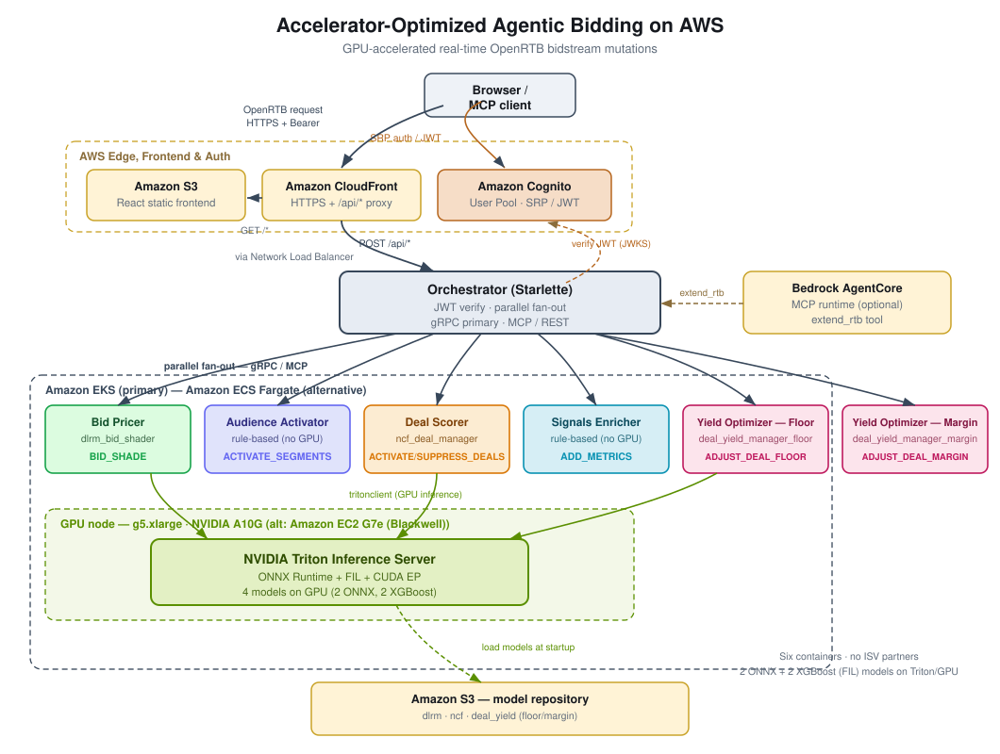

# Guidance for Accelerator-Optimized Agentic Bidding on AWS, Part 1

**Category:** Advertising &amp; Marketing Technology  
**Industry:** Advertising, Media &amp; Entertainment  
**Products:** Amazon EKS, NVIDIA Triton Inference Server, Amazon Bedrock AgentCore  
**Published:** June 2026

## Overview

In programmatic advertising, the bidder that evaluates more signals and responds fastest wins. This guidance shows how NVIDIA GPU-accelerated compute and deep learning with NVIDIA Triton Inference Server can reduce bid-response latency while increasing the breadth of features evaluated per impression. This contributes to higher win rates and improved return on ad spend (ROAS).

The solution provides five production-ready ARTF-compliant containers, each doing one job in the bidstream — pricing bids, activating audience segments, scoring private marketplace deals, enriching quality signals, and optimizing publisher yield. Three run GPU-accelerated inference on NVIDIA Triton Inference Server (two deep-learning models via ONNX/TensorRT, one tree model via Triton's Forest Inference Library backend); two use deterministic, rule-based logic on CPU. Future releases will include ISV (Independent Software Vendor) partner containers demonstrating the ecosystem extensibility — including a partner segment-activation model slated to replace the current rule-based audience activator. It also includes an orchestration layer for parallel fan-out using gRPC as the primary ARTF protocol for the production auction path. Optionally, Amazon Bedrock AgentCore with Model Context Protocol (MCP) support is available as a testing and simulation interface for AI agent integration.

> **Note for the reader:** This Guidance is published in two parts. Part 1 (this edition) demonstrates how to implement ARTF-compliant containers that act as agents in a bidstream, determining ARTF intents to apply to a bid request while adhering to response-time SLAs. The containers leverage GPU-accelerated inference via NVIDIA Triton to meet sub-millisecond latency requirements.
>
> Part 2 introduces the additional infrastructural assets required to implement a closed-loop optimization architecture. This includes offline training pipelines (using NVIDIA NeMo-RL to support reinforcement learning workflows that use auction-outcome signals) that improve bidding behavior over time, and NVIDIA TensorRT for optimizing model artifacts — Part 2 upgrades Triton serving from ONNX Runtime to compiled `tensorrt_plan` engines, built by an in-cluster **Model Optimizer** microservice (a TensorRT optimizer, not a stock NVIDIA NIM — none exists for these custom recommender models). Triton Inference Server remains the real-time serving layer; it does not perform training. The training pipelines operate separately, producing updated ONNX models that are compiled to TensorRT engines and rolled out to Triton — via a live stable/canary router — to improve bid decisions over time based on actual campaign performance data.

## Use Cases

1. **Bid price optimization:** The bid pricer uses deep learning CTR prediction (a DLRM model) to compute optimal shaded bid prices in real time, reducing overspend while maintaining win rates
2. **Audience segment activation:** The audience activator activates high-value audience segments at the impression level from real bid-request signals (content category, demographics, existing DMP segments, contextual signals) via transparent rules — slated for a partner ISV neural-model implementation
3. **Private marketplace deal management:** The deal scorer predicts user-deal relevance with Neural Collaborative Filtering to autonomously activate high-affinity deals and suppress poor matches
4. **Quality metrics enrichment:** The signals enricher adds viewability and brand safety scores to bid requests before auction execution
5. **Publisher yield optimization:** The yield optimizer predicts a floor-price multiplier and margin adjustment per private marketplace deal from real deal/context signals, using an XGBoost model served by Triton's Forest Inference Library backend — an SSP/publisher-side example distinct from the buy-side bid pricer
6. **[Future Version] Creative intelligence:** Score creative quality, visual attention, brand suitability, and fatigue signals (ISV container)
7. **[Future Version] Identity resolution:** Resolve fragmented user/device signals into cross-device and household IDs (ISV container)
8. **[Future Version] Location audience activation:** Activate location-derived audience segments from device geo and visitation patterns (ISV container)
9. **Agentic advertising:** Enable AI agents to invoke real-time bidding decisions via MCP tool calls, supporting the transition to autonomous campaign optimization

## Business Benefits

| Benefit | Description |
|---------|-------------|
| Reduced decision-making latency | Sub-millisecond inference increases conversion rates and improves Return on Ad Spend (ROAS) |
| Expanded models improve optimization | Deep learning architectures (DLRM, NCF) and tree-based models (the yield optimizer's XGBoost) outperform linear models and heuristic rules for the decisions they cover, delivering better advertising outcomes |
| ISV partner ecosystem [Future] | Pre-built ISV partner containers enable DSPs to obtain new functionality faster without custom development |
| Agentic-ready platform | MCP interfaces enable AI agents to participate in bidding decisions, delivering a future-ready platform for autonomous advertising |

## Technical Benefits

| Benefit | Description |
|---------|-------------|
| Sub-millisecond inference | Dynamic batching on Triton with CUDA EP delivers GPU-accelerated inference well within OpenRTB timeout budgets |
| GPU acceleration | NVIDIA A10G GPUs via Triton deliver significant throughput improvement over equivalent CPU-based inference for recommender models |
| Deep learning CTR | The bid pricer and deal scorer's deep learning models (DLRM and NCF) outperform linear models and heuristic rules for the advertising decisions they cover |
| Tree-model yield optimization | The yield optimizer's XGBoost model, served by Triton's FIL backend, follows the published approach for reserve-price optimization — a tree/regression problem, not a deep-embedding one |
| Dynamic batching | Triton's preferred batch sizes (8, 16, 32) and max queue delay (500μs) maximize GPU utilization under concurrent load |
| Modular and extensible | ARTF container specification allows DSPs to add, swap, or update models independently without pipeline changes |
| ISV ecosystem ready [Future] | Three ISV partner containers demonstrate how third-party data providers plug into the same pipeline |
| Agentic-ready | MCP interfaces (optional) enable AI agents to participate in bidding decisions via the extend_rtb tool |

## How It Works

### Step-by-Step Flow

1. **Bid request ingestion:** An OpenRTB bid request arrives via Amazon CloudFront and is routed through the load balancer to the orchestrator (CloudFront is for the front end testing tool).

2. **Orchestration:** The orchestrator (Starlette/Python) receives the request and fans it out in parallel to all registered ARTF containers.

   **GPU-accelerated inference:** The three GPU-backed containers — the bid pricer, the deal scorer, and the yield optimizer — extract features from the bid request, invoke their assigned model (DLRM, NCF, and XGBoost via FIL, respectively) on NVIDIA Triton Inference Server via tritonclient.http, and receive predictions from the GPU (A10G). The audience activator and signals enricher apply rule-based logic on CPU.

3. **Mutation generation:** Each container translates model predictions into typed ARTF mutations (bid price adjustments, segment activations, deal decisions, quality metrics).

4. **Response assembly:** The orchestrator merges all mutations from all containers into a single RTBResponse.

5. **Mutation application:** The DSP host platform applies approved mutations atomically to the bidstream before the auction continues.

### Architecture



### ARTF Container Protocol Stack

Each ARTF container exposes three interfaces per the IAB Tech Lab ARTF v1.0 specification. The gRPC interface is the primary production protocol for real-time auction integration; the MCP interface is an optional testing and simulation endpoint for AI agent experimentation, and is not required for the core bidding stack:

| Port | Protocol | Endpoint | Description |
|------|----------|----------|-------------|
| 50051 | gRPC | RTBExtensionPoint.GetMutations | Primary ARTF protocol (protobuf) |
| 8081 | MCP (JSON-RPC) | POST /mcp | extend_rtb tool for AI agents (Streamable HTTP transport) |
| 8080 | HTTP | /health/live, /health/ready | Kubernetes liveness and readiness probes |


### The Five Containers

Each container does one job in the bidstream. Three are GPU-accelerated on
NVIDIA Triton Inference Server (two deep-learning models, one tree model); two
are rule-based on CPU. The model architecture behind each GPU-accelerated
container is implementation detail, noted below for reference — see
[Container → Model → Intent Mapping](#container--model--intent-mapping)
for the full picture.

#### Bid Pricer: bid pricing (BID_SHADE)

**What it does:** Prices every bid at the lowest amount still likely to win —
shading down from the maximum bid based on how likely the impression is to
convert, so the platform doesn't overpay for impressions it would have won at a
lower price.

**How:** Predicts click-through rate (CTR) from sparse categorical features (user
IDs, site categories, device types) and dense numerical features (bid floors,
time of day, user age, video presence), then converts that prediction into a
shaded price: `shaded_price = min(original_bid, predicted_CTR × $12
conversion_value × 0.65 shade_factor)`, floored at the publisher's bidfloor.

**Model (implementation detail):** A Deep Learning Recommendation Model (DLRM).
Bottom MLPs (4→32→16) transform dense features into embedding space; 3
EmbeddingBag tables (vocab=1000, dim=16) encode sparse features; dot-product
interaction layers capture feature crosses; a top MLP (22→64→32→1→sigmoid)
produces the CTR prediction. Served by Triton as model `dlrm_bid_shader` (ONNX
backend, max batch size 64, 2× GPU instances, dynamic batching with preferred
sizes [8, 16, 32] and 500μs max queue delay).

#### Audience Activator: audience segment activation (ACTIVATE_SEGMENTS)

**What it does:** Activates high-value audience segments on an impression from
signals already on the bid request — content category, demographics, existing
first/third-party DMP segments, and contextual signals (bid floor tier, video
inventory, device type) — so downstream targeting can act on segments the buy
side cares about.

**How:** A deterministic rule engine (no GPU, no Triton) scores candidate
segments against the signals above, and activates those exceeding a 0.55
confidence threshold (overridable via `segment_threshold`).

**Model (implementation detail):** This container previously scored segments
with a Wide & Deep neural network on Triton — a wide linear model (8→15)
combined with a deep network (6→64→32→15 with BatchNorm). That model's ONNX
graph could not be compiled to a TensorRT engine (the `BatchNorm1d` fusion is
unsupported for this shape by TensorRT 10.3.0's builder), so it was replaced
with the transparent rules described above, and this container is slated to be
replaced by a partner ISV neural-model implementation.

#### Deal Scorer: private marketplace deal management (ACTIVATE_DEALS / SUPPRESS_DEALS)

**What it does:** Scores how well each private marketplace (PMP) deal fits the
current impression, autonomously activating high-affinity deals and suppressing
poor matches — so PMP inventory converts at a higher rate without a human
reviewing every deal on every impression.

**How:** Produces a per-deal relevance score from the bid-request profile and
each candidate deal; activates deals scoring ≥0.499, suppresses deals scoring
<0.497.

**Model (implementation detail):** Neural Collaborative Filtering (NCF/NeuMF),
which learns non-linear user-item interactions rather than relying on
traditional matrix factorization. In the RTB context, "items" are PMP deals and
"users" are bidstream profiles. A GMF path (user_embed × deal_embed, dim=64)
captures linear interactions; an MLP path (concat → 256→128→64) captures
non-linear patterns; a NeuMF fusion layer (128→1→sigmoid) produces the relevance
score. Served by Triton as model `ncf_deal_manager` (ONNX backend, dynamic
batching, GPU instances).

#### Signals Enricher: quality signal enrichment (ADD_METRICS)

**What it does:** Adds viewability and brand-safety scores to the bid request
before auction execution, so downstream bidding logic (including the bid
pricer) can factor real quality signals into the decision rather than treating
every impression as equally brand-safe and viewable.

**How:** A rule-based container (no GPU required) — the same pattern used by the
audience activator, demonstrating that ARTF's container model mixes ML and
deterministic logic in one pipeline. Viewability = f(ad position, banner
dimensions, video presence); brand safety = 0.60 + 0.40 × (safe_categories /
total_categories).

#### Yield Optimizer: publisher deal floor & margin adjustment (ADJUST_DEAL_FLOOR / ADJUST_DEAL_MARGIN)

**What it does:** An SSP/publisher-side example — predicts a floor-price
multiplier and margin adjustment per private marketplace deal, so a publisher
can raise floors on high-demand inventory and lower them on remnant inventory
without manual deal management, and set margins appropriately for the deal's
auction type. Distinct from the (buy-side) bid pricer: this container adjusts
what the *seller* will accept, not what the buyer bids.

**How:** Builds a 7-feature vector per deal from real signals already on the
bid request (auction type, existing bidfloor, IAB content-category tier,
hour-of-day, day-of-week — no fabricated signals), sends it to a Triton-served
XGBoost model, and emits `ADJUST_DEAL_FLOOR`/`ADJUST_DEAL_MARGIN` mutations
independently per deal when the model recommends a real change.

**Model (implementation detail):** An XGBoost tree ensemble, served by
NVIDIA Triton's Forest Inference Library (FIL) backend rather than the
ONNX/TensorRT path DLRM/NCF use — FIL is purpose-built for GPU-accelerated
tree-model inference and is already bundled in the same
`nvcr.io/nvidia/tritonserver:24.08-py3` image this Guidance uses, so no
additional Triton image is required. Tree/regression models are the approach
used in the published literature for reserve-price optimization, unlike the
deep embedding architectures (DLRM, NCF) used for CTR prediction and
relevance scoring. Served by Triton as model `deal_yield_manager` (FIL
backend, GPU instance).

### Container → Model → Intent Mapping

| Container | What it does | Model (implementation detail) | Triton Model Name | ARTF Intent | Output |
|-----------|--------------|-------------------------------|-------------------|-------------|--------|
| Bid Pricer | Prices bids by shading down from a CTR prediction | DLRM | dlrm_bid_shader | BID_SHADE | Optimal shaded bid price |
| Audience Activator | Activates audience segments from bid-request signals | Rule engine (CPU) — slated for a partner ISV neural model | N/A | ACTIVATE_SEGMENTS | Audience segments |
| Deal Scorer | Scores and activates/suppresses PMP deals | NCF / NeuMF | ncf_deal_manager | ACTIVATE_DEALS / SUPPRESS_DEALS | Deal activations / suppressions |
| Signals Enricher | Adds viewability + brand-safety quality signals | Rule engine (CPU) | N/A | ADD_METRICS | Viewability + brand safety |
| Yield Optimizer | Predicts deal floor/margin adjustments | XGBoost (Triton FIL backend) | deal_yield_manager | ADJUST_DEAL_FLOOR / ADJUST_DEAL_MARGIN | Floor multiplier + margin value |
| [Future] Creative Enricher (ISV) | Scores creative quality signals | ViT/CLIP mock (CPU) | N/A | ADD_METRICS | Creative quality, attention, suitability, fatigue |
| [Future] Identity Resolver (ISV) | Resolves cross-device identity | Graph NN mock (CPU) | N/A | ADD_CIDS | Cross-device + household IDs |
| [Future] Location Activator (ISV) | Activates location-derived segments | Blueprints™ mock (CPU) | N/A | ACTIVATE_SEGMENTS | Location-derived audience segments |


### AWS Services in This Guidance

| AWS Service | Role in This Guidance |
|-------------|----------------------|
| Amazon Elastic Kubernetes Service (EKS) | Orchestrates GPU and CPU node groups; manages container lifecycle, scaling, and health |
| Amazon EC2 (g5.xlarge) | Provides NVIDIA A10G GPU instances for Triton Inference Server |
| Amazon EC2 (c5.xlarge) | Runs ARTF containers, orchestrator, and the signals enricher on CPU |
| Amazon S3 | Stores ONNX model repository (Triton) and static frontend assets |
| Amazon CloudFront | HTTPS edge delivery for testing frontend; proxies API requests to the cluster |
| Amazon ECR | Stores container images for all ARTF containers, orchestrator, and AgentCore bundle |
| Elastic Load Balancing (NLB) | TCP pass-through in front of the orchestrator |
| AWS IAM (IRSA) | IAM Roles for Service Accounts grants Triton S3 read access without long-lived credentials |
| Amazon Bedrock AgentCore | Hosts the MCP runtime for AI agent integration via the extend_rtb tool |


### NVIDIA Acceleration and Integration Components

| Component | Version | Purpose |
|-----------|---------|---------|
| NVIDIA Triton Inference Server | nvcr.io/nvidia/tritonserver:24.08-py3 | Multi-model serving with dynamic batching on GPU |
| ONNX Runtime | Built into Triton | Part 1 backend for ONNX-exported models (Part 2 upgrades serving to `tensorrt_plan`) |
| Triton FIL (Forest Inference Library) backend | Built into Triton | GPU-accelerated serving backend for the yield optimizer's XGBoost tree model — no ONNX/TensorRT conversion step |
| NVIDIA TensorRT (`tensorrt_plan`) | trtexec 24.08 | Part 2 serving backend — compiled TensorRT engine plans on Triton |
| Model Optimizer microservice | nvcr.io/nvidia/tensorrt:24.08-py3 | In-cluster ONNX→TensorRT engine compilation (FP16 default); a TensorRT optimizer, **not** a stock NVIDIA NIM |
| CUDA Execution Provider | CUDA 12.x | GPU-accelerated inference |
| NVIDIA Kubernetes Device Plugin | v0.15.0 | Exposes GPU resources to Kubernetes scheduler |
| NVIDIA DCGM Exporter | Latest | GPU metrics for Prometheus/Grafana monitoring |
| tritonclient[http] | Latest | Python client SDK in ARTF containers |

### Part 2: NVIDIA Software Stack

Part 2 extends the NVIDIA software stack with components that build on the Triton inference path established in Part 1, and upgrades that path from ONNX Runtime to compiled TensorRT engines:

- **NVIDIA NeMo-RL** supports reinforcement-learning workflows that use auction-outcome signals to improve bidding behavior over time. Training runs offline on GPU clusters; the resulting DLRM or NCF artifacts are exported to ONNX and registered for promotion. (The audience activator is rule-based and has no trainable artifact.)

- **NVIDIA TensorRT (Model Optimizer).** Part 2 upgrades Triton serving to `tensorrt_plan`: an in-cluster **Model Optimizer** microservice (built on `nvcr.io/nvidia/tensorrt:24.08-py3`) compiles each ONNX artifact into an optimized TensorRT engine (FP16 by default; INT8 only with a real calibration cache, else an honest `400`). This is a TensorRT optimizer, **not** a stock NVIDIA NIM — no stock NIM exists for these custom recommender architectures, and TensorRT is the same engine a NIM is built on. Model versioning and zero-downtime A/B rollout are handled by the Model Governance Agent driving a **Triton-side canary router**: an in-memory `<model>_stable`↔`<model>_canary` split set at model load/reload (control-plane), never a per-request lookup, so the real-time ARTF bidstream stays dependency-free and the ARTF containers are never modified.


## Well-Architected Pillars

### Operational Excellence

- **Infrastructure as Code:** The entire solution deploys via a single `deploy.sh` script that provisions EKS (GPU + CPU node groups), ONNX model export, S3 model upload, Kubernetes manifests, CloudFront distribution, and AgentCore runtime
- **Idempotent deployments:** Re-running `deploy.sh` reuses existing resources, re-exports models, rebuilds images, and applies manifests in place with zero manual intervention
- **Observability:** NVIDIA DCGM Exporter provides GPU utilization metrics; Triton exposes Prometheus metrics on port 8002; Kubernetes health probes ensure container readiness; CloudFront access logs capture request patterns
- **Container lifecycle:** Amazon ECR stores versioned images tagged with git commit SHA; Kubernetes rolling updates enable zero-downtime deployments

### Security

- **Least privilege:** IAM Roles for Service Accounts (IRSA) grant only S3 read access to the Triton pod; no long-lived credentials in containers
- **Non-root execution:** All ARTF containers run as appuser (non-root) per the ARTF specification
- **Security hardening:** no-new-privileges security option and read-only filesystem in container runtime
- **Network isolation:** ARTF containers communicate only within the cluster; external traffic enters exclusively through CloudFront → NLB
- **Image provenance:** Base images sourced from NVIDIA NGC (authenticated registry) and Python official images; application containers stored in private ECR

### Reliability

- **Multi-AZ deployment:** EKS node groups span multiple Availability Zones for fault tolerance
- **Health probes:** Every container implements /health/live and /health/ready endpoints for automatic pod replacement on failure
- **Graceful degradation:** The orchestrator continues with available container responses if one container times out (respects tmax budget)
- **Startup probes:** Triton uses startup probes with 30 retries to handle model loading time without false-positive restarts

### Performance Efficiency

- **GPU-accelerated inference:** NVIDIA A10G GPUs with CUDA Execution Provider for deep learning recommender models
- **Dynamic batching:** Triton batches concurrent requests (preferred sizes 8/16/32, max 500μs queue delay) to maximize GPU throughput
- **Multi-model serving:** A single Triton instance serves both ONNX models (DLRM, NCF) with 2 GPU instances each
- **Parallel fan-out:** The orchestrator invokes all ARTF containers simultaneously; total latency equals the slowest container, not the sum

### Cost Optimization

- **Right-sized instances:** GPU nodes (g5.xlarge) run only Triton; lightweight ARTF containers run on cost-effective CPU nodes (c5.xlarge)
- **Horizontal Pod Autoscaler:** Kubernetes HPA scales pods based on actual request load, avoiding over-provisioning
- **Deterministic naming:** Resource names include sha256(stack:account:region)[:8] suffix enabling multiple isolated stacks in one account without collision

### Sustainability

- **GPU efficiency:** Dynamic batching and multi-model serving maximize compute utilization per watt of GPU power consumed
- **Serverless edge:** CloudFront handles static assets and TLS termination without dedicated compute
- **Right-sized scaling:** Autoscaling ensures resources match demand rather than provisioning for peak at all times

## Plan Your Deployment

### Prerequisites

- An AWS account with permissions to create EKS clusters, EC2 instances (including g5 GPU instances), S3 buckets, ECR repositories, and IAM roles
- AWS CLI v2 with valid credentials
- Docker with buildx (for ARM64 cross-compilation)
- Python 3.11+ with boto3, torch, onnx, onnxscript
- jq, eksctl, kubectl
- Access to NVIDIA NGC registry for the Triton Inference Server image (`nvcr.io/nvidia/tritonserver:24.08-py3`)
- Service quota for at least one g5.xlarge instance in the target region

### Supported Regions

This Guidance can be deployed in any AWS Region that supports Amazon EKS and NVIDIA A10G instances (g5 family), including:

- US East (N. Virginia): `us-east-1`
- US West (Oregon): `us-west-2`
- Europe (Ireland): `eu-west-1`
- Europe (Frankfurt): `eu-central-1`
- Asia Pacific (Tokyo): `ap-northeast-1`
- Asia Pacific (Sydney): `ap-southeast-2`

### Deployment Steps

Full deployment (EKS + Triton + Frontend + AgentCore):

```bash
./deploy.sh
```

This single command provisions all infrastructure:

| Step | What | AWS Resources |
|------|------|---------------|
| 1 | ECR repositories | 9 repos (7 containers + orchestrator + agentcore) |
| 2 | Export ONNX models | PyTorch → ONNX via triton/export_models.py |
| 3 | Upload models to S3 | S3 model repository bucket |
| 4 | Build & push images | AMD64 for EKS, ARM64 for AgentCore |
| 5 | EKS cluster | g5.xlarge GPU nodes + c5.xlarge CPU nodes |
| 6 | NVIDIA Device Plugin | GPU scheduling in Kubernetes |
| 7 | IRSA configuration | IAM role for Triton S3 access |
| 8 | Kubernetes manifests | Triton server, ARTF containers, orchestrator, HPA |
| 9 | Frontend | S3 + CloudFront distribution |
| 10 | AgentCore | MCP runtime registration |

Deploy options:

```bash
./deploy.sh --prefix v1                    # namespaced resources (v1-nvidia-artf-*)
./deploy.sh --prefix prod --skip-agentcore # EKS + frontend only
./deploy.sh --skip-images                  # reuse existing images
./deploy.sh --skip-cluster                 # reuse existing EKS cluster
./deploy.sh --export-only                  # just export ONNX models
./deploy.sh --ui-only                      # redeploy frontend only
./deploy.sh --destroy                      # tear down everything
./deploy.sh --destroy --prefix v1          # tear down a specific stack
AWS_REGION=us-west-2 ./deploy.sh           # different region
```

Local development:

```bash
docker compose up --build
# Frontend at http://localhost:8081
# Orchestrator at http://localhost:8080/v1/mutations
```

### Integration with a DSP

1. **Model export:** Export your proprietary bidding models to ONNX format using `triton/export_models.py` as reference
2. **Upload to S3:** Place models in the Triton model repository following the `model_name/version/model.onnx` convention with a `config.pbtxt`
3. **Custom ARTF containers:** Implement the ARTF mutation logic specific to your bidding decisions, using the provided containers as reference implementations
4. **Register with orchestrator:** Add your containers to the orchestrator fan-out configuration
5. **Connect to bid pipeline:** Route OpenRTB bid requests through the orchestrator before auction execution

## Scaling Scenarios

The default deployment (1 GPU node) is designed for demos and development. Production DSPs handling real auction traffic need to scale horizontally. The solution includes built-in autoscaling at multiple layers.

### Scaling Architecture

```
┌─────────────────────────────────────────────────────────────────────┐
│  Scaling Layers                                                      │
│                                                                      │
│  Layer 1: Pod Autoscaling (HPA)                                      │
│    Orchestrator:  2→10 pods  (CPU utilization > 70%)                 │
│    Triton:        1→4 pods   (GPU utilization > 75% or CPU > 80%)    │
│                                                                      │
│  Layer 2: Node Autoscaling (Cluster Autoscaler)                      │
│    GPU nodes:     1→3 g5.xlarge  (when Triton pods are pending)      │
│    CPU nodes:     1→4 c5.xlarge  (when ARTF/orchestrator pods pend)  │
│                                                                      │
│  Layer 3: Triton Dynamic Batching                                    │
│    Preferred batch sizes: [8, 16, 32], max batch: 64                 │
│    Max queue delay: 500μs                                            │
│    GPU instances per model: 2                                        │
└─────────────────────────────────────────────────────────────────────┘
```

### Production Scaling Scenarios

| Scenario | QPS | GPU Nodes | CPU Nodes | Triton Pods | Orchestrator Pods | Est. Monthly |
|----------|-----|-----------|-----------|-------------|-------------------|--------------|
| Demo / Dev | <100 | 1× g5.xlarge | 2× c5.xlarge | 1 | 2 | ~$1,080 |
| Small DSP | 1K–10K | 2× g5.xlarge | 3× c5.xlarge | 2 | 4 | ~$2,000 |
| Mid-market DSP | 10K–100K | 3× g5.xlarge | 4× c5.xlarge | 3–4 | 6–8 | ~$3,000 |
| Large DSP | 100K–500K | 6× g5.2xlarge | 8× c5.2xlarge | 6 | 10+ | ~$8,500 |
| Enterprise DSP | 500K–1M+ | 12× g5.4xlarge | 16× c5.4xlarge | 12 | 20+ | ~$22,000 |

### Instance Type Selection Guide

| Instance | GPU | GPU Memory | vCPU | RAM | Use Case |
|----------|-----|------------|------|-----|----------|
| g5.xlarge | 1× A10G | 24 GB | 4 | 16 GB | Demo, dev, small DSP |
| g5.2xlarge | 1× A10G | 24 GB | 8 | 32 GB | Mid-market DSP (more CPU headroom for Triton) |
| g5.4xlarge | 1× A10G | 24 GB | 16 | 64 GB | Large DSP (high-concurrency Triton serving) |
| g5.12xlarge | 4× A10G | 96 GB | 48 | 192 GB | Enterprise (multi-GPU Triton, many models) |
| p4d.24xlarge | 8× A100 | 320 GB | 96 | 1152 GB | Extreme scale (large models, TensorRT-LLM) |

> **Future GPU path:** This Guidance currently deploys on NVIDIA A10G GPUs (g5 instance family). As NVIDIA Blackwell-architecture GPUs become available on AWS (g7e instance family), they will offer significantly higher inference throughput and improved power efficiency. The Triton-based serving architecture is GPU-generation agnostic, requiring only updated instance types in the cluster configuration.

## Cost Estimation

### EKS Production Path (GPU) — Part 1 only

All line items below are Part 1 (the real-time bidding path). This table
assumes the GPU node runs 24/7; see [README.md](README.md#cost) for the
lower-cost default (scheduled GPU shutdown) and the combined Part 1 + Part 2
total, since `deploy.sh` deploys both parts by default.

| Resource | Configuration | Part | Est. Monthly Cost |
|----------|---------------|------|-------------------|
| EKS Cluster | 1 cluster | Part 1 | $73 |
| GPU Node (g5.xlarge) | 1 instance (On-Demand) | Part 1 | ~$727 |
| CPU Nodes (c5.xlarge) | 2 instances (On-Demand) | Part 1 | ~$245 |
| NAT Gateway | 1 gateway + data transfer | Part 1 | ~$32 |
| S3 (Models + Frontend) | ~50 MB storage | Part 1 | <$1 |
| CloudFront | Low-traffic demo | Part 1 | <$1 |
| ECR | Image storage | Part 1 | <$1 |
| **Part 1 total (estimate)** | | | **~$1,080/month** |

GPU costs dominate. For demos: deploy, test, then `./deploy.sh --destroy` immediately. A 2-hour demo session costs approximately $3.

Part 2 (closed-loop learning, deployed by default alongside Part 1) adds
roughly $170–200/month on top of this — see
[GUIDANCE-part2.md](GUIDANCE-part2.md#cost-estimation) for its line items, or
[README.md](README.md#cost) for both parts combined in one table.

## Amazon Bedrock AgentCore Integration

The AgentCore deployment is an optional component for testing and AI agent simulation. It bundles all ARTF containers into a single ARM64 image that runs inside an AgentCore microVM, exposing the `extend_rtb` MCP tool on port 8000 at `/mcp`. AgentCore is not required for the core production bidding stack, which uses gRPC exclusively for real-time auction integration.

### AgentCore Configuration

```json
{
  "agents": [
    {
      "name": "NvidiaArtfRecommenders",
      "language": "Python",
      "framework": "Custom",
      "type": "create",
      "codeLocation": "agentcore",
      "entrypoint": "artf_mcp_server.py",
      "build": "Container",
      "protocol": "MCP",
      "networkMode": "PUBLIC",
      "memory": "none"
    }
  ]
}
```

### Invoke via AgentCore

```python
import boto3, json

client = boto3.client("bedrock-agentcore", region_name="us-east-1")
response = client.invoke_agent_runtime(
    agentRuntimeArn="arn:aws:bedrock-agentcore:us-east-1:ACCOUNT:runtime/NvidiaArtfRecommenders",
    payload=json.dumps({
        "jsonrpc": "2.0", "id": 1,
        "method": "tools/call",
        "params": {
            "name": "extend_rtb",
            "arguments": {
                "id": "auction-123",
                "tmax": 100,
                "applicable_intents": ["ACTIVATE_SEGMENTS", "ADD_METRICS"],
                "bid_request": {
                    "id": "auction-123",
                    "imp": [{"id": "imp-1", "banner": {"w": 300, "h": 250}, "bidfloor": 1.50}],
                    "site": {"domain": "espn.com", "cat": ["IAB17"]},
                    "user": {"id": "user-789", "yob": 1990}
                }
            }
        }
    }).encode()
)
```

### AgentCore-Only Deploy

```bash
./deploy-agentcore.sh
./deploy-agentcore.sh --prefix v1
./deploy-agentcore.sh --destroy --prefix v1
```

## ARTF Compliance

Each container meets the IAB Tech Lab ARTF v1.0 specification:

| Requirement | Implementation |
|-------------|----------------|
| Non-root user | `adduser appuser` + `USER appuser` in Dockerfile |
| agent-manifest Docker label | JSON label with name, version, vendor, intents, health probes |
| gRPC RTBExtensionPoint.GetMutations | Generic handler on port 50051 |
| MCP extend_rtb tool | JSON-RPC at /mcp with Streamable HTTP transport and Mcp-Session-Id session management |
| Health probes | /health/live and /health/ready on port 8080 |
| applicable_intents filtering | Each container checks `intent_applicable()` before processing |
| tmax timeout respect | Orchestrator passes tmax/1000 as HTTP timeout to containers |
| Read-only filesystem | `read_only: true` in container runtime |
| No-new-privileges | `no-new-privileges:true` security option |
| Typed mutations | Mutation objects with intent, op, path, and typed payloads |

## Related Content

### AWS Resources

- [Amazon Bedrock AgentCore Documentation](https://docs.aws.amazon.com/bedrock/latest/userguide/agentcore.html)
- [Amazon EKS Best Practices Guide: Running GPU Workloads](https://aws.github.io/aws-eks-best-practices/gpu/)
- [Scaling Inference with Triton on Amazon EKS](https://aws.amazon.com/blogs/machine-learning/)

### NVIDIA Resources

- [NVIDIA Triton Inference Server](https://developer.nvidia.com/triton-inference-server)
- [NVIDIA Triton Client Libraries](https://github.com/triton-inference-server/client)
- [NVIDIA Deep Learning Recommender Models (DLRM)](https://github.com/NVIDIA/DeepLearningExamples/tree/master/PyTorch/Recommendation/DLRM)
- [NVIDIA Recommender Systems Collection](https://developer.nvidia.com/recommender-systems)
- [NVIDIA TensorRT: Model Optimization](https://developer.nvidia.com/tensorrt)
- [NVIDIA Triton Inference Server: Optimization Guide](https://docs.nvidia.com/deeplearning/triton-inference-server/user-guide/docs/optimization.html)

### Industry Standards

- [IAB Tech Lab: Agentic RTB Framework (ARTF) v1.0 Specification](https://iabtechlab.com/artf)
- [ARTF Reference Implementation (Go)](https://github.com/nicholasgasior/artf)
- [ARTF MCP Integration Guide](https://iabtechlab.com/artf-mcp)
- [OpenRTB 2.6 Specification](https://iabtechlab.com/openrtb)
- [Model Context Protocol (MCP) Specification](https://modelcontextprotocol.io)

### Academic Papers

- [Deep Learning Recommendation Model for Personalization and Recommendation Systems (Naumov et al. 2019)](https://arxiv.org/abs/1906.00091)
- [Neural Collaborative Filtering (He et al. 2017)](https://arxiv.org/abs/1708.05031)

## Source Code

The complete source code for this Guidance is available at:

**Repository:** [aws-solutions-library-samples/guidance-for-accelerator-optimized-agentic-bidding-on-aws](https://github.com/aws-solutions-library-samples/guidance-for-accelerator-optimized-agentic-bidding-on-aws)

### Includes

- ARTF container implementations: bid pricer, audience activator, deal scorer, signals enricher, yield optimizer
- Orchestrator with parallel fan-out (gRPC primary, HTTP fallback)
- Model export scripts (PyTorch → ONNX via triton/export_models.py)
- Triton model repository with config.pbtxt configurations
- Kubernetes manifests with HPA (EKS deployment)
- Testing frontend (CloudFront + S3)
- Amazon Bedrock AgentCore MCP runtime (ARM64)
- Single-command deployment script (deploy.sh)
- Local development via `docker compose up --build`

---

*© 2026 Amazon Web Services, Inc. or its affiliates. All rights reserved.*
