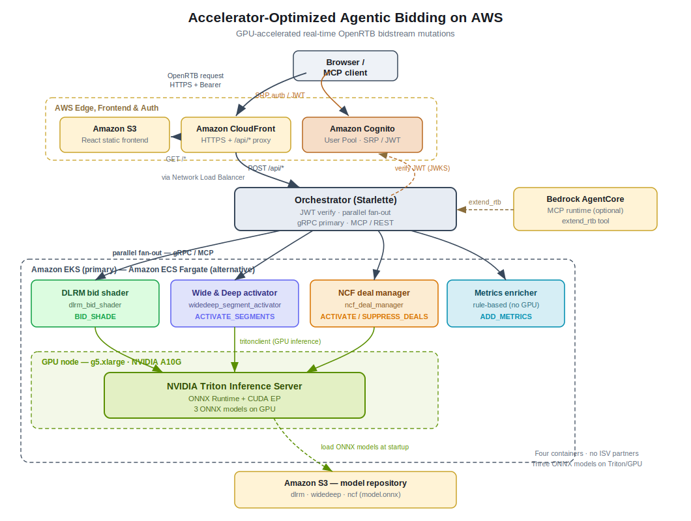

# Guidance for Accelerator-Optimized Agentic Bidding on AWS

## Table of Contents

1. [Overview](#overview)
    - [Architecture](#architecture)
    - [Cost](#cost)
2. [Prerequisites](#prerequisites)
    - [Operating System](#operating-system)
    - [Third-party tools](#third-party-tools)
    - [AWS account requirements](#aws-account-requirements)
    - [Supported Regions](#supported-regions)
3. [Deployment Steps](#deployment-steps)
4. [Deployment Validation](#deployment-validation)
5. [Running the Guidance](#running-the-guidance)
6. [Next Steps](#next-steps)
7. [Cleanup](#cleanup)
8. [Notices](#notices)

## Overview

This Guidance shows how demand-side platforms (DSPs) and advertising technology providers can run GPU-accelerated AI inference directly inside the OpenRTB programmatic bidding pipeline, following the IAB Tech Lab Agentic RTB Framework (ARTF) v1.0 specification.

ARTF defines agent-driven containers that receive an OpenRTB bid request, analyze it, and propose typed *mutations* to the bidstream — adjusting bid prices, activating audience segments, managing private marketplace deals, or adding quality metrics. The host platform applies approved mutations atomically before the auction continues. This Guidance replaces rule-based bidding heuristics with real-time neural network inference served on the GPU, so bidding decisions stay within OpenRTB timeout budgets.

The solution provides four ARTF-compliant containers backed by NVIDIA deep learning recommender models served on NVIDIA Triton Inference Server, an orchestration layer for parallel fan-out, and AI agent integration through Amazon Bedrock AgentCore with Model Context Protocol (MCP) support:

- **DLRM Bid Shader** (`BID_SHADE`) — predicts click-through rate (CTR) and computes an optimal shaded bid price.
- **Wide & Deep Segment Activator** (`ACTIVATE_SEGMENTS`) — scores user-segment affinities and activates high-value segments.
- **NCF Deal Manager** (`ACTIVATE_DEALS` / `SUPPRESS_DEALS`) — predicts user-deal relevance and activates or suppresses private marketplace deals.
- **Metrics Enricher** (`ADD_METRICS`) — a rule-based container that adds viewability and brand-safety scores, demonstrating that the ARTF container model can mix neural and deterministic logic in one pipeline.

Three of the four containers (DLRM, Wide & Deep, NCF) run inference against ONNX models hosted on NVIDIA Triton Inference Server using ONNX Runtime and the CUDA Execution Provider on NVIDIA A10G GPUs (`g5.xlarge`). The orchestrator (a Starlette application exposing gRPC as the primary protocol plus MCP and REST) fans each `RTBRequest` out to all four containers in parallel, merges the resulting mutations, and returns a single `RTBResponse`. A React testing frontend (served from Amazon S3 through Amazon CloudFront, authenticated by Amazon Cognito) lets builders submit sample payloads, inspect mutations, and exercise the MCP interface. Test run history is persisted in Amazon DynamoDB.

> **Note on the models.** The DLRM, Wide & Deep, and NCF models in this Guidance are *reference architectures* that follow the published NVIDIA DeepLearningExamples (DLRM, NeuMF/NCF) and NVIDIA Merlin (Wide & Deep) designs. They are defined in `source/triton/export_models.py` and exported to ONNX with **randomly initialized (seeded) weights** — they are **not pretrained or production-trained models**. They demonstrate the end-to-end GPU inference path and the ARTF container/Triton integration; their predictions are not meaningful until you train the architectures on your own data (or substitute your own ONNX models — see [Next Steps](#next-steps)). The NVIDIA Triton Inference Server image itself (`nvcr.io/nvidia/tritonserver:24.08-py3`) is the genuine upstream NVIDIA NGC container.

### How it works

1. **Bid request ingestion** — An OpenRTB bid request arrives through Amazon CloudFront and is routed to the orchestrator.
2. **Orchestration** — The orchestrator receives the request and fans it out in parallel to the four ARTF containers.
3. **GPU-accelerated inference** — The DLRM, Wide & Deep, and NCF containers extract features, invoke their assigned model on Triton via `tritonclient.http`, and receive predictions from the GPU. The Metrics Enricher applies rule-based logic on CPU.
4. **Mutation generation** — Each container translates its result into typed ARTF mutations.
5. **Response assembly** — The orchestrator merges all mutations into a single `RTBResponse`.
6. **Mutation application** — The DSP host platform applies the approved mutations to the bidstream before the auction continues.

### Architecture



A detailed component-by-component description of the architecture is available at [assets/images/architecture.md](assets/images/architecture.md).

The primary deployment path provisions an Amazon EKS cluster:

- **CPU node group (`c5.xlarge`)** runs the orchestrator behind a Network Load Balancer.
- **GPU node group (`g5.xlarge`, NVIDIA A10G)** runs NVIDIA Triton Inference Server (`nvcr.io/nvidia/tritonserver:24.08-py3`) serving three ONNX models — `dlrm_bid_shader`, `widedeep_segment_activator`, and `ncf_deal_manager` — loaded from Amazon S3, co-located with the four ARTF containers.
- **Amazon CloudFront + Amazon S3** serve the React frontend; **Amazon Cognito** authenticates users; the orchestrator verifies Cognito-issued JWTs.
- **Amazon Bedrock AgentCore** optionally hosts an MCP runtime (ARM64 microVM) that exposes the `extend_rtb` tool for AI agent integration.

An ECS Fargate path is also provided as an explicit alternative for CPU-only demos without GPU infrastructure (see [Deployment Steps](#deployment-steps)).

### Cost

You are responsible for the cost of the AWS services used while running this Guidance. As of June 2026, the cost for running this Guidance with the default settings in the US East (N. Virginia) Region is approximately **$1,080 per month** assuming a single-GPU demo configuration with the GPU node group running on a daytime-only schedule.

We recommend creating a [Budget](https://docs.aws.amazon.com/cost-management/latest/userguide/budgets-managing-costs.html) through [AWS Cost Explorer](https://aws.amazon.com/aws-cost-management/aws-cost-explorer/) to help manage costs. Prices are subject to change. For full details, refer to the pricing webpage for each AWS service used in this Guidance.

#### Sample cost table

The following table provides a sample, illustrative cost breakdown for deploying this Guidance with the default demo parameters in the US East (N. Virginia) Region for one month. Figures are example estimates only; actual costs depend on traffic, instance hours, and data transfer. The GPU node group is the dominant cost — this estimate assumes the included scheduled shutdown keeps it running roughly 12 hours per business day (~260 hours/month) rather than 24/7.

| AWS service | Dimensions | Cost [USD/month] |
| ----------- | ---------- | ---------------- |
| Amazon EKS | 1 cluster control plane, 730 hrs @ $0.10/hr | $73 |
| Amazon EC2 (GPU) | 1 × g5.xlarge (NVIDIA A10G), ~260 hrs/month with scheduled shutdown @ ~$1.006/hr | $262 |
| Amazon EC2 (CPU) | 2 × c5.xlarge, 730 hrs each @ $0.17/hr | $248 |
| Amazon S3 | ~1 GB model + frontend storage and requests | $1 |
| Amazon CloudFront | Low-traffic demo, < 10 GB egress | $2 |
| Amazon Cognito | < 1,000 monthly active users | $0 |
| Amazon DynamoDB | On-demand, low read/write volume for test history | $1 |
| Amazon Bedrock AgentCore | Optional MCP runtime, intermittent invocation | $5 |
| **Total (example estimate)** | | **~$592** |

> The headline ~$1,080/month figure reflects running the GPU node 24/7 plus headroom; enabling the included scheduled GPU shutdown brings a typical demo month closer to the ~$592 shown above. For a short demo, deploy, validate, and tear down immediately — a 2-hour session costs only a few dollars.

## Prerequisites

### Operating System

These deployment instructions are optimized to best work on **macOS** or a **Linux** workstation (for example Amazon Linux 2023 or Ubuntu). Deployment on Windows may require additional steps (for example, running the deployment scripts inside WSL2). The deployment scripts are POSIX shell and Python and assume a Unix-like environment.

### Third-party tools

Install the following before running the deployment, with the listed minimum versions:

- **AWS CLI v2** with valid credentials configured (`aws configure`)
- **Docker** with **buildx** (required for ARM64 cross-compilation of the AgentCore bundle)
- **Python 3.11+** with `boto3`, `torch`, `onnx`, and `onnxscript` (used to export PyTorch models to ONNX)
- **jq** (JSON processor)
- **eksctl** (EKS cluster management)
- **kubectl** (Kubernetes CLI)

```bash
# AWS CLI v2
aws --version

# Docker with buildx
docker buildx version

# Python 3.11+ with export/deploy dependencies
pip install boto3 torch onnx onnxscript

# jq, eksctl, kubectl (macOS via Homebrew shown; see each tool's docs for Linux)
brew install jq eksctl kubectl
```

The deployment script checks for all of these at startup and fails with a clear message if any are missing.

### AWS account requirements

This deployment requires:

- An AWS account with permissions to create Amazon EKS clusters, Amazon EC2 instances (including `g5` GPU instances), Amazon S3 buckets, Amazon ECR repositories, Amazon CloudFront distributions, Amazon Cognito user pools, Amazon DynamoDB tables, and AWS IAM roles.
- **NVIDIA NGC registry access** to pull the NVIDIA Triton Inference Server image (`nvcr.io/nvidia/tritonserver:24.08-py3`).
- **NVIDIA GPU service quota** for at least one `g5.xlarge` (NVIDIA A10G) instance in your target Region. In `us-east-1`, confirm the *Running On-Demand G and VT instances* quota is large enough before deploying. If not, request an increase through the [Service Quotas console](https://console.aws.amazon.com/servicequotas/).

### Supported Regions

This Guidance can be deployed in any AWS Region that supports Amazon EKS and NVIDIA A10G (`g5` family) instances, including:

- US East (N. Virginia): `us-east-1` (default)
- US West (Oregon): `us-west-2`
- Europe (Ireland): `eu-west-1`
- Europe (Frankfurt): `eu-central-1`
- Asia Pacific (Tokyo): `ap-northeast-1`
- Asia Pacific (Sydney): `ap-southeast-2`

## Deployment Steps

1. Clone the repository:

   ```bash
   git clone https://github.com/aws-solutions-library-samples/guidance-for-accelerator-optimized-agentic-bidding-on-aws.git
   ```

2. Change into the repository directory:

   ```bash
   cd guidance-for-accelerator-optimized-agentic-bidding-on-aws
   ```

3. Confirm your AWS credentials and target Region:

   ```bash
   aws sts get-caller-identity
   export AWS_REGION=us-east-1
   ```

4. Authenticate to the NVIDIA NGC registry so Docker can pull the Triton image, then deploy the full solution on the **primary EKS path** using the deployment entry-point script:

   ```bash
   cd deployment
   ./deploy.sh
   ```

   `deploy.sh` provisions the entire EKS stack end to end:

   | Step | Action |
   |------|--------|
   | 1 | Create Amazon ECR repositories |
   | 2 | Export PyTorch models to ONNX (`../source/triton/export_models.py`) |
   | 3 | Upload the ONNX model repository to Amazon S3 |
   | 4 | Build and push container images (AMD64 for EKS, ARM64 for AgentCore) |
   | 5 | Create the Amazon EKS cluster (`g5.xlarge` GPU + `c5.xlarge` CPU node groups) |
   | 6 | Install the NVIDIA Kubernetes Device Plugin |
   | 7 | Configure IAM Roles for Service Accounts (IRSA) for Triton S3 access |
   | 8 | Apply the Kubernetes manifests in `deployment/eks/` (Triton, ARTF containers, orchestrator, HPA) |
   | 9 | Deploy the frontend (Amazon S3 + Amazon CloudFront) and Amazon Cognito user pool |
   | 10 | Register the Amazon Bedrock AgentCore MCP runtime |

   Useful options:

   ```bash
   ./deploy.sh --prefix v1                    # namespaced resources (v1-*)
   ./deploy.sh --prefix prod --skip-agentcore # EKS + frontend only
   ./deploy.sh --skip-images                  # reuse existing images
   ./deploy.sh --skip-cluster                 # reuse an existing EKS cluster
   AWS_REGION=us-west-2 ./deploy.sh           # deploy to a different Region
   ```

   During deployment you will be prompted (or must set via the `DEMO_USER_PASSWORD` environment variable) for the initial password of the admin-created demo user. The frontend has no self-signup; users are created by an administrator. Choose a strong password and keep it private — it is never printed by the scripts and must not be committed.

5. **(Alternative) ECS Fargate path.** For a CPU-only demo without provisioning GPU infrastructure, deploy the alternative ECS Fargate stack instead of `deploy.sh`. This path runs the containers with inline CPU inference behind an Application Load Balancer:

   ```bash
   cd deployment
   python scripts/deploy_ecs.py
   ```

   The ECS Fargate path is intended for rapid demos and does not provide GPU-accelerated Triton inference. The EKS path (`deploy.sh`) remains the primary, production-oriented deployment.

## Deployment Validation

After `deploy.sh` completes, validate the deployment:

1. Confirm the EKS cluster is reachable and nodes are ready:

   ```bash
   kubectl get nodes
   ```

   You should see at least one GPU node (labeled `role: inference`) and the CPU nodes in `Ready` state.

2. Confirm all workloads are running:

   ```bash
   kubectl get pods
   ```

   The Triton server pod, the four ARTF container pods, and the orchestrator pod should all report `Running` with ready containers. Triton may take a few minutes to reach `Ready` while it loads the ONNX models from S3 (startup probes allow for this).

3. Confirm the orchestrator health endpoints respond:

   ```bash
   kubectl port-forward deploy/orchestrator 8000:8000 &
   curl -s localhost:8000/health/ready
   ```

4. Confirm the frontend distribution is deployed. The deployment output prints the CloudFront domain; open `https://<CLOUDFRONT_DOMAIN>/` in a browser and confirm the login screen loads.

**Security note:** The frontend is served through Amazon CloudFront using Origin Access Control (OAC) over a private Amazon S3 bucket — the bucket is not publicly readable. All orchestrator API calls require a valid Amazon Cognito JWT: the orchestrator verifies the RS256 signature, issuer, and expiry against the Cognito JWKS on every non-health endpoint. There are no open or unauthenticated application endpoints.

## Running the Guidance

1. Open the frontend at `https://<CLOUDFRONT_DOMAIN>/` and sign in with the admin-created demo user and the password set at deploy time. On first login you may be prompted to set a new password (the Cognito `newPasswordRequired` challenge).

2. On the **REST Orchestrator** tab, load one of the bundled OpenRTB sample payloads, optionally edit the JSON, and submit it. Sample payloads are available at:
   - `source/samples/` — `banner-basic.json`, `bid-shading.json`, `video-deals.json`
   - `source/frontend-react/public/samples/` — the same payloads served to the browser

   Expected behavior:

   | Sample | What it exercises | Expected mutations |
   |--------|-------------------|--------------------|
   | `banner-basic.json` | 300×250 banner on a sports site | `ACTIVATE_SEGMENTS`, `ADD_METRICS` |
   | `bid-shading.json` | DSP bid above floor on a 728×90 banner | `BID_SHADE` (shaded bid price) |
   | `video-deals.json` | Video pre-roll with private marketplace deals | `ACTIVATE_DEALS` / `SUPPRESS_DEALS`, `ADD_METRICS` |

   The bid shader computes its shaded price from the model output as `min(original_bid, predicted_CTR × $12.0 × 0.65)`, floored at the publisher's `bidfloor` — where `EST_CONVERSION_VALUE = $12.0` and `SHADE_FACTOR = 0.65` (see `source/containers/dlrm_bid_shader/app.py`).

3. On the **MCP Extension Point** tab, initialize an MCP session and call the `extend_rtb` tool via JSON-RPC to exercise the same containers through the interface AI agents use.

4. (Optional) Invoke the Amazon Bedrock AgentCore MCP runtime directly. The runtime exposes the `extend_rtb` tool over MCP and can be called with the `invoke_agent_runtime` API from a Bedrock-enabled agent or the AWS SDK.

## Next Steps

You can adapt this Guidance to your own bidding pipeline:

- **Bring your own models.** The bundled DLRM, Wide & Deep, and NCF models are reference architectures exported with seeded random weights (see the note in the [Overview](#overview)); they exercise the inference path but do not make meaningful predictions. To move toward production:
  1. **Train real weights.** These are dataset-specific recommender models — there is no portable "pretrained" checkpoint to drop in, because the embedding tables are keyed to a particular feature vocabulary. Reuse NVIDIA's reference *training recipes* rather than expecting reusable weights: [NVIDIA DeepLearningExamples](https://github.com/NVIDIA/DeepLearningExamples) (DLRM, NCF/NeuMF) and the [NVIDIA Merlin](https://github.com/NVIDIA-Merlin/Merlin) stack (Wide & Deep). Training on a public benchmark (e.g., Criteo for DLRM, MovieLens for NCF) yields legitimately trained weights, but predictions are only meaningful once you train on data representative of *your* bidstream and outcomes (clicks, conversions, deal acceptance).
  2. **Align the feature contract.** A real model's input schema will differ from the small synthetic tensors used here (e.g., DLRM's `dense_features [4]` + three sparse inputs over a vocabulary of 1000). Update each container's feature-engineering in `source/containers/<name>/app.py` so the tensors it builds match the trained model's expected inputs, and update the corresponding `config.pbtxt` I/O (`name`, `dims`, `data_type`) to match the new ONNX signature. Plan for recsys-specific concerns: large sparse embedding tables, a hashing/collision strategy for high-cardinality IDs, train/serve feature skew, and periodic retraining as your catalog drifts.
  3. **Export and serve.** Produce the new `model.onnx`, place it under `source/triton/model_repository/<model_name>/<version>/model.onnx` with its `config.pbtxt`, and re-run `deployment/deploy.sh` (or `./deploy.sh --export-only` to regenerate models only). Triton loads from the S3 model repository at startup. Point the relevant container at the new model name. The integration plumbing is model-agnostic — swapping in a trained model is a config-and-upload step; the training and feature alignment above are where the real effort lives.
- **Add or swap ARTF containers.** Implement additional ARTF intent logic using the four containers under `source/containers/` as reference implementations, then register them with the orchestrator fan-out.
- **Scale for production traffic.** The included Horizontal Pod Autoscalers and Cluster Autoscaler scale the orchestrator and Triton pods (and their nodes) with load. For higher QPS, increase node-group capacity in `deployment/eks/cluster-config.yaml` and adjust the HPA targets in `deployment/eks/triton-hpa.yaml`. Consider EC2 Spot Instances or Savings Plans for the GPU node group, and NVIDIA TensorRT optimization of the ONNX models to reduce GPU requirements.
- **Connect to a live DSP.** Route OpenRTB bid requests through the orchestrator before auction execution, and apply the returned mutations to your bidstream.

## Cleanup

Tear down all deployed resources using the destroy flag on the deployment script:

```bash
cd deployment
./deploy.sh --destroy
```

To tear down a specific namespaced stack, include the same prefix used at deploy time:

```bash
./deploy.sh --destroy --prefix v1
```

This removes the EKS cluster (including GPU and CPU node groups), the Kubernetes workloads, the CloudFront distribution, the S3 buckets, the Cognito user pool, and the AgentCore runtime.

**Note:** Amazon ECR repositories are retained by design so cached images are not lost between deployments. If you no longer need them, delete the ECR repositories manually from the Amazon ECR console or with the AWS CLI. Also confirm the S3 model and frontend buckets are emptied and removed if you want to stop all associated storage charges.

## Notices

*Customers are responsible for making their own independent assessment of the information in this Guidance. This Guidance: (a) is for informational purposes only, (b) represents AWS current product offerings and practices, which are subject to change without notice, and (c) does not create any commitments or assurances from AWS and its affiliates, suppliers or licensors. AWS products or services are provided "as is" without warranties, representations, or conditions of any kind, whether express or implied. AWS responsibilities and liabilities to its customers are controlled by AWS agreements, and this Guidance is not part of, nor does it modify, any agreement between AWS and its customers.*
