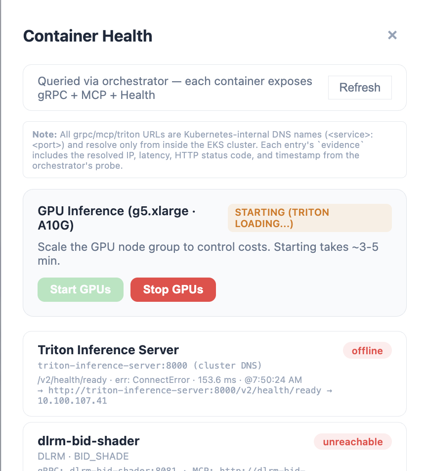
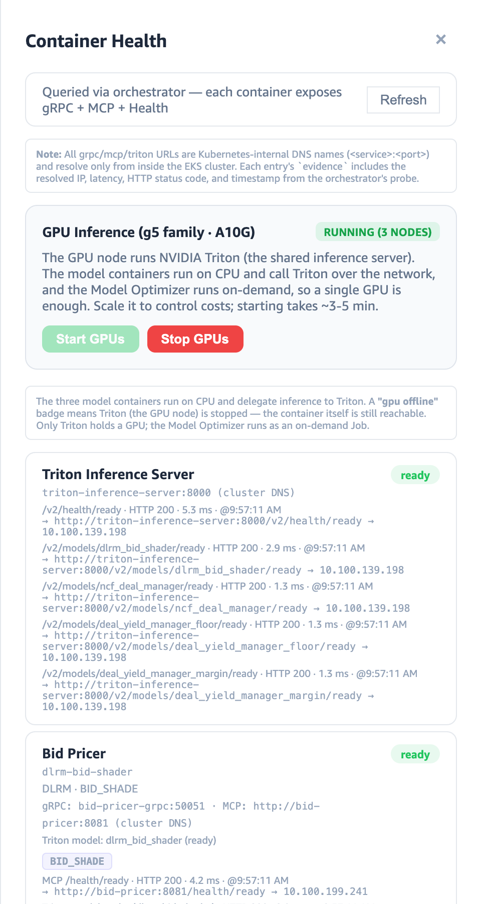
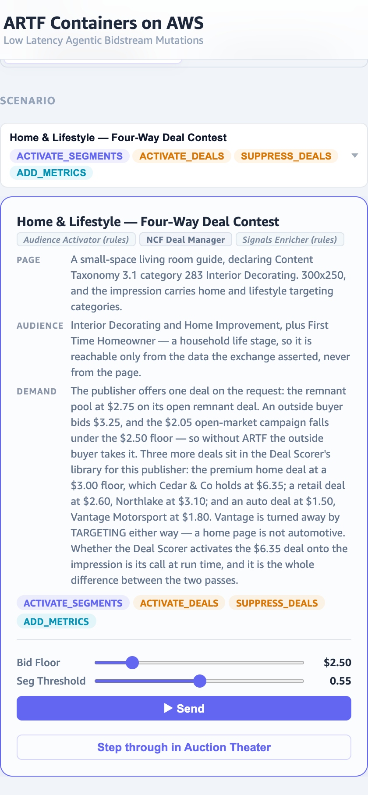
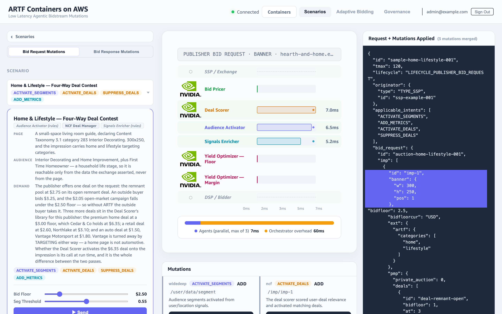
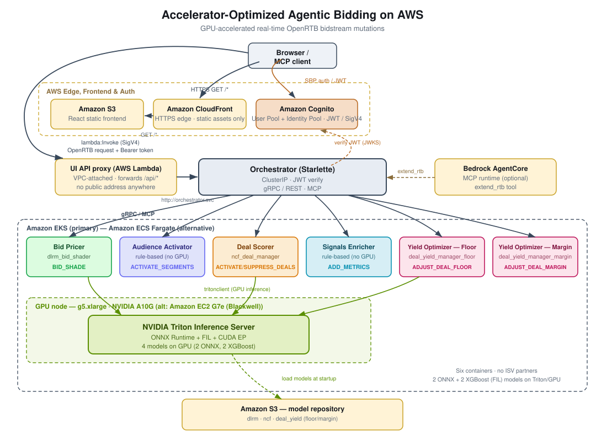

# Guidance for Accelerator-Optimized Agentic Bidding on AWS

Run AI models that price bids, activate audience segments, and manage private marketplace deals in real time — accelerated by NVIDIA GPUs, deployed on Amazon EKS.

> 📄 **Full guidance documents:** This Guidance is published in two parts. [GUIDANCE.md](GUIDANCE.md) covers **Part 1** — the real-time, GPU-accelerated bidding pipeline. [GUIDANCE-part2.md](GUIDANCE-part2.md) covers **Part 2** — the closed-loop learning system: bid-outcome capture, retraining (including the Yield Optimizer's XGBoost floor and margin models), and model-promotion governance. Each includes architecture details, model specifications, scaling scenarios, and Well-Architected analysis.

## Table of Contents

1. [Quick start](#quick-start)
2. [What just happened?](#what-just-happened)
3. [Try it](#try-it)
    - [Demo credentials](#demo-credentials)
4. [Go deeper](#go-deeper)
    - [Architecture](#architecture)
    - [Cost](#cost)
    - [Prerequisites](#prerequisites)
    - [Customizing your deployment](#customizing-your-deployment)
    - [Resuming, re-running, and remembered settings](#resuming-re-running-and-remembered-settings)
    - [Building your own ARTF container](#building-your-own-artf-container)
    - [Part 2: closed-loop learning](#part-2-closed-loop-learning)
    - [Variant: Prebid Server as a second ARTF host (sell side)](#variant-prebid-server-as-a-second-artf-host-sell-side)
    - [Next steps](#next-steps)
5. [Cleanup](#cleanup)
    - [Stopping a deployment in progress](#stopping-a-deployment-in-progress)
6. [Notices](#notices)

## Quick start

Before you start, you'll need an AWS account with permission to create Amazon EKS, EC2 (including `g5` GPU instances), S3, ECR, CloudFront, Cognito, and IAM resources, and a `g5.xlarge` GPU quota in your target Region. `deploy.sh` checks for the required CLI tools at startup and tells you exactly what's missing — see [Prerequisites](#prerequisites) for the full list if you want to check ahead of time.

You'll also need an **NVIDIA NGC API key**. `deploy.sh` deploys the closed-loop retraining stack by default ([Part 2](#part-2-closed-loop-learning)), which builds an NVIDIA NeMo-RL training container from a gated NGC image — the key is what authenticates that pull. Get a free one:

1. Create an account (or sign in) at [ngc.nvidia.com/signin](https://ngc.nvidia.com/signin).
2. Click your account icon (top right) → **Setup** → **Generate Personal Key** (older accounts: **Account Settings** → **Generate API Key**).
3. Give the key a name, leave the default expiration/services, and click **Generate Personal Key**. Copy it now — NGC only shows it once.

```bash
git clone https://github.com/aws-solutions-library-samples/guidance-for-accelerator-optimized-agentic-bidding-on-aws.git
cd guidance-for-accelerator-optimized-agentic-bidding-on-aws/deployment
./deploy.sh --ngc-key YOUR_NGC_API_KEY
```

`deploy.sh` stores the key in AWS Secrets Manager and reuses it automatically on later runs of the same stack — you only need to pass `--ngc-key` once. It provisions everything: an EKS cluster with GPU and CPU node groups, NVIDIA Triton Inference Server, the bidding containers, the orchestrator, and a React frontend behind CloudFront. It takes roughly 30–40 minutes. When it finishes, it prints a URL and a demo login — open the URL in your browser.

Don't want the closed-loop stack (and don't want to create an NGC account)? Skip it — the core real-time bidding pipeline doesn't need NGC credentials:

```bash
./deploy.sh --no-retraining
```

Want a separate, namespaced deployment (for example to run more than one environment in the same account)? Add `--prefix`:

```bash
./deploy.sh --ngc-key YOUR_NGC_API_KEY --prefix stg
```

## What just happened?

```
Browser (React UI)
    |
    |  sign in (Cognito) + HTTPS
    v
+--------------------------------+
|  Amazon CloudFront + S3        |
|  (serves the UI)               |
+--------------------------------+
    |
    |  POST /api/*
    v
+--------------------------------+
|  Orchestrator (EKS)            |
|  verifies the login, fans      |
|  out the bid request           |
+--------------------------------+
    |
    |  parallel calls
    v
+--------------------------------+
|  6 ARTF containers (EKS)       |
|  bid pricer, audience          |
|  activator, deal scorer,       |
|  signals enricher,             |
|  yield optimizer floor,        |
|  yield optimizer margin        |
+--------------------------------+
    |
    |  4 of the 6 call Triton
    v
+--------------------------------+
|  NVIDIA Triton (GPU node)      |
|  runs the AI models            |
+--------------------------------+
```

`deploy.sh` deployed an Amazon EKS cluster with two node groups: a GPU node running NVIDIA Triton Inference Server, and CPU nodes running the orchestrator and six bidding containers, each responsible for one job in the pipeline:

| Container | What it does |
|-----------|---------------|
| **Bid Pricer** | Shades every bid down to the lowest price still likely to win |
| **Audience Activator** | Activates audience segments from bid-request signals |
| **Deal Scorer** | Scores and activates/suppresses private marketplace deals |
| **Signals Enricher** | Adds viewability and brand-safety quality signals |
| **Yield Optimizer — Floor** | Publisher/SSP-side — adjusts the floor price on private marketplace deals |
| **Yield Optimizer — Margin** | Publisher/SSP-side — adjusts the margin taken on private marketplace deals |

The orchestrator fans out every incoming bid request to all six containers in parallel, merges their mutations, and returns a single response — the fan-out includes both yield containers, so each is exercised whenever a scenario carries a deal with the matching floor- or margin-adjustable intent. A React frontend, served through CloudFront and authenticated by Cognito, lets you submit sample payloads and inspect the results — that's the "Try it" step below.

The two yield containers are deliberately separate. `ADJUST_DEAL_FLOOR` and `ADJUST_DEAL_MARGIN` are independent, atomic ARTF intents — neither is gated on the other — so each gets its own model, its own container, and its own scaling and failure boundary. A failure in one cannot affect the other's request path.

### Which models exist, and how each one is served

Containers and models are not 1:1. Four of the six containers run a real model on
the GPU; two are deterministic rule engines with no model at all. Every model that
exists has exactly one container, and every model is a fully separate unit — its own
Triton model name, its own config, its own SageMaker Model Package Group, its own
training job, and its own promotion lifecycle.


| Model | Container | Type | Artifact served | Triton backend | GPU |
|---|---|---|---|---|---|
| `dlrm_bid_shader` | Bid Pricer | DLRM (PyTorch) | TensorRT `.plan`, compiled from ONNX | `tensorrt_plan` | Yes |
| `ncf_deal_manager` | Deal Scorer | NCF/NeuMF (PyTorch) | TensorRT `.plan`, compiled from ONNX | `tensorrt_plan` | Yes |
| `deal_yield_manager_floor` | Yield Optimizer — Floor | XGBoost regressor | native `xgboost.json` | `fil` | Yes |
| `deal_yield_manager_margin` | Yield Optimizer — Margin | XGBoost regressor | native `xgboost.json` | `fil` | Yes |
| *(none — rules)* | Audience Activator | deterministic rules | n/a | n/a | No |
| *(none — rules)* | Signals Enricher | deterministic rules | n/a | n/a | No |

The two yield models share one thing by design: the **7-element feature vector** both
consume. That derivation lives in shared code rather than being duplicated per
container, because the Glue ETL job reconstructs the same vector when building
training data — if the two containers computed it differently, or drifted from the
ETL job, training data would silently stop matching what the models see at inference
time.

**Two different serving paths, and why.** ONNX and FIL are not alternatives to each
other — one is a file format, the other is an inference engine:

- **Neural networks (DLRM, NCF).** PyTorch → **ONNX** (a portable file format for
  neural networks) → NVIDIA **TensorRT** compiles that ONNX into a `.plan` engine
  tuned for the specific GPU → Triton serves the `.plan`. The compile step is what
  TensorRT is for.
- **Tree models (floor, margin).** XGBoost → native `xgboost.json` → NVIDIA's
  **FIL** (Forest Inference Library, from RAPIDS/cuML, bundled in Triton) reads that
  format directly on the GPU. **There is no ONNX and no compile step in this path** —
  FIL loads the tree model as-is.

Both paths run inside the same Triton server on the same GPU node. Note that
`dlrm_bid_shader` and `ncf_deal_manager` are each fronted by a small Python-backend
router on CPU that splits traffic between `*_stable` and `*_canary` versions; the two
yield models are currently single-version and loaded directly, with no router.

> **On the XGBoost version pin.** `xgboost` is pinned to `1.7.6` deliberately. Newer
> versions write a `"cats"` field into the saved JSON that Triton 24.08's bundled FIL
> backend rejects outright (`Error: key "cats" is not recognized!`), which would take
> both yield models down. The pin matches the SageMaker training-side version.

> **The yield models also produce an ONNX file. Nothing serves it.** `deploy.sh` exports
> each yield model in two formats — the native `xgboost.json` that FIL actually loads,
> and an ONNX copy uploaded to `onnx-source/`. The ONNX copy exists only so the model
> registration script can treat all four models identically instead of branching on
> format; **FIL never reads it, and there is no TensorRT compile step for tree models.**
> If you're tracing artifacts through S3, that's why an ONNX file appears for a model
> that is not served from ONNX.

> **Note on the two yield containers.** Earlier releases served both yield models from
> a single container. They are now split, so each model has its own container, image,
> Kubernetes Deployment, HPA, and load-test target — matching how every other model in
> this guidance is deployed. The Triton model names (`deal_yield_manager_floor` /
> `deal_yield_manager_margin`) and their SageMaker Model Package Groups are unchanged
> from before the split, so existing registered model versions and promotion history
> carry over.
>
> **If you are upgrading from a pre-split deployment:** load-test runs recorded before
> the split were tagged with a single combined target and are **not** eligible as
> training data for either model afterward. Re-run a load test against each new target
> to regenerate training data. Registered model versions are unaffected.

> **Note on the models.** The bundled models (DLRM, NCF, and both XGBoost models) ship with **seeded, untrained weights**. They exercise the real GPU inference path but don't make meaningful predictions until you train them on your own data — see [Next steps](#next-steps). The audience activator and signals enricher are deterministic rule engines, not models.

> **How the yield models break their own cold start.** A freshly seeded XGBoost model has no reason to recommend anything other than "no change" — and "no change" never produces a mutation, so it never generates an outcome for itself to learn from. Both yield containers run an exploration step after the model returns its prediction, which nudges the recommendation by a small, bounded random amount instead of always returning the same answer. It is **on by default** (`YIELD_EXPLORATION_EPSILON=0.1`, settable independently per container) but **structurally scoped to load-test and demo traffic only** — live auction bids are never perturbed, regardless of how that value is set. Every nudged response is disclosed with a `:explore` suffix on `model_version`, so training data never mistakes an exploratory probe for a real recommendation. That's what produces the variation each model's [training pipeline](CLOSED_LOOP.md#yield-optimizer-bootstrapping-training-data-without-a-live-signal-path-yet) needs to have something to learn from.

### The 5 deployment phases

`deploy.sh` prints its progress as 5 numbered phases (`Phase N/5: ...`), naming each step as it enters it and marking it `✓` or `✗` as it finishes:

```
=== Phase 5/5  Registering agents ===
  -> Step 10: Deploying AgentCore MCP runtime
  ✓ Registering bt1_nvidia_artf_recommenders_mcp
  -> Step 11: Deploying closed-loop retraining infrastructure
  ✓ Building Adaptive Bidding agent image (arm64)
  ✗ Registering bt1_adaptive_bidding_agent (HTTP) — exit 1
    last 15 lines of deployment/.deploy-bt1-closed-loop.log:
      botocore: connect timeout to bedrock-agentcore
```

While a step is running its line animates in place, so a long wait is visibly a wait rather than a hang. The genuinely noisy commands — arm64 image builds, the AgentCore SDK's INFO logging — write their output to `deployment/.deploy-*.log` instead of the terminal. **A failure is never quiet:** the last 15 lines of the log are printed inline and the file is named, so you do not have to know where to look.

Pass `--verbose` to see every underlying command instead of just the step summaries; use `--start-at N` to resume from a given phase (for example after fixing a one-off failure) without redoing earlier ones. Set `DEPLOY_NO_SPINNER=1` to hold the line still. The animation is skipped automatically when output is redirected, so a `nohup`-ed log stays readable text.

| Phase | What happens |
|-------|---------------|
| **1/5 — Preparing models** | Creates the ECR repositories and the DynamoDB load-test-history table; exports the PyTorch DLRM/NCF models to ONNX and the yield optimizer's genesis XGBoost models (best-effort — the deploy continues even if this step is skipped); uploads all of it, plus the Triton router/model-config repository, to the S3 model bucket. |
| **2/5 — Building containers & provisioning infrastructure** | Builds and pushes any container image whose source has changed (remotely via AWS CodeBuild by default, or locally with `--local-build`) **at the same time** it creates the EKS cluster (GPU + CPU node groups) — the two don't depend on each other, so running them in parallel is roughly half the wait of doing them one after another. Then installs the NVIDIA Kubernetes device plugin and sets up the IAM/IRSA roles Triton, the Model Optimizer, and the orchestrator need. |
| **3/5 — Deploying workloads** | Provisions the Cognito user pool, then applies the Kubernetes manifests for Triton, the six ARTF containers, and the orchestrator. Kicks off a one-shot Kubernetes Job that compiles the base TensorRT engines on the GPU node — this runs in the background and does **not** block the rest of the deploy; Triton picks the compiled engines up automatically once they're ready (see the "Confirm everything is healthy" note below). Also configures the included daily GPU-node scheduled shutdown. |
| **4/5 — Setting up access** | Deploys the React frontend (S3 + CloudFront) and creates the demo admin user in Cognito. |
| **5/5 — Registering agents** | Registers the Amazon Bedrock AgentCore MCP runtime, then — unless you passed `--no-retraining` — deploys the entire Part 2 closed-loop stack: the bid-outcome feedback pipeline, the Glue ETL job, the SageMaker Model Registry groups (seeded with genesis model versions), the NeMo-RL training container (built asynchronously — this is the long build the NGC key is for), the Adaptive Bidding and Governance AgentCore agent runtimes, their EventBridge invocation schedules, and a final frontend rebuild wired with the real agent ARNs. |

**Cost while it's running:** approximately **$762/month** with the included daytime-only GPU schedule (about **$1,250/month** if the GPU node runs 24/7) — this includes Part 2 (closed-loop learning), which deploys by default. See [Cost](#cost) for the breakdown. Deploy, try it, and [tear it down](#cleanup) when you're done — a short session costs a few dollars.

**Confirm everything is healthy:**

```bash
kubectl get nodes    # at least one GPU node + CPU nodes, all Ready
kubectl get pods     # Triton, the 6 containers, and the orchestrator all Running
```

Triton and the model-optimizer bootstrap Job may take a few minutes to finish loading/compiling models after the script exits — `deploy.sh`'s final summary tells you whether that finished and how to check.

## Try it

1. Open the frontend URL from the deployment summary and sign in with the demo username and password shown there. On first login, Cognito will prompt you to set a new password. See [Demo credentials](#demo-credentials) below if you missed them or need to reset the password.

2. Click **Containers** in the navigation to check status. The GPU node group scales to zero when idle to save cost — if Triton shows *offline*, click **Start GPUs** (takes about 3–5 minutes).

   

   Once Triton has loaded its models, every container shows a green **ready** badge.

   

3. Click one of the pre-built **Scenarios** to run it through the pipeline:

   

   | Scenario | Containers exercised |
   |----------|----------------------|
   | Banner Ad — Segment Activation | Audience Activator, Signals Enricher |
   | Bid Shading — Price Optimization | Bid Pricer |
   | Video + PMP Deals — Deal Scoring | Deal Scorer, Signals Enricher |
   | SSP Enrichment — 3 Containers | Audience Activator, Deal Scorer, Signals Enricher |
   | PMP Deals — Yield Optimizer | Yield Optimizer — Floor, Yield Optimizer — Margin |

   

   The result view shows the mutated bid request, a per-container latency breakdown, and the individual mutations each container proposed.

4. (Optional) Call the same pipeline over MCP. An Amazon Bedrock AgentCore runtime exposes an `extend_rtb` tool that any Bedrock-hosted agent can invoke — see [GUIDANCE.md](GUIDANCE.md#amazon-bedrock-agentcore-integration) for a working example.

5. (Optional) Click **Load Test** in the navigation to generate synthetic traffic against any single container — including either yield container, selectable independently. This isn't only a throughput demo: for the yield models, load-test traffic travels the same real closed-loop feedback path production traffic uses (a real `DealYieldOutcomeEvent`, tagged `source=load_test` so it's never confused with production data), which is how their training data actually gets bootstrapped before real auction outcomes accumulate. A **Traffic scenario** selector shapes the synthetic requests each run generates — a balanced default, or recognisable demand shapes such as a Black Friday retail surge or NFL-Sunday sports traffic (each a weighted mix of publisher domains, content categories, devices, and deal-floor ranges). It shapes the request inputs the pipeline processes; it does not replay real traffic recorded during those events. See [Part 2: closed-loop learning](#part-2-closed-loop-learning).

### Demo credentials

`deploy.sh` creates one Cognito user for you in Phase 4 and prints it in the deployment summary:

| | |
|---|---|
| **Username** | `admin@example.com` (set `DEMO_USER_EMAIL` before deploying to use a different address) |
| **Password** | A 16-character temporary password, generated locally and **printed only once**, in the summary |
| **First login** | Cognito requires you to set a permanent password — the user is created with a *temporary* one, so the password change is forced, not optional |

**If you missed the password, or it has scrolled past.** It cannot be recovered. Cognito stores passwords hashed, `admin-get-user` returns no credential, and `admin-create-user` does not return the temporary password it set — so the only option is to set a new one. The deployment summary prints this command with your real User Pool ID already filled in; if you no longer have the summary, find the ID first:

```bash
# Find your User Pool ID (look for <prefix->nvidia-artf-recommenders)
aws cognito-idp list-user-pools --max-results 60 --region us-east-1

# Set a permanent password — you will NOT be prompted to change it at next login
aws cognito-idp admin-set-user-password \
  --user-pool-id <your-user-pool-id> \
  --username admin@example.com \
  --password '<new-password>' --permanent --region us-east-1
```

It is also recorded locally: `jq -r '.deployments[""].resolved.cognitoUserPoolId' deployment/.deploy-state.json` (use the prefix as the key if you deployed with `--prefix`).

**If you have deployed before, your old login will not work.** Each deployment creates its own user pool, and `--prefix` creates a separate one per prefix. A user in a pool from an earlier deployment has no relationship to the new pool, and `--destroy` deletes the pool along with its users. Sign in with the credentials from the **current** deployment's summary, or reset the password in the current pool using the commands above.

## Go deeper

### Architecture



An Amazon EKS cluster runs two node groups: a `g5`-family GPU node group (NVIDIA A10G, or the more powerful Amazon EC2 G7e) running NVIDIA Triton Inference Server, and a `c5.xlarge` CPU node group running the orchestrator and the bidding containers. Four containers call Triton for GPU-accelerated inference — the bid pricer and deal scorer (TensorRT-compiled neural networks) plus the two yield optimizers, floor and margin (XGBoost models served through Triton's Forest Inference Library backend); the audience activator and signals enricher are deterministic rule engines on CPU. Amazon CloudFront + S3 serve the React frontend; Amazon Cognito authenticates users; an optional Amazon Bedrock AgentCore runtime exposes the same pipeline over MCP.

Full component-by-component detail, model specifications, and a request-flow diagram: [assets/images/architecture.md](assets/images/architecture.md). Container-naming history (what changed, what didn't, and why): [RENAME_MAP.md](RENAME_MAP.md).

**One architectural variant ships with this Guidance.** The topology above has a single ARTF host — the orchestrator, called directly. Adding `--with-prebid` deploys **Prebid Server into the same cluster as a second, independent host**, which calls that same orchestrator from inside a real auction and then resolves the auction itself. It is opt-in and additive: without the flag, nothing above changes. It runs a **contested** auction: two independent seats bid, so there is a real winner and real losers. See [Variant: Prebid Server as a second ARTF host](#variant-prebid-server-as-a-second-artf-host-sell-side) for the architecture, a full page-load walkthrough, and what is and is not real about it.

### Cost

Sample estimate for the default settings in `us-east-1`, assuming the included scheduled GPU shutdown (~260 GPU-hours/month). `deploy.sh` deploys Part 2 (closed-loop learning) by default, so this table includes both parts, tagged by which part each line item belongs to:

| AWS service | Part | Cost [USD/month] |
| ----------- | ---- | ----------------- |
| Amazon EKS | Part 1 | $73 |
| Amazon EC2 (GPU, ~260 hrs/mo) | Part 1 | $262 |
| Amazon EC2 (CPU) | Part 1 | $248 |
| Everything else (S3, CloudFront, Cognito, DynamoDB, AgentCore) | Part 1 | ~$9 |
| Amazon DynamoDB (parameter store, audit trail, user features) | Part 2 | ~$5 |
| Amazon Bedrock AgentCore (Adaptive Bidding Agent) | Part 2 | ~$15 |
| Amazon Bedrock AgentCore (Governance Agent) | Part 2 | ~$2 |
| Amazon SageMaker Training | Part 2 | ~$60 |
| AWS Glue (2 scheduled ETL jobs — bid outcomes, deal-yield outcomes) | Part 2 | ~$88 |
| Amazon EventBridge Scheduler | Part 2 | <$1 |
| **Total** | | **~$762** |

Running the GPU node 24/7 instead of on the included schedule raises the total to roughly **$1,250/month**. The `g5.xlarge` line item can be swapped for the more powerful Amazon EC2 G7e instances at higher cost. Skip Part 2 entirely with `--no-retraining` to drop the Part 2 rows above. Full line-item detail: [GUIDANCE.md](GUIDANCE.md#cost-estimation) (Part 1) and [GUIDANCE-part2.md](GUIDANCE-part2.md#cost-estimation) / [CLOSED_LOOP.md](CLOSED_LOOP.md#cost) (Part 2, including the optional DAX add-on not counted above).

### Prerequisites

**Operating system:** macOS or Linux (for example Amazon Linux 2023 or Ubuntu). The deployment scripts are POSIX shell and Python; Windows users should run them inside WSL2.

**Third-party tools** (minimum versions; `deploy.sh` checks these at startup):

```bash
aws --version                                    # AWS CLI v2, with credentials configured
pip install boto3 torch onnx onnxscript sagemaker  # Python 3.11+ (deploy.sh auto-installs sagemaker when Part 2 is enabled)
brew install jq eksctl kubectl                   # or your Linux package manager
docker buildx version                            # only needed for --local-build
```

**AWS account requirements:** permission to create Amazon EKS clusters, EC2 instances (including `g5` GPU instances), S3 buckets, ECR repositories, CloudFront distributions, Cognito user pools, DynamoDB tables, and IAM roles. A `g5.xlarge` (NVIDIA A10G) service quota in your target Region — check the *Running On-Demand G and VT instances* quota in the [Service Quotas console](https://console.aws.amazon.com/servicequotas/) before deploying.

**NVIDIA NGC API key:** required by default, since Part 2 (closed-loop retraining) is on unless you pass `--no-retraining`. `nvcr.io/nvidia/tritonserver` itself is a public image and needs no key. See the [Quick start](#quick-start) above for how to get one.

**Supported Regions:** any Region with Amazon EKS and `g5`-family (or G7e) instances, including `us-east-1` (default), `us-west-2`, `eu-west-1`, `eu-central-1`, `ap-northeast-1`, and `ap-southeast-2`.

### Customizing your deployment

```bash
./deploy.sh --prefix v1                    # namespaced resources (v1-*)
./deploy.sh --skip-images                  # reuse existing images
./deploy.sh --skip-cluster                 # reuse an existing EKS cluster
./deploy.sh --local-build                  # build images locally with Docker instead of CodeBuild
./deploy.sh --no-retraining                # Part 1 only — skip the closed-loop stack (see below)
./deploy.sh --ngc-secret my-secret-name    # reuse an NGC key already stored in Secrets Manager
./deploy.sh --maxGPUs 5                    # raise the GPU node group's max size (default 3)
./deploy.sh --artf-node-role inference     # co-locate the model containers on the GPU node
./deploy.sh --start-at 3                   # resume from Phase 3 (see the breaking-change note below)
./deploy.sh --verbose                      # print every underlying command, not just step summaries
DEPLOY_NO_SPINNER=1 ./deploy.sh            # hold the progress line still (no animation)
AWS_REGION=us-west-2 ./deploy.sh           # deploy to a different Region
```

By default, images build remotely on **AWS CodeBuild** — no local Docker required, and ARM64 images (AgentCore) build natively on Graviton. The first deploy provisions a CodeBuild stack automatically; later runs skip rebuilding images whose source hasn't changed. Pass `--local-build` if you'd rather build with Docker on your own machine (needs ~30 GB free disk, plus buildx for the ARM64 cross-compile).

The closed-loop stack (on by default) also builds an NVIDIA NeMo-RL training container from a gated NGC image, which is a long build (15–50 minutes) that runs asynchronously — the rest of the deployment doesn't wait on it. If you already stored your NGC key in Secrets Manager on a prior run (or via `aws secretsmanager create-secret --name my-secret-name --secret-string YOUR_NGC_API_KEY`), pass `--ngc-secret my-secret-name` instead of `--ngc-key` to reuse it. Check the NeMo build's status any time with:

```bash
./check_builds.sh --prefix stg          # one-time check
./check_builds.sh --prefix stg --watch  # refresh every 30s
```

**Breaking change:** `deploy.sh --start-at` now takes a phase number 1–5 instead of the old internal step numbers. If you have scripts referencing the old numbering, see the old-step-to-new-phase mapping table in [RENAME_MAP.md](RENAME_MAP.md).

### Resuming, re-running, and remembered settings

**Re-running does not require a teardown first.** Every phase is idempotent: existing ECR repositories, DynamoDB tables and EKS clusters are reused, images whose source has not changed are not rebuilt, manifests are re-applied, and the demo Cognito user is left alone if it already exists. Run `./deploy.sh` again as often as you like. Use `--destroy` when you actually want the resources gone — to stop paying for them, or to start from a genuinely clean account — not as a precaution before redeploying.

**Where did I get to? Ask AWS.**

```
./deploy.sh --prefix bt1 --status
```

```
Deployment status — prefix 'bt1'
  account 123456789012 · region us-east-1 · stack bt1-nvidia-artf-recommenders
  (read live from AWS — safe to run any time, from anywhere, while a deploy is running)

  ✓         Phase 1/5  Preparing models
  ✗ missing Phase 2/5  Building containers & provisioning infrastructure
            ✗ missing container images — repos exist but hold no image: adaptive-bidding-agent
            ✓         EKS cluster — bt1-nvidia-artf-recommenders-triton ACTIVE
            ✓         node group gpu-inference — 1 node(s) registered, ['g5.xlarge']
  ✓         Phase 3/5  Deploying workloads
  ✓         Phase 4/5  Setting up access
  ✗ missing Phase 5/5  Registering agents
            ✗ missing stack bt1-governance-eventbridge — not created
            ✗ missing agent runtime *AdaptiveBiddingStrategyAgent — not created
```

`✓` is deployed and `✗` is not; the word after the cross says which kind of "not",
because *never created* and *created and broken* need different responses:

| Mark | Meaning |
|---|---|
| `✓` | Present and ready |
| `✗ missing` | Does not exist. Re-running the phase creates it |
| `✗ FAILED` | Exists and is broken — a rolled-back stack, a pod that will not schedule. Needs a look, not just a re-run |
| `· working` | AWS is mid-operation. A re-run waits for it rather than competing |
| `? unknown` | Could not be determined (usually no `kubectl` context for the cluster). The phase is **run**, not skipped |

Terminals without UTF-8 get `+`, `x` and `.` instead. These are the same marks the
deploy itself prints, so a phase looks identical whether you are watching it happen
or asking about it afterwards.

That comes from CloudFormation stack statuses, CodeBuild build states, EKS nodegroups **and the nodes actually registered in the cluster**, ECR images, Kubernetes readiness, CloudFront, Cognito and AgentCore runtimes — not from a local file. So it works from any machine, after a reboot, for a colleague, and while a deploy is running, because it only reads. It exits 0 only when everything expected is present, so it is usable in a script.

**If a deploy stops part-way, run the same command again.** No flags, no prompt:

```
./deploy.sh --prefix bt1
```

It probes AWS first, prints the table above, then does only what is missing:

- A phase whose resources already exist is **skipped**, and says so.
- If AWS is **mid-operation** — a stack creating, a CodeBuild build running — it **waits for that** rather than starting a competing one. Two terminals running this at once is therefore safe, and useful, instead of a race.
- A phase whose state **cannot be verified** is run, not skipped. Every phase is idempotent, so re-running one costs time; skipping one would ship a deployment that claims to be complete and is not.
- `--start-at N` still forces a starting phase, for when you know something the probe cannot — "rebuild my container even though an image exists".

There is no resume prompt, because there is no longer a question to ask. `--resume` is accepted as a no-op so older scripts and notes keep working.

If Phase 3 reports `unknown`, your `kubectl` has no context for that cluster, and the output prints the exact `aws eks update-kubeconfig` command. It will never report another cluster's pods as yours — which matters, because every deploy rewrites the shared `~/.kube/config`.

**Detaching is supported.** With no terminal attached — `nohup`, a detached session, CI — nothing prompts. If a subsystem fails, the run prints a partial-completion summary with a freshly probed status table, names what failed, and **exits non-zero**. It will not print a success banner for a deploy that did not finish.

**Docker is started for you when it is needed.** Phase 5 builds the two AgentCore agent images locally by design (AgentCore needs arm64, and the builds are small). If the Docker daemon is not running at that point, `deploy.sh` starts it and waits instead of failing with a connect error. Same for `--local-build`.


**Settings are remembered per `--prefix`.** Flags you omit are filled in from the last run of that prefix, and every value applied is printed at startup:

```
  Reusing values from the last deploy of prefix '<none>':
    AWS_REGION = us-east-1
    --maxGPUs = 3
    --ngc-secret = nvidia-artf-recommenders-ngc-api-key
    (pass the flag explicitly to override, or delete deployment/.deploy-state.json)
```

The NGC key is the one that matters most in practice: pass `--ngc-key` once and later runs of the same prefix find the stored secret on their own. An explicit flag always wins over a remembered value. Remembered: region, `--maxGPUs`, `--artf-node-role`, `--model-id`, `--local-build`, `--with-retraining`/`--no-retraining`, `--with-prebid`, `--skip-agentcore`, and the NGC secret name.

Three things worth knowing about the record:

- It is keyed on `--prefix`, so `./deploy.sh` and `./deploy.sh --prefix stg` never read each other's values. If the record's account or stack name disagrees with the current invocation, nothing is reused and the script says why.
- It is local, gitignored, safe to delete (you lose the remembered flags and nothing else), and removed by `--destroy`. It never contains your NGC key or the demo password — only the *name* of the Secrets Manager secret.
- It records **no progress**. That was tried and removed: a file describing what the script had done disagreed with what the account actually contained, and reported a phase complete for a workload that had never started. Progress comes from `--status`.

### Building your own ARTF container

The deployment includes a seventh container, **ARTF Template**, as the starting point for your own. It is built, deployed and wired to the orchestrator like the six shipped ones, but starts **inactive** and returns no mutations, so it changes nothing until you switch it on.

Everything except the logic is already done: the gRPC/MCP/health server, the ECR repository, the Kubernetes Deployment/Service/HPA, orchestrator registration, a row in the Container Health panel, and an activation switch. Adding a container by hand means editing nine places across the orchestrator, the manifests, `deploy.sh` and the CodeBuild config, and then redeploying the orchestrator so it knows the container exists. This one is already in all nine.

**Four steps:**

1. **Write your logic** in `source/containers/artf_template/app.py`. There is one marked block, with a worked example, the intent-to-payload-field mapping, and pointers to the two containers worth copying.
2. **Rebuild that one image**: `cd deployment && ./deploy.sh --start-at 2`
3. **Restart that one Deployment**: `kubectl rollout restart deployment/artf-template`
   Don't skip this. `deploy.sh` reuses the previous image tag when the registry already has it, so `kubectl apply` is a no-op when only the image *content* changed and the old pod keeps serving your old code.
4. **Activate it** in the Container Health panel. No redeploy — the flag lives in a DynamoDB registry table, and every orchestrator replica picks it up within the cache TTL (30s by default; the UI tells you the window).

Full walkthrough, including how to add a Triton model or a second container: [`source/containers/artf_template/README.md`](source/containers/artf_template/README.md).

**Container statuses.** Activating a container that isn't working shouldn't look like one that's switched off, so the orchestrator reports these distinctly, per container, in every bid response and in the health panel:

| Status | Meaning |
|---|---|
| `disabled` | Inactive. Not called. Not a failure |
| `unreachable` | Active, but nothing answered — pod down, no Service endpoints, wrong port |
| `error` | Answered, but the response was unusable |
| `timeout` | Exceeded the request's `tmax` budget |
| `no_mutations` | Ran, and returned nothing. What the unmodified template reports |
| `ok` | Ran, and returned mutations |

An inactive, absent, broken or slow container never breaks the flow: the other containers' mutations are still returned, and the HTTP status and response shape are unchanged.

**Where the knobs live:**

| Knob | Where | Default |
|---|---|---|
| Active / inactive | Container Health panel, or the `active` field on the DynamoDB record | inactive |
| Display name, description | `display_name` / `description` on the record | seeded by `deploy.sh` |
| Intents the orchestrator routes on | `intents` on the record (**authoritative**) | `["ADD_CIDS"]` |
| Intent the container itself guards on | `ARTF_TEMPLATE_INTENT` in `deployment/eks/artf-containers-deployment.yaml` | `ADD_CIDS` |
| Registry cache TTL (how fast a toggle takes effect) | `CONTAINER_REGISTRY_TTL` on the orchestrator | `30` seconds |
| Registry table name | `CONTAINER_REGISTRY_TABLE` on the orchestrator, set by `deploy.sh` | `${STACK_NAME}-container-registry` |
| Container endpoint | `endpoint` on the record; `ARTF_TEMPLATE_URL` as fallback | `http://artf-template:8081` |
| Replica floor | `artf-template-hpa` `minReplicas` | `1` |
| Request-handling threads | `ARTF_MUTATE_WORKERS` (shared by all containers) | `16` |

The registry record is authoritative for routing. Changing only the env var leaves the orchestrator filtering on the old intent, so your container never gets called.

`ADD_CIDS` is the default intent because it is the one intent in the ARTF enum that no shipped container implements — the template fills a gap rather than shadowing working code. Two containers *may* claim the same intent: both are called, and the orchestrator then decides which one's mutation is returned for a given path. See [Precedence](#precedence-when-two-containers-claim-the-same-intent) below. The panel flags a shared intent and names who wins.

The six shipped containers stay defined in the orchestrator's code and cannot be renamed, re-targeted or deactivated from the UI or the registry table — the real-time bidding path is deliberately not UI-mutable.

### Attaching a container built outside this guidance

The registry table accepts containers this repository did not build. A container prepared elsewhere — for example the Contextual Yield Agent from [Guidance for Containerized Advertising Context on AWS](https://github.com/aws-solutions-library-samples/guidance-for-containerized-semantic-context-on-aws) — attaches with **no orchestrator code change and no Java change**, because the Prebid ARTF hook calls the orchestrator rather than the containers and inherits whatever the registry resolves.

That producer emits an `artf-registry-record.json` describing the container and a Kubernetes example manifest. `deployment/attach_artf_container.sh` consumes both.

**Everything in one block:**

```bash
cd deployment

# 1. Attach: validate, copy the image into this account's ECR, render the manifest,
#    probe POST /mutate, and write the registry record (inactive).
./attach_artf_container.sh \
  --record   /path/to/guidance-for-containerized-semantic-context-on-aws/deployment/artf-registration/artf-registry-record.json \
  --template /path/to/guidance-for-containerized-semantic-context-on-aws/deployment/k8s/artf-container.example.yaml \
  --stack    "${STACK_NAME}" \
  --region   us-east-1 \
  --priority 0

# 2. Review the rendered manifest, then apply it.
cat eks/external-contextual-yield-agent.yaml
kubectl apply -f eks/external-contextual-yield-agent.yaml

# 3. Activate it — in the Container Health panel, or here.
aws dynamodb update-item \
  --table-name "${STACK_NAME}-container-registry" --region us-east-1 \
  --key '{"registry":{"S":"artf-containers"},"name":{"S":"contextual-yield-agent"}}' \
  --update-expression 'SET active = :a' \
  --expression-attribute-values '{":a":{"BOOL":true}}'

# 4. Teardown — record first, then workload. The script enforces that order.
./attach_artf_container.sh --detach contextual-yield-agent --stack "${STACK_NAME}"
```

**What the script refuses, and why:**

| Refusal | Reason |
|---|---|
| An endpoint that is not cluster-internal | ARTF conformance. A container reachable from outside the cluster is a different deployment model with a different security posture |
| An endpoint with a path, no port, or an IP address | The orchestrator appends `/mutate` itself, and an IP does not survive the pod being rescheduled |
| `--variant gpu` when the image's `agent-manifest` label does not advertise a GPU serving mode | The label is the authority. A manifest can be rendered for a shape the image cannot serve, and the failure would then appear as a startup refusal instead of a refusal to attach |
| Detaching a built-in container | Built-ins have no registry record, so the deletion would silently succeed and change nothing |

**The cross-account image pull is not something this repository can grant.** The image lives in the producer's account. Copying it into yours still requires `ecr:BatchGetImage` and `ecr:GetDownloadUrlForLayer` on *their* repository, which only they can grant with a repository policy. What the copy buys is *where and when* that gap surfaces: once, at attach time, with a named error — rather than on every node, continuously, as `ImagePullBackOff` after a registry record that already looks healthy. Use `--no-copy` to register the foreign reference directly and take the ongoing dependency instead.

#### Precedence: when two containers claim the same intent

Both containers are called. For any given `(path, intent)` only one mutation is returned, and the orchestrator decides which:

1. **Higher `priority` wins.** It is an integer on the registry record, defaulting to `0`.
2. **Equal priority falls back to registry order**, where code-defined containers come first and store-defined ones follow.

Because store containers sort *after* built-ins, an attached container at the default priority **wins** against a built-in claiming the same intent — and the built-in's mutation is computed and then discarded. That is not new behaviour: it is what a consumer applying an unresolved mutation list already did, since the last write to a path is the one that sticks. What is new is that it is now decided in one place, reported, and controllable.

`contextual-yield-agent` claims `ADJUST_DEAL_FLOOR`, which the built-in **Yield Optimizer** also claims. So attaching and activating it hands the floor decision to the external model. To keep the built-in's floor instead, give the external container a negative priority:

```bash
./attach_artf_container.sh --record ... --stack "${STACK_NAME}" --priority -1
```

Built-in containers are pinned at priority `0` and **cannot be deactivated** — the bid path is not UI-mutable. Priority is the only lever, which is why it exists.

The losing mutation is not hidden. `metadata.conflicts` names the path, the intent, the winner and the losers; each container's `superseded` count says how many of its mutations lost; and its own `mutations` list still shows what it computed. The Container Health panel shows the priority and who wins, and the flow pipeline marks a container whose work was overridden.

**Where the knobs live:**

| Knob | Where | Default |
|---|---|---|
| Precedence | `priority` on the registry record; `--priority` on the attach script | `0` |
| Copied-image repository | `--dest-repo` | `${STACK_NAME}-external-artf/<name>` |
| CPU or GPU shape | `--variant` | `cpu` |
| Skip the image copy | `--no-copy` | off (the copy runs) |
| Rendered manifest path | `--out` | `deployment/eks/external-<name>.yaml` |
| Namespace | `--namespace`, else the record's | the record's (`default`) |
| Registry table | `--table`, else `${STACK_NAME}-container-registry` | derived from the stack |

**Not verified.** The GPU variant is implemented and guarded but **untested**: only the CPU image is published today (`serving_modes: ["cpu"]`), so there is nothing to pull and nothing to run. The guard refuses it rather than rendering a manifest for an image that does not exist. This cluster's GPU nodes *would* be compatible — `g5.*` is A10G, `sm_86`, which the container builds for — but that is a static compatibility check, not a run.

### Part 2: closed-loop learning

The models above ship with static, untrained weights. Part 2 closes the loop: it watches real bid outcomes, retrains and validates new model versions, and tunes bidding parameters continuously — all without touching the real-time bidding path. It's deployed by default (`--with-retraining`) alongside Part 1.

**How each model is retrained.** The two serving paths from Part 1 carry through to
two different retraining paths, one per model type:

| Model | Trained by | Training data | Result loaded as | Compile step? |
|---|---|---|---|---|
| `dlrm_bid_shader` | NVIDIA **NeMo-RL** container on SageMaker | `training-data/` | ONNX → TensorRT `.plan` | Yes (`trtexec`) |
| `ncf_deal_manager` | NVIDIA **NeMo-RL** container on SageMaker | `training-data/` | ONNX → TensorRT `.plan` | Yes (`trtexec`) |
| `deal_yield_manager_floor` | SageMaker **built-in XGBoost** | `training-data-deal-yield-floor/` | native `xgboost.json` | **No** |
| `deal_yield_manager_margin` | SageMaker **built-in XGBoost** | `training-data-deal-yield-margin/` | native `xgboost.json` | **No** |
| Audience Activator, Signals Enricher | *not applicable* — rule engines | — | — | — |

Each model has its own SageMaker Model Package Group, so versions, approval status,
and promotions are tracked independently. The two yield models train from two
separately labeled datasets produced by a **single** Glue ETL job — one job is
sufficient because its dedup key includes the ARTF intent, which is what separates
floor rows from margin rows. Tree models skip TensorRT entirely: FIL loads the
retrained `xgboost.json` directly, so there is no engine-compile stage in that path.

Because the two yield containers are now separate load-test targets, you can also
bootstrap training data for one model without generating traffic for the other.

#### Testing the governance flow end to end

The **Governance** page drives the whole loop from a load test. Each step gates on
the previous one finishing, so the order matters:

1. **Generate outcomes.** On the **Load Test** page pick a target under *Capture
   outcomes for* (e.g. **Bid Pricer**) — the list shows only models that have a
   training pipeline — leave the variant on **Current (stable)**, optionally pick a
   **Traffic scenario** to shape the synthetic requests, and run a batch. Only the
   selected target's responses are captured as outcomes.
2. **Wait for the sweep — about 6 minutes.** Outcomes reach S3 through Kinesis
   Firehose, which buffers up to 300s by default
   (`FirehoseBufferIntervalSeconds`), and a Glue ETL job then labels them into
   `training-data/`. A completed load test schedules that sweep itself, waiting
   `ETL_SWEEP_DELAY_SECONDS` (default 360s) so Firehose has flushed first —
   sweeping earlier would mark the run ready with no data behind it. If you raise
   the Firehose interval, raise this too. The Glue schedule (every 6 hours by
   default, `ScheduleIntervalHours`) remains as a backstop. The **Load test
   outcome pipeline** card shows which stage your run is on.
3. **Train.** Under **Train from load test**, pick the run, review the cost
   estimate, and confirm. This starts a real SageMaker training job. Note the
   picker only lists runs a sweep has already covered, so the run you just
   finished appears a few minutes later — check the timestamp so you aren't
   retraining on an older test.

   The trainer checks the dataset before it trains and **refuses** a run it cannot
   learn anything from, rather than producing a model whose loss falls convincingly
   and means nothing. The common refusal is a single-class label: bid shading needs
   both responses and non-responses, and a non-response cannot be observed directly
   — nothing emits a "no click" event. The Bid Pricer therefore needs the optional
   **outcome simulator** enabled and a `CONVERSION_LAG_HOURS` set, which is what
   turns "no conversion reported, and its attribution window has closed" into a real
   negative. See [where the bid shader's labels come
   from](CLOSED_LOOP.md#bid-pricer-where-the-bid-shaders-labels-come-from).
4. **Let governance run.** When training completes, the new version registers in
   its SageMaker Model Package Group automatically, which triggers the Model
   Promotion Governance Agent: compile TensorRT → stage a canary → live A/B test →
   promote, reject, or roll back. The **Model registry versions** table shows the
   resulting approval status and the agent's stated reason, with the full text on
   hover.
5. **Compare a challenger.** Once a canary is staged, re-run the load test with
   **Challenger (canary)** selected, then use **Compare load-test outcomes**.
   Re-use the same preset and seed as your baseline run: requests are generated
   from the seed, so replaying it puts both variants under identical market
   conditions and leaves the model as the only difference.

If something isn't selectable, the panel now says why rather than showing an
empty list:

| What you see | What it means |
|---|---|
| *"N runs … waiting for the next ETL sweep"* | Normal. The outcomes are recorded; the sweep hasn't covered them yet. |
| *"The ETL job for … has never completed successfully"* | The Glue job is failing every run, so waiting will not help. The latest Spark error is shown (hover for the full text). |
| *"No canary is currently staged for model type …"* | Expected until step 4 produces one. Use **Current (stable)** to run now — a challenger-targeted test is refused rather than quietly run against the stable model. |
| **Rejected** with a *pipeline failure* tag | A governance step failed (compile, canary deploy, guardrail) — this is **not** a verdict on the model, and the A/B test never ran. Hover for the failure. |
| Training job failed with *"a single-class label trains the model to predict a constant"* | The dataset gate working as intended. Every labelled row has the same outcome, so there is nothing to learn. Enable the outcome simulator and set `CONVERSION_LAG_HOURS` — see [step 3](#testing-the-governance-flow-end-to-end). |
| Training job failed with *"all N rows have a NULL label"* | No response signal reached the dataset at all for the chosen objective. The outcome simulator is off, or no win notice / pixel path is wired in. |

**Reading the comparison.** The primary metric is advertiser surplus — the
impression's value to the advertiser minus what was actually paid, and zero on a
loss. Higher is better, and it has an interior optimum: bidding too low forfeits
winnable impressions and bidding too high overpays for them, so it rewards what
bid shading is actually for rather than simply winning more.

**Caveats on what a comparison can prove.** Two of them, and both are about
whether the outcome depends on the decision being compared.

*The yield models.* Floor and margin load-test outcomes are not yet a function of
those models' own floor/margin decisions, so a yield canary-vs-stable comparison
should not be read as a verdict on the model.

*The Bid Pricer, when the outcome simulator is supplying the labels.* The simulator
derives each outcome from the request ID alone — deliberately, because that is what
makes a training run reproducible — so the same request yields the same
win/impression/click/conversion no matter what price was bid. A simulated dataset
therefore contains no relationship between price and winning, which has two
consequences worth being explicit about: the model cannot learn one from it, and a
canary-vs-stable comparison over simulated outcomes is not evidence about pricing,
because both variants meet identical outcomes. Wire in real win notices and
conversion pixels and both limitations go away. Deal Scorer is unaffected.

See [CLOSED_LOOP.md](CLOSED_LOOP.md) for how to deploy it separately, try the Adaptive Bidding and Governance demos, disable the scheduled components to control cost, and its own cost breakdown. For the full architecture and Well-Architected analysis, see [GUIDANCE-part2.md](GUIDANCE-part2.md).

### Variant: Prebid Server as a second ARTF host (sell side)

This Guidance's default topology has one ARTF host: the orchestrator, called directly over `POST /v1/mutations`. This variant adds a **second, independent host** — [Prebid Server](https://docs.prebid.org/prebid-server/overview/prebid-server-overview.html) Java — that calls the *same* orchestrator from *inside* a real auction, and resolves that auction itself.

It is **opt-in and additive**. Without it, nothing in the topology above changes:

```bash
cd deployment
./deploy.sh --with-prebid                  # with a fresh deployment
./deploy_prebid.sh --prefix <prefix>       # onto an existing one
```

**Why this is worth having.** The default path proves the ARTF containers can transform a bid request. It cannot show *who calls ARTF in production*. Real sell-side infrastructure does not POST to a mutations endpoint out of band — it runs an auction, and enrichment happens on the auction's own critical path, inside the auction's own time budget. This variant puts ARTF exactly there, so the latency it costs is the latency the bidders lose.

#### How it differs from the AWS Prebid guidance

The upstream [Guidance for Deploying a Prebid Server on AWS](https://github.com/aws-solutions-library-samples/prebid-server-deployment-on-aws) deploys Prebid Server to **ECS Fargate in its own VPC**. This variant deploys the same pinned upstream release into **the EKS cluster you already have**, beside the orchestrator and the ARTF containers.

That is a deliberate deviation, on one ground: **Fargate in a second VPC reinstates the network hop ARTF exists to shorten.** The hook's whole job is to enrich a request within an auction's `tmax`, and a cross-VPC hop plus peering or an RTB Fabric link is spent budget. In-cluster, the orchestrator answers the Prebid pod in **8 ms**. Co-location is also closer to how a real bidding stack is laid out.

**Nothing upstream is forked.** The pinned `prebid-server-java` release is fetched at deploy time and our sources are *added* to the checkout through the one extension point the upstream Dockerfile provides. The deploy proves it rather than asserting it — `diff -rq` against the pristine release reports **0 modified files, 0 removals, 5 additions**, and the deploy script prints `Upstream files modified by this step: 0 (additions only)` as it runs.

#### The two integration points

| Piece | Prebid extension point | What it does |
|---|---|---|
| **ARTF host module** (`artf-orchestrator`) | [`processed-auction-request` hook](https://docs.prebid.org/prebid-server/developers/add-a-module.html) | Calls the orchestrator's `POST /v1/mutations` and applies the returned mutations to the bid request, before any bidder is asked |
| **`artfhouse` bid adapter** | [bid adapter](https://docs.prebid.org/prebid-server/developers/add-new-bidder-java.html) | Answers as a seat in the auction, translating to a demand endpoint that holds a campaign catalog |

The module is the sell side: it mutates the request every bidder then sees. The adapter is the buy side: it bids into the auction the module just shaped. Keeping them separate is what makes the two parties distinguishable rather than one program talking to itself.

```
+------------------------------------------------------------+
|  Publisher page  (prebid.js in the browser)                |
+------------------------------------------------------------+
     |
     |  1. POST /openrtb2/auction   (OpenRTB 2.x)
     v
+------------------------------------------------------------+
|  Prebid Server (EKS, same cluster)                         |
|                                                            |
|  2. stage: processed-auction-request                       |
|     +--------------------------------------------------+   |
|     |  ARTF host module  'artf-orchestrator'           |   |
|     |  budget check -> call -> apply mutations         |   |
|     +--------------------------------------------------+   |
+------------------------------------------------------------+
     |                                        ^
     |  3. POST /v1/mutations                 |  4. mutations
     |     Bearer (client_credentials)        |     + per-container status
     v                                        |
+------------------------------------------------------------+
|  Orchestrator (EKS)  -- the SAME one the UI calls          |
|  fans out to the ARTF containers, merges, replies (8 ms)   |
+------------------------------------------------------------+
     |
     |  parallel
     v
+------------------------------------------------------------+
|  6 ARTF containers -> NVIDIA Triton (GPU)                  |
+------------------------------------------------------------+

                 ... back in Prebid Server ...

+------------------------------------------------------------+
|  5. bidder fan-out, on the ENRICHED request                |
|     +--------------------------------------------------+   |
|     |  'artfhouse' bid adapter                         |   |
|     +--------------------------------------------------+   |
+------------------------------------------------------------+
     |
     |  6. OpenRTB request -> demand endpoint
     v
+------------------------------------------------------------+
|  artfhouse demand endpoint (API Gateway + Lambda)          |
|  campaign catalog, deal matching, floor comparison         |
+------------------------------------------------------------+
     |
     |  7. seatbid  (or nothing, with reasons)
     v
+------------------------------------------------------------+
|  8. Prebid resolves: floors, currency, top bid per imp,    |
|     targeting keys, ext.seatnonbid  -> response to page    |
+------------------------------------------------------------+
```

#### The full scenario: one page load, end to end

What actually happens, in order, when a browser loads a page carrying prebid.js. Timings are measured from the deployed stack, not estimates.

1. **The page loads.** prebid.js builds an OpenRTB 2.x bid request from the ad units on the page — sizes, the page URL, first-party signals, any PMP deals the publisher has attached to the impression — and posts it to Prebid Server's `POST /openrtb2/auction` with a `tmax` (the total time the page will wait; 1500 ms in our test request).

2. **Prebid reaches the `processed-auction-request` stage.** This is *before* any bidder is called, which is the only place a request-side mutation can still affect every bidder equally. Prebid invokes the hooks named in its execution plan — here, `artf-orchestrator`.

3. **The module decides whether it has time.** `CallBudgetCalculator` takes the auction's remaining budget, subtracts a transport allowance and a reserve held back for bidder fan-out and auction resolution, and caps the result at the ARTF `tmax` (100 ms). If too little remains it returns `SkippedInsufficientBudget` — *not* an error, because nothing decided and nothing broke; the orchestrator was simply never asked.

4. **The module calls the orchestrator.** `POST /v1/mutations` with a bearer token it already holds — a Cognito `client_credentials` token, refreshed on a timer, never fetched on the auction path. The orchestrator fans out to the six ARTF containers, four of which call Triton on the GPU, merges the results and replies in about **8 ms**, carrying per-container status:

   ```
   dlrm-bid-shader            skipped        (BID_SHADE is response-side; see below)
   widedeep-segment-activator no_mutations   9.84 ms
   ncf-deal-manager           error         16.71 ms
   metrics-enricher           ok            10.79 ms
   yield-optimizer-floor      error         15.20 ms
   yield-optimizer-margin     error         15.94 ms
   ```

5. **The module applies the mutations to the bid request.** Segments onto `user.data`, deals activated or suppressed in `imp.pmp.deals`, quality metrics onto `imp.metric`, content ids, and deal floors — each write validated against what Prebid will actually accept, and each one either applied or **rejected with a reason**. A real run:

   ```
   success / update in 44 ms
     outcome            mutations_returned      latency  36 ms
     request_mutated    True
     applied            1        by intent  {ADD_METRICS: 1}
     rejected           0
   ```

6. **Prebid fans out to the bidders** — on the enriched request. Every bidder, including third-party ones you add, sees the ARTF-shaped request. This is the property that makes the integration production-shaped rather than a side channel.

7. **The `artfhouse` adapter bids.** It forwards the enriched request to the demand endpoint, which holds a campaign catalog, matches deals on the impression, compares each campaign's CPM against the resolved floor, and returns a `seatbid` — or returns nothing, with a per-campaign exclusion reason (`below_floor`, `deal_suppressed`, `not_targeted`, `no_deal_on_impression`).

8. **Prebid resolves the auction.** Price-floor enforcement, currency conversion, the top bid per impression, `hb_*` targeting keys, and [`ext.seatnonbid`](https://docs.prebid.org/prebid-server/endpoints/openrtb2/pbs-endpoint-auction.html) saying why each losing bid lost. The response goes back to prebid.js, which passes the winning bid to the page's ad server.

**Cold start, stated because you will see it.** The first auction or two after a rollout time out at around 91 ms against the 100 ms ARTF budget — JVM warm-up and first-connection cost — then settle at **34–37 ms**. The hook reports that honestly as a timeout and the auction proceeds unmutated, which is the designed behaviour: a fault in the module never rejects an auction.

#### Seeing the auction from the browser

Prebid Server is a ClusterIP Service with no public address, and deliberately keeps none: the auction endpoint has no authentication of its own, so publishing it would publish an unauthenticated auction. The browser therefore cannot call it. The orchestrator can, and it already owns the only public path the frontend uses, so it makes the hop:

| Route | Returns |
|---|---|
| `GET /api/v1/auction/status` | whether a live auction is available |
| `POST /api/v1/auction/run` | the auction, as Prebid returned it |

The response body is Prebid's own — no bid added, no price altered. Timing, the resolved endpoint, the seats that bid, and anything the orchestrator added to the request are reported separately under `artf_meta`.

**When Prebid is not deployed, `/run` answers `501` and says so.** It does not replay a stored response. An empty auction and an undeployed exchange are different facts and return different statuses: `200` with no `seatbid` versus `501`. A timeout is `504`, an unreachable Prebid is `502`, and a request Prebid rejects comes back with Prebid's own explanation. None of them return anything shaped like an auction.

The Auction Theater uses this. If a live auction is available the offers column shows it; if not, it shows the captured fixture with a notice saying so. A fixture is never presented as live, and the check for "live" is a positive one — the orchestrator marks a real auction, rather than the UI assuming anything that is not the fixture must be real.

The switch is `PREBID_AUCTION_URL`, set on the orchestrator by `deploy_prebid.sh` and removed by its `--destroy`. It is deployment state rather than a probe: probing the Service per request would make a transient failure read as "Prebid was never deployed".

#### What is real here, and what is not

Worth being exact, because "we deployed Prebid" invites a bigger claim than the topology supports.

**Real:** the auction mechanism, and all of Prebid's own logic — floor enforcement, currency, deal handling, top-bid selection, targeting keys, `ext.seatnonbid`. Real: the ARTF call, the GPU inference behind it, the mutations, and their application to the request. The winner is *computed*, not declared.

**Real: the competition.** Two independent seats bid. `artfhouse` calls the ARTF demand endpoint; `amt` is the AWS Prebid guidance's own adapter, injected from the release at build time and pointed at the bidder simulator that same release provides, running in-cluster. Prebid compares them against the same floor, so there is a real winner, real losers, and a populated `ext.seatnonbid`. Which seat wins depends on the request: on `yield-optimizer` ARTF takes it at 13.40 on `deal-guaranteed-premium` against the simulator's 12.50, while on `banner-basic` the simulator wins at 3.25 because that scenario carries no deal ARTF holds. Change the impression's categories and the winner changes with it.

**Not real: the prices.** Both catalogs are authored. ARTF's campaigns are a fixture you control, and the simulator answers with static creatives at fixed CPMs. So the auction *mechanism* and the *contest* are real while the *numbers going into it* are yours. Nor are the creatives playable: no video asset ships here, so both seats' video bids carry VAST that says "placeholder" and points at a path that is not shipped — enough for the exchange to accept the bid, and honest about what it is. This is market *behaviour*, not market data.

**Turning the second seat off:** `--no-simulator` deploys ARTF as the only seat. The auction then resolves one seat against the publisher's floor, which is a weaker demonstration but a smaller footprint.

**Not run:** the Java unit tests. The upstream image build passes `-Dmaven.test.skip`, so the module's and adapter's tests are compiled by no toolchain in the deploy path. What the deploy does verify is that the Java **compiles** (2057 source files) and that the classes are **in the shipped jar** — the failure mode this design guards against is an image that builds cleanly and contains none of your code.

#### Three behaviours that look correct and are not

Each of these produces a plausible-looking result while quietly doing the wrong thing, so they are configured for you and called out here.

- **`ext.prebid.multibid` is required to see more than one campaign.** Without it Prebid keeps **one** bid per impression per seat and silently drops the rest. One campaign appears, and nothing indicates the others were discarded.
- **Do not configure `low` price granularity.** There is no bid ceiling in Prebid Server 3.43.0 — a high bid is not dropped. What happens instead is that `hb_pb` is *clamped* to the top bucket, so the bid survives with a **misreported** targeting key. `low` tops out at 5.00; `medium` and above top out at 20.
- **`BID_SHADE` cannot apply at this stage.** It addresses a bid in the auction *response*, and `processed-auction-request` runs before any `seatbid` exists. It is excluded from the module's intent set and rejected with a reason if requested — left in, it would be a silent no-op, which is why the Bid Pricer reports `skipped` above.

One more, for anyone building on this: the demand endpoint's per-campaign **exclusion reasons cannot cross Prebid's `Bidder` contract**. `CompositeBidderResponse` carries bids, errors, FLEDGE configs and IGI — there is no response-`ext` channel, and an excluded campaign has no bid to attach to. They survive only in `ext.debug.httpcalls.artfhouse[].responsebody`, which is **account-gated** (a stricter gate than the `ext.prebid.trace` one on the hook's analytics tags). Read them from there or from the endpoint directly, never from `seatbid`.

#### Authentication

The orchestrator is a Cognito-protected service and the auction path is **not exempted from it** — exempting an endpoint to make a hot path cheaper is how an internal service ends up open.

The Prebid host gets its own Cognito app client and a `client_credentials` grant scoped to `artf-orchestrator/mutations:write`. The module refreshes that token on a timer and reads it synchronously from memory, so no auction ever waits on token acquisition. When no valid token is held the call is reported as a **transport failure** — the call could not be made — rather than being retried on the auction's budget.

Authorization on the orchestrator is a **list of mechanisms**, any one of which grants a request: `user_session` for the frontend's user token, and `machine_scope` for a scoped machine credential. Both are needed. A rule keyed only on scope would lock the UI out of itself, because a Cognito *user pool* access token can never carry a resource-server scope. A refusal names every mechanism tried and what each wanted:

```
403  no authorization mechanism granted this request --
     user_session: not a user session (no username claim; this is a machine credential);
     machine_scope: machine credential lacks the required scope (artf-orchestrator/mutations:write)
```

**Enforcement is opt-in and off by default.** `ARTF_MUTATIONS_REQUIRED_SCOPE` is empty unless you deploy with `--with-prebid`, and while it is empty no route is scope-protected and the orchestrator authorizes exactly as it did before this variant existed. `deploy_prebid.sh` sets it, `--destroy` clears it, and the deploy checks that the running orchestrator image actually contains the enforcement code — setting the variable on an older image is a silent no-op, and a control that reads as protection without being one is worse than none.

> **The credential reaches the pod as a Kubernetes Secret, not through the AWS SDK.** The Prebid image is built from the pinned upstream release, whose pom declares only the AWS SDK's `s3` module — the jar carries no `secretsmanager` and no `sts`, so there is no client to call Secrets Manager with and no way to use the pod's IRSA identity. Adding either dependency would mean editing the upstream pom, which is a fork. So `deploy_prebid.sh` reads the secret with credentials that can and writes a Kubernetes Secret, referenced by `secretKeyRef` so the value never lands in a manifest. Secrets Manager remains the source of record; only the delivery route changed.

#### Cost

Everything runs on the cluster you already have, so there is no second VPC, no second NAT gateway, no ALB and no Fargate task.

The deploy discloses cost **before** it provisions anything, and it will not accept that disclosure from a pipe. Known standing cost is **$0.40/month** — one Secrets Manager secret. Cognito domains, resource servers and app clients carry no standing charge; CodeBuild and the demand endpoint's API Gateway and Lambda are per-use and zero when idle. The disclosure also names what it *cannot* price: ECR image storage, which depends on the built image size and is unknown until the image exists. It says so rather than printing a total that looks complete.

The upstream guidance's published ~$241.50/month figure describes **its** ECS Fargate deployment, not this one, and is not carried over.

#### Where the knobs live

| Knob | Where | Default |
|---|---|---|
| Deploy the variant at all | `deploy.sh --with-prebid`, or `deploy_prebid.sh` directly | off |
| Prebid Server version | `GIT_TAG_VERSION` in the pinned upstream release's `docker-build-config.json` | `3.43.0` |
| Upstream release pinned | `PINNED_VERSION` in `deployment/deploy_prebid.sh` | `v1.4.0` |
| ARTF `tmax`, transport overhead, reserve | `hooks.artf-orchestrator.{tmax-ms,overhead-ms,reserve-ms}` in the config overlay | `100` / `20` / `60` ms |
| Which ARTF intents are requested | `hooks.artf-orchestrator.intents` in the overlay | the seven request-side intents |
| Token refresh check interval, timeout | `hooks.artf-orchestrator.{token-refresh-period-ms,token-timeout-ms}` | `60000` / `5000` ms |
| Prebid config (floors, bidders, granularity, `multibid`) | `prebid-server/current/prebid-config.yaml` in the config bucket, then `kubectl rollout restart deployment/prebid-server` | rendered from `deployment/scripts/prebid_config_template.yaml` |
| Orchestrator scope enforcement | `ARTF_MUTATIONS_REQUIRED_SCOPE` on the orchestrator Deployment | empty (inert) unless `--with-prebid` |
| Demand endpoint campaign catalog | `source/demand/artfhouse/` | the bundled catalog |
| Resume a failed deploy at a step | `deploy_prebid.sh --start-at N` (1-8), `--skip-build` | — |

Editing the config overlay in S3 is the supported way to reconfigure; the deploy **never overwrites an existing overlay**, so your edits survive a redeploy. No rebuild is needed — just restart the Deployment.

#### Teardown

```bash
cd deployment
./deploy_prebid.sh --prefix <prefix> --destroy
```

Kubernetes objects first, then the CloudFormation stack, then the ECR repository and its images. It also **clears `ARTF_MUTATIONS_REQUIRED_SCOPE`**, returning the orchestrator to its pre-variant authorization behaviour — leaving it set would keep an existing component altered by a feature that is no longer installed. The shared Cognito user pool is **not** deleted: the frontend and the orchestrator use it. `deploy.sh --destroy` also removes this stack if present.

#### Alternative: the upstream stack, standalone

If you want Prebid Server in its own isolated VPC on ECS Fargate — with the upstream bidder simulator supplying competing demand, and its Glue/Athena/QuickSight analytics pipeline — deploy [the upstream guidance](https://github.com/aws-solutions-library-samples/prebid-server-deployment-on-aws) separately with its own scripts. It is a self-contained CDK app; nothing here forks or vendors it. You would then need a network path between the two VPCs (VPC peering or an [AWS RTB Fabric](https://aws.amazon.com/rtb-fabric/) link — the orchestrator already records `network_path: "rtb-fabric"` when an `x-rtb-fabric-link-id` header is present) and service-to-service auth, which is the work this variant does for you in-cluster.

**Licensing.** Prebid Server and the upstream AWS guidance are Apache-2.0; this Guidance is MIT-0. This variant copies no upstream source — it fetches a pinned release at deploy time and adds files to it — so the distinction stays a documentation matter. Vendor any of their source into this repo and Apache-2.0 attribution applies, including carrying forward their `NOTICE.txt`.

### Next steps

- **Bring your own models.** The bundled models exercise the inference path but aren't trained on real data — there's no portable "pretrained" checkpoint to drop in, since the embedding tables are keyed to a particular feature vocabulary. Train real weights on a representative dataset, align each container's feature-engineering (`source/containers/<name>/app.py`) and Triton `config.pbtxt` to the new ONNX signature, then re-run `deploy.sh --export-only` to regenerate and upload the models.
- **Add or swap containers.** Use the containers under `source/containers/` as reference implementations for additional ARTF intents, then register them with the orchestrator fan-out.
- **Scale for production traffic.** The included Horizontal Pod Autoscalers and Cluster Autoscaler scale with load; raise `--maxGPUs` or edit `deployment/eks/cluster-config.yaml` for higher ceilings. See [GUIDANCE.md](GUIDANCE.md#scaling-scenarios) for reference sizing at different QPS levels.
- **Connect to a live DSP.** Route real OpenRTB bid requests through the orchestrator before auction execution, and apply the returned mutations to your bidstream. See [GUIDANCE.md](GUIDANCE.md#integration-with-a-dsp) for the integration steps.

## Cleanup

```bash
cd deployment
./deploy.sh --destroy
```

The script prompts for confirmation — type `destroy` to proceed. Include the same `--prefix` used at deploy time to tear down a specific namespaced stack.

`--destroy` removes the Kubernetes workloads, the EKS cluster (both node groups), the S3 model bucket, the DynamoDB load-test table, the CloudFront distribution and frontend bucket, the AgentCore runtime, the Cognito user pool, and the IAM policies/roles this Guidance created.

**Deployed the [Prebid variant](#variant-prebid-server-as-a-second-artf-host-sell-side) too?** `--destroy` here covers most of it: the Kubernetes objects go with the cluster, and it deletes the `<prefix>-prebid-artf` stack explicitly if it exists. What it leaves behind is the **ECR repository and its images**, because this script retains ECR repositories by design. Run `./deploy_prebid.sh --prefix <prefix> --destroy` instead — or afterwards — to remove those too and to clear the orchestrator's `ARTF_MUTATIONS_REQUIRED_SCOPE`.

**Retained by design:** Amazon ECR repositories persist across deployments so cached images survive between runs. Delete them manually from the ECR console or CLI if you no longer need them.

**Required permission for teardown:** disabling CloudFormation termination protection (which `eksctl` enables automatically) needs `cloudformation:UpdateTerminationProtection`. If your session denies that action, `--destroy` logs a warning and the EKS stacks won't delete — re-run it from a session that allows the action.

### Stopping a deployment in progress

**Ctrl+C stops the script, not the deployment.** None of `deploy.sh`, `deploy_prebid.sh` or `remote_build.sh` installs a signal handler, so interrupting them kills the local shell loop and leaves every AWS-side operation running: CloudFormation stacks keep creating, `eksctl`'s cluster and node-group stacks keep going, and a CodeBuild build keeps building. A half-created cluster bills for its control plane, its nodes and its NAT gateway exactly like a finished one.

So the first decision is not *how* to stop — it is whether to stop at all.

**First, see where things actually got to.** `--status` reads live from AWS and is safe to run while a deploy is still going, from any machine:

```bash
cd deployment
./deploy.sh --prefix <your-prefix> --status
```

That tells you which of the five phases completed and, for anything missing, whether it was never created or created and broken. Two things it does not cover, because they are not deploy phases:

```bash
export AWS_PROFILE=default AWS_REGION=us-east-1
STACK_NAME=<your-prefix>-nvidia-artf-recommenders

# Is a local script still running? (Ctrl+C only ever stops this part)
ps -eo pid,etime,command | grep -E "deploy\.sh|deploy_prebid|eksctl|remote_build" | grep -v grep

# Is a remote image build still going?
aws codebuild list-builds-for-project --project-name "${STACK_NAME}-image-builder" \
  --region "$AWS_REGION" --max-items 5 --query 'ids' --output text \
  | xargs -n1 -I{} aws codebuild batch-get-builds --ids {} --region "$AWS_REGION" \
      --query 'builds[0].[id,buildStatus]' --output text
```

#### Option 1 — resume instead of stopping (usually right)

The EKS cluster takes 15–20 minutes and an interrupted run does not lose it. Every phase is idempotent, so re-running picks up where it left off:

```bash
cd deployment
./deploy.sh --resume
```

See [Resuming, re-running, and remembered settings](#resuming-re-running-and-remembered-settings) for how `--resume`, `--start-at` and the remembered flags in `.deploy-state.json` interact. The short version: you do not need to tear down before redeploying, and `--destroy` is for when you want the resources *gone*, not as a precaution.

#### Option 2 — stop the in-flight work, keep what exists

```bash
# Stop a running build. Immediate, and it cannot leave a usable-looking bad image:
# a container manifest is pushed after its layers, so an interrupted push leaves
# untagged blobs rather than a tag pointing at something incomplete.
aws codebuild stop-build --id "<build-id>" --region "$AWS_REGION"
```

**A CloudFormation stack mid-`CREATE` cannot be cancelled.** `cancel-update-stack` applies only to `UPDATE_IN_PROGRESS`; there is no equivalent for a create. Your choices are to let it reach `CREATE_COMPLETE` or `CREATE_FAILED`, or to call `delete-stack`, which queues the deletion behind the create it is already performing. Waiting is normally faster and always less confusing.

#### Option 3 — tear it all down

```bash
cd deployment
./deploy.sh --destroy --prefix <your-prefix>
```

Three things to know before you run it on an interrupted deployment:

- **It needs an interactive terminal.** It prompts for the word `destroy` and fails outright if it cannot read a TTY — so it will not work backgrounded, piped, or from CI.
- **Let the in-flight stacks settle first.** `--destroy` clears `eksctl`'s termination protection only on stacks in `CREATE_COMPLETE`, `UPDATE_COMPLETE` or `UPDATE_ROLLBACK_COMPLETE`. A stack still in `CREATE_IN_PROGRESS` — precisely what an interrupted deploy leaves — is not in that list, so its protection stays on and the delete can stall. Wait for the status to settle, then destroy.
- **ECR repositories are retained by design**, including any created by `attach_artf_container.sh`. Delete them separately if you want them gone.

**If a stack is wedged**, deal with `eksctl`'s stacks through `eksctl` rather than CloudFormation, because it knows the dependency order between the cluster and its node groups:

```bash
eksctl delete cluster --name "${STACK_NAME}-triton" --region "$AWS_REGION" --wait
```

Should that still fail, clear termination protection by hand and retry:

```bash
for s in $(aws cloudformation list-stacks --region "$AWS_REGION" \
    --query "StackSummaries[?starts_with(StackName,'eksctl-${STACK_NAME}-triton-')].StackName" \
    --output text); do
  aws cloudformation update-termination-protection --stack-name "$s" \
    --no-enable-termination-protection --region "$AWS_REGION"
done
```

#### After an interrupted run

Two local state files survive and are safe to delete, though deleting the first loses your remembered flags:

| File | Holds |
|---|---|
| `deployment/.deploy-state.json` | The flags the last run was given — what `--resume` reads |
| `deployment/.bootstrap-status.json` | Progress of the model-optimizer TensorRT build, which runs in the background and outlives the script by design |

The optimizer bootstrap is deliberately fire-and-forget: `deploy.sh` does not block on it, so a Job may still be compiling engines after the script exits normally. That is expected, not a leftover.

```bash
kubectl get job model-optimizer-bootstrap
cat deployment/.bootstrap-status.json
```

## Notices

*Customers are responsible for making their own independent assessment of the information in this Guidance. This Guidance: (a) is for informational purposes only, (b) represents AWS current product offerings and practices, which are subject to change without notice, and (c) does not create any commitments or assurances from AWS and its affiliates, suppliers or licensors. AWS products or services are provided "as is" without warranties, representations, or conditions of any kind, whether express or implied. AWS responsibilities and liabilities to its customers are controlled by AWS agreements, and this Guidance is not part of, nor does it modify, any agreement between AWS and its customers.*
