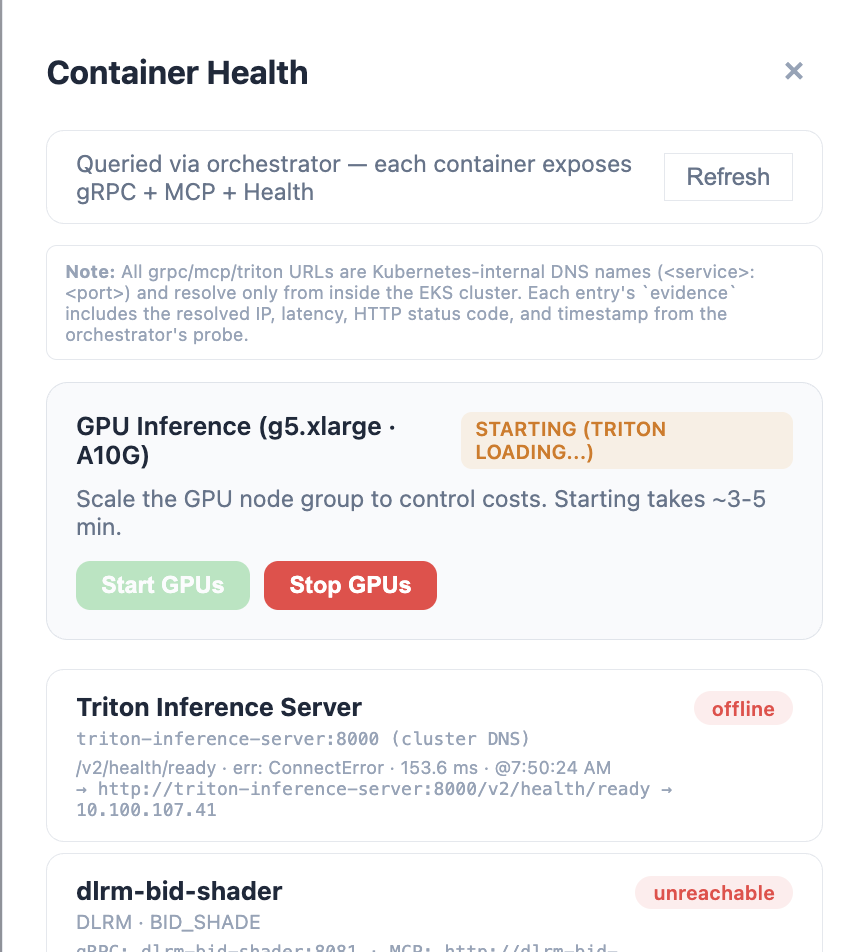
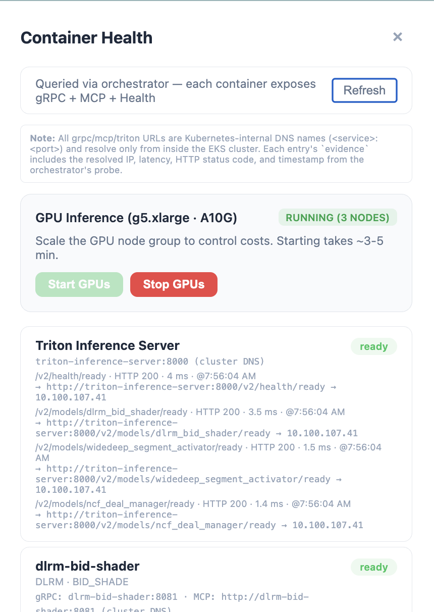
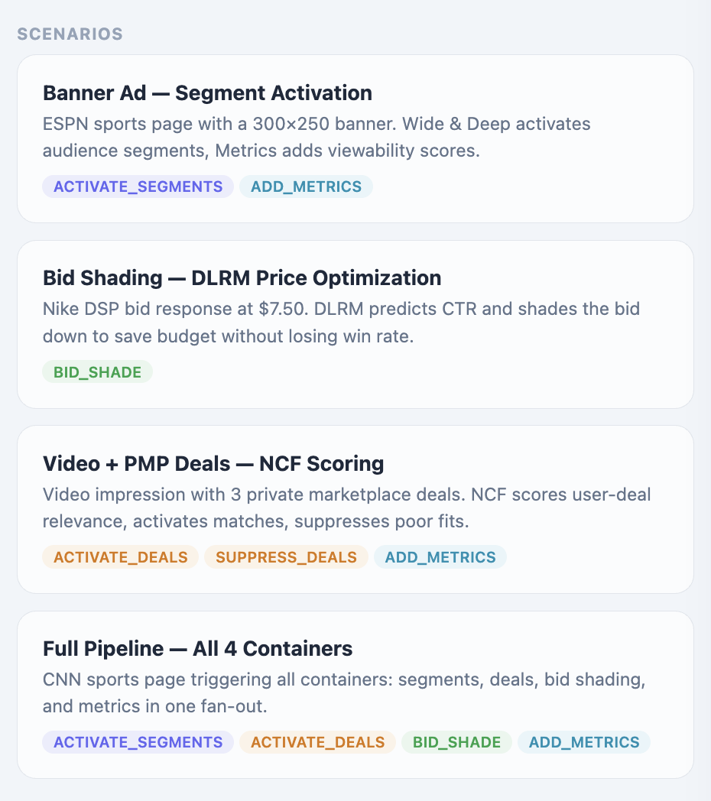
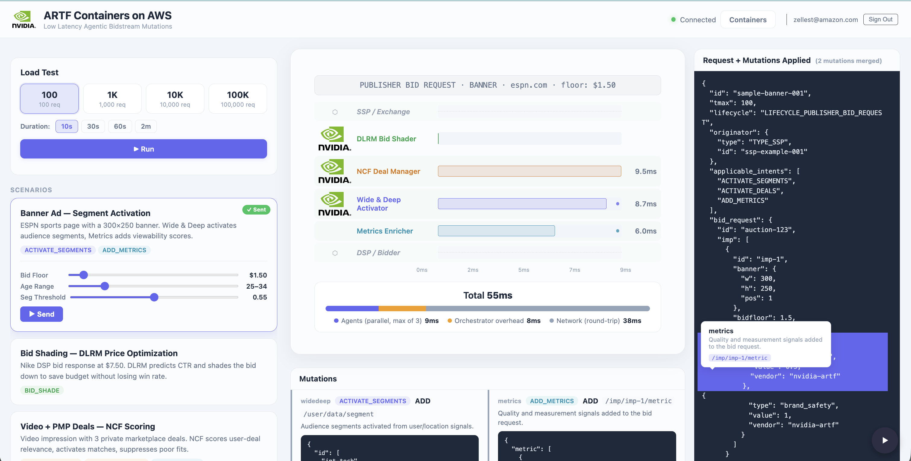

<!-- ==========================================================================
     ⚠️  NOT THE CURRENT README — DO NOT PUBLISH OR LINK TO THIS FILE YET.
     ==========================================================================
     This is a staged replacement for README.md, written for the state of the
     repo AFTER the Yield Optimizer is split into two independent containers.
     It claims SIX containers. That is not true yet — the shipped repo has
     five container directories and five Kubernetes Deployments, with both
     yield models served by one container.

     Swap this file over README.md only once ALL of the following are true:
       1. Two container source packages exist (one per yield model).
       2. Two ECR repositories / images build, with two build keys in
          deploy.sh's content-hash map.
       3. deployment/eks/artf-containers-deployment.yaml has two
          Deployment/Service/HPA sets for the yield models.
       4. The orchestrator's CONTAINERS list has two entries (and
          container_to_model no longer needs the two-model tuple case).
       5. Load tests can target each yield model independently.
       6. `kubectl get pods` genuinely shows six ARTF containers.

     Plan of record: aidlc-docs/inception/requirements/
                     yield-container-split-requirements.md  (gitignored, local)

     NAMING ASSUMPTION: this draft uses container names
     `yield-optimizer-floor` / `yield-optimizer-margin` and display names
     "Yield Optimizer — Floor" / "Yield Optimizer — Margin", matching the
     labels ALREADY shipped in GovernancePanel.jsx's TRAINING_MODEL_TYPES.
     That corresponds to option (B) of the spec's open Question 1. If you
     answer Q1 differently, every name in this file must be reconciled before
     the swap.

     Search this file for "FUTURE-CHECK" to find every claim that depends on
     the split actually being done.
     ========================================================================== -->

# Guidance for Accelerator-Optimized Agentic Bidding on AWS

Run AI models that price bids, activate audience segments, and manage private marketplace deals in real time — accelerated by NVIDIA GPUs, deployed on Amazon EKS.

> 📄 **Full guidance document:** See [GUIDANCE.md](GUIDANCE.md) for the complete published guidance, including architecture details, model specifications, scaling scenarios, and Well-Architected analysis.

## Table of Contents

1. [Quick start](#quick-start)
2. [What just happened?](#what-just-happened)
3. [Try it](#try-it)
4. [Go deeper](#go-deeper)
    - [Architecture](#architecture)
    - [Cost](#cost)
    - [Prerequisites](#prerequisites)
    - [Customizing your deployment](#customizing-your-deployment)
    - [Part 2: closed-loop learning](#part-2-closed-loop-learning)
    - [Next steps](#next-steps)
5. [Cleanup](#cleanup)
6. [Notices](#notices)

## Quick start

Before you start, you'll need an AWS account with permission to create Amazon EKS, EC2 (including `g5` GPU instances), S3, ECR, CloudFront, Cognito, and IAM resources, and a `g5.xlarge` GPU quota in your target Region. `deploy.sh` checks for the required CLI tools at startup and tells you exactly what's missing — see [Prerequisites](#prerequisites) for the full list if you want to check ahead of time.

You'll also need an **NVIDIA NGC API key**. `deploy.sh` deploys the closed-loop retraining stack by default ([Part 2](#part-2-closed-loop-learning)), which builds an NVIDIA NeMo-RL training container from a gated NGC image — the key is what authenticates that pull. Get a free one:

1. Create an account (or sign in) at [ngc.nvidia.com/signin](https://ngc.nvidia.com/signin).
2. Click your account icon (top right) → **Setup** → **Generate Personal Key** (older accounts: **Account Settings** → **Generate API Key**).
3. Give the key a name, leave the default expiration/services, and click **Generate Personal Key**. Copy it now — NGC only shows it once.

```bash
git clone https://github.com/aws-solutions-library-samples/guidance-for-accelerator-optimized-agentic-bidding-on-aws.git
cd guidance-for-accelerator-optimized-agentic-bidding-on-aws/deployment
./deploy.sh --ngc-key YOUR_NGC_API_KEY
```

`deploy.sh` stores the key in AWS Secrets Manager and reuses it automatically on later runs of the same stack — you only need to pass `--ngc-key` once. It provisions everything: an EKS cluster with GPU and CPU node groups, NVIDIA Triton Inference Server, the bidding containers, the orchestrator, and a React frontend behind CloudFront. It takes roughly 30–40 minutes. When it finishes, it prints a URL and a demo login — open the URL in your browser.

Don't want the closed-loop stack (and don't want to create an NGC account)? Skip it — the core real-time bidding pipeline doesn't need NGC credentials:

```bash
./deploy.sh --no-retraining
```

Want a separate, namespaced deployment (for example to run more than one environment in the same account)? Add `--prefix`:

```bash
./deploy.sh --ngc-key YOUR_NGC_API_KEY --prefix stg
```

## What just happened?

```
Browser (React UI)
    |
    |  sign in (Cognito) + HTTPS
    v
+--------------------------------+
|  Amazon CloudFront + S3        |
|  (serves the UI)               |
+--------------------------------+
    |
    |  POST /api/*
    v
+--------------------------------+
|  Orchestrator (EKS)            |
|  verifies the login, fans      |
|  out the bid request           |
+--------------------------------+
    |
    |  parallel calls
    v
+--------------------------------+
|  6 ARTF containers (EKS)       |
|  bid pricer, audience          |
|  activator, deal scorer,       |
|  signals enricher,             |
|  yield optimizer floor,        |
|  yield optimizer margin        |
+--------------------------------+
    |
    |  4 of the 6 call Triton
    v
+--------------------------------+
|  NVIDIA Triton (GPU node)      |
|  runs the AI models            |
+--------------------------------+
```

<!-- FUTURE-CHECK: six containers, one job each. -->
`deploy.sh` deployed an Amazon EKS cluster with two node groups: a GPU node running NVIDIA Triton Inference Server, and CPU nodes running the orchestrator and six bidding containers, each responsible for one job in the pipeline:

| Container | What it does |
|-----------|---------------|
| **Bid Pricer** | Shades every bid down to the lowest price still likely to win |
| **Audience Activator** | Activates audience segments from bid-request signals |
| **Deal Scorer** | Scores and activates/suppresses private marketplace deals |
| **Signals Enricher** | Adds viewability and brand-safety quality signals |
| **Yield Optimizer — Floor** | Publisher/SSP-side — adjusts the floor price on private marketplace deals |
| **Yield Optimizer — Margin** | Publisher/SSP-side — adjusts the margin taken on private marketplace deals |

The orchestrator fans out every incoming bid request to all six containers in parallel, merges their mutations, and returns a single response — the fan-out includes both yield containers, so each is exercised whenever a scenario carries a deal with the matching floor- or margin-adjustable intent. A React frontend, served through CloudFront and authenticated by Cognito, lets you submit sample payloads and inspect the results — that's the "Try it" step below.

The two yield containers are deliberately separate. `ADJUST_DEAL_FLOOR` and `ADJUST_DEAL_MARGIN` are independent, atomic ARTF intents — neither is gated on the other — so each gets its own model, its own container, and its own scaling and failure boundary. A failure in one cannot affect the other's request path.

### Which models exist, and how each one is served

Containers and models are not 1:1. Four of the six containers run a real model on
the GPU; two are deterministic rule engines with no model at all. Every model that
exists has exactly one container, and every model is a fully separate unit — its own
Triton model name, its own config, its own SageMaker Model Package Group, its own
training job, and its own promotion lifecycle.

<!-- FUTURE-CHECK: each yield model maps to its own container in this table. -->

| Model | Container | Type | Artifact served | Triton backend | GPU |
|---|---|---|---|---|---|
| `dlrm_bid_shader` | Bid Pricer | DLRM (PyTorch) | TensorRT `.plan`, compiled from ONNX | `tensorrt_plan` | Yes |
| `ncf_deal_manager` | Deal Scorer | NCF/NeuMF (PyTorch) | TensorRT `.plan`, compiled from ONNX | `tensorrt_plan` | Yes |
| `deal_yield_manager_floor` | Yield Optimizer — Floor | XGBoost regressor | native `xgboost.json` | `fil` | Yes |
| `deal_yield_manager_margin` | Yield Optimizer — Margin | XGBoost regressor | native `xgboost.json` | `fil` | Yes |
| *(none — rules)* | Audience Activator | deterministic rules | n/a | n/a | No |
| *(none — rules)* | Signals Enricher | deterministic rules | n/a | n/a | No |

The two yield models share one thing by design: the **7-element feature vector** both
consume. That derivation lives in shared code rather than being duplicated per
container, because the Glue ETL job reconstructs the same vector when building
training data — if the two containers computed it differently, or drifted from the
ETL job, training data would silently stop matching what the models see at inference
time.

**Two different serving paths, and why.** ONNX and FIL are not alternatives to each
other — one is a file format, the other is an inference engine:

- **Neural networks (DLRM, NCF).** PyTorch → **ONNX** (a portable file format for
  neural networks) → NVIDIA **TensorRT** compiles that ONNX into a `.plan` engine
  tuned for the specific GPU → Triton serves the `.plan`. The compile step is what
  TensorRT is for.
- **Tree models (floor, margin).** XGBoost → native `xgboost.json` → NVIDIA's
  **FIL** (Forest Inference Library, from RAPIDS/cuML, bundled in Triton) reads that
  format directly on the GPU. **There is no ONNX and no compile step in this path** —
  FIL loads the tree model as-is.

Both paths run inside the same Triton server on the same GPU node. Note that
`dlrm_bid_shader` and `ncf_deal_manager` are each fronted by a small Python-backend
router on CPU that splits traffic between `*_stable` and `*_canary` versions; the two
yield models are currently single-version and loaded directly, with no router.

> **On the XGBoost version pin.** `xgboost` is pinned to `1.7.6` deliberately. Newer
> versions write a `"cats"` field into the saved JSON that Triton 24.08's bundled FIL
> backend rejects outright (`Error: key "cats" is not recognized!`), which would take
> both yield models down. The pin matches the SageMaker training-side version.

> **Note on the two yield containers.** Earlier releases served both yield models from
> a single container. They are now split, so each model has its own container, image,
> Kubernetes Deployment, HPA, and load-test target — matching how every other model in
> this guidance is deployed. The Triton model names (`deal_yield_manager_floor` /
> `deal_yield_manager_margin`) and their SageMaker Model Package Groups are unchanged
> from before the split, so existing registered model versions and promotion history
> carry over.

> **Note on the models.** The bundled models (DLRM, NCF, and both XGBoost models) ship with **seeded, untrained weights**. They exercise the real GPU inference path but don't make meaningful predictions until you train them on your own data — see [Next steps](#next-steps). The audience activator and signals enricher are deterministic rule engines, not models.

<!-- FUTURE-CHECK: exploration paths point at the two split container packages. -->
> **How the yield models break their own cold start.** A freshly seeded XGBoost model has no reason to recommend anything other than "no change" — and "no change" never produces a mutation, so it never generates an outcome for itself to learn from. Both yield containers run an exploration step after the model returns its prediction, which nudges the recommendation by a small, bounded random amount instead of always returning the same answer. It is **on by default** (`YIELD_EXPLORATION_EPSILON=0.1`, settable independently per container) but **structurally scoped to load-test and demo traffic only** — live auction bids are never perturbed, regardless of how that value is set. Every nudged response is disclosed with a `:explore` suffix on `model_version`, so training data never mistakes an exploratory probe for a real recommendation. That's what produces the variation each model's [training pipeline](CLOSED_LOOP.md#yield-optimizer-bootstrapping-training-data-without-a-live-signal-path-yet) needs to have something to learn from.

### The 5 deployment phases

`deploy.sh` prints its progress as 5 numbered phases (`Phase N/5: ...`). Pass `--verbose` to see every underlying command instead of just the phase summaries; use `--start-at N` to resume from a given phase (for example after fixing a one-off failure) without redoing earlier ones.

| Phase | What happens |
|-------|---------------|
| **1/5 — Preparing models** | Creates the ECR repositories and the DynamoDB load-test-history table; exports the PyTorch DLRM/NCF models to ONNX and the yield optimizer's genesis XGBoost models (best-effort — the deploy continues even if this step is skipped); uploads all of it, plus the Triton router/model-config repository, to the S3 model bucket. |
| **2/5 — Building containers & provisioning infrastructure** | Builds and pushes any container image whose source has changed (remotely via AWS CodeBuild by default, or locally with `--local-build`) **at the same time** it creates the EKS cluster (GPU + CPU node groups) — the two don't depend on each other, so running them in parallel is roughly half the wait of doing them one after another. Then installs the NVIDIA Kubernetes device plugin and sets up the IAM/IRSA roles Triton, the Model Optimizer, and the orchestrator need. |
| **3/5 — Deploying workloads** | Provisions the Cognito user pool, then applies the Kubernetes manifests for Triton, the six ARTF containers, and the orchestrator. Kicks off a one-shot Kubernetes Job that compiles the base TensorRT engines on the GPU node — this runs in the background and does **not** block the rest of the deploy; Triton picks the compiled engines up automatically once they're ready (see the "Confirm everything is healthy" note below). Also configures the included daily GPU-node scheduled shutdown. |
| **4/5 — Setting up access** | Deploys the React frontend (S3 + CloudFront) and creates the demo admin user in Cognito. |
| **5/5 — Registering agents** | Registers the Amazon Bedrock AgentCore MCP runtime, then — unless you passed `--no-retraining` — deploys the entire Part 2 closed-loop stack: the bid-outcome feedback pipeline, the Glue ETL job, the SageMaker Model Registry groups (seeded with genesis model versions), the NeMo-RL training container (built asynchronously — this is the long build the NGC key is for), the Adaptive Bidding and Governance AgentCore agent runtimes, their EventBridge invocation schedules, and a final frontend rebuild wired with the real agent ARNs. |

**Cost while it's running:** approximately **$762/month** with the included daytime-only GPU schedule (about **$1,250/month** if the GPU node runs 24/7) — this includes Part 2 (closed-loop learning), which deploys by default. See [Cost](#cost) for the breakdown. Deploy, try it, and [tear it down](#cleanup) when you're done — a short session costs a few dollars.

**Confirm everything is healthy:**

```bash
kubectl get nodes    # at least one GPU node + CPU nodes, all Ready
kubectl get pods     # Triton, the 6 containers, and the orchestrator all Running
```

Triton and the model-optimizer bootstrap Job may take a few minutes to finish loading/compiling models after the script exits — `deploy.sh`'s final summary tells you whether that finished and how to check.

## Try it

1. Open the frontend URL from the deployment summary and sign in with the demo username and password shown there. On first login, Cognito will prompt you to set a new password.

2. Click **Containers** in the navigation to check status. The GPU node group scales to zero when idle to save cost — if Triton shows *offline*, click **Start GPUs** (takes about 3–5 minutes).

   

   Once Triton has loaded its models, every container shows a green **ready** badge.

   

3. Click one of the pre-built **Scenarios** to run it through the pipeline:

   

   | Scenario | Containers exercised |
   |----------|----------------------|
   | Banner Ad — Segment Activation | Audience Activator, Signals Enricher |
   | Bid Shading — Price Optimization | Bid Pricer |
   | Video + PMP Deals — Deal Scoring | Deal Scorer, Signals Enricher |
   | SSP Enrichment — 3 Containers | Audience Activator, Deal Scorer, Signals Enricher |
   | PMP Deals — Yield Optimizer | Yield Optimizer — Floor, Yield Optimizer — Margin |

   

   The result view shows the mutated bid request, a per-container latency breakdown, and the individual mutations each container proposed.

4. (Optional) Call the same pipeline over MCP. An Amazon Bedrock AgentCore runtime exposes an `extend_rtb` tool that any Bedrock-hosted agent can invoke — see [GUIDANCE.md](GUIDANCE.md#amazon-bedrock-agentcore-integration) for a working example.

<!-- FUTURE-CHECK: floor and margin are independently selectable load-test targets. -->
5. (Optional) Click **Load Test** in the navigation to generate synthetic traffic against any single container — including either yield container, selectable independently. This isn't only a throughput demo: for the yield models, load-test traffic travels the same real closed-loop feedback path production traffic uses (a real `DealYieldOutcomeEvent`, tagged `source=load_test` so it's never confused with production data), which is how their training data actually gets bootstrapped before real auction outcomes accumulate. See [Part 2: closed-loop learning](#part-2-closed-loop-learning).

## Go deeper

### Architecture


An Amazon EKS cluster runs two node groups: a `g5`-family GPU node group (NVIDIA A10G, or the more powerful Amazon EC2 G7e) running NVIDIA Triton Inference Server, and a `c5.xlarge` CPU node group running the orchestrator and the bidding containers. Two containers — the bid pricer and the deal scorer — call Triton for GPU-accelerated inference; the audience activator and signals enricher are deterministic rule engines on CPU; the yield optimizer calls Triton's Forest Inference Library backend for its XGBoost model. Amazon CloudFront + S3 serve the React frontend; Amazon Cognito authenticates users; an optional Amazon Bedrock AgentCore runtime exposes the same pipeline over MCP.

Full component-by-component detail, model specifications, and a request-flow diagram: [assets/images/architecture.md](assets/images/architecture.md). Container-naming history (what changed, what didn't, and why): [RENAME_MAP.md](RENAME_MAP.md).

### Cost

Sample estimate for the default settings in `us-east-1`, assuming the included scheduled GPU shutdown (~260 GPU-hours/month). `deploy.sh` deploys Part 2 (closed-loop learning) by default, so this table includes both parts, tagged by which part each line item belongs to:

| AWS service | Part | Cost [USD/month] |
| ----------- | ---- | ----------------- |
| Amazon EKS | Part 1 | $73 |
| Amazon EC2 (GPU, ~260 hrs/mo) | Part 1 | $262 |
| Amazon EC2 (CPU) | Part 1 | $248 |
| Everything else (S3, CloudFront, Cognito, DynamoDB, AgentCore) | Part 1 | ~$9 |
| Amazon DynamoDB (parameter store, audit trail, user features) | Part 2 | ~$5 |
| Amazon Bedrock AgentCore (Adaptive Bidding Agent) | Part 2 | ~$15 |
| Amazon Bedrock AgentCore (Governance Agent) | Part 2 | ~$2 |
| Amazon SageMaker Training | Part 2 | ~$60 |
| AWS Glue (2 scheduled ETL jobs — bid outcomes, deal-yield outcomes) | Part 2 | ~$88 |
| Amazon EventBridge Scheduler | Part 2 | <$1 |
| **Total** | | **~$762** |

Running the GPU node 24/7 instead of on the included schedule raises the total to roughly **$1,250/month**. The `g5.xlarge` line item can be swapped for the more powerful Amazon EC2 G7e instances at higher cost. Skip Part 2 entirely with `--no-retraining` to drop the Part 2 rows above. Full line-item detail: [GUIDANCE.md](GUIDANCE.md#cost-estimation) (Part 1) and [GUIDANCE-part2.md](GUIDANCE-part2.md#cost-estimation) / [CLOSED_LOOP.md](CLOSED_LOOP.md#cost) (Part 2, including the optional DAX add-on not counted above).

### Prerequisites

**Operating system:** macOS or Linux (for example Amazon Linux 2023 or Ubuntu). The deployment scripts are POSIX shell and Python; Windows users should run them inside WSL2.

**Third-party tools** (minimum versions; `deploy.sh` checks these at startup):

```bash
aws --version                                    # AWS CLI v2, with credentials configured
pip install boto3 torch onnx onnxscript          # Python 3.11+
brew install jq eksctl kubectl                   # or your Linux package manager
docker buildx version                            # only needed for --local-build
```

**AWS account requirements:** permission to create Amazon EKS clusters, EC2 instances (including `g5` GPU instances), S3 buckets, ECR repositories, CloudFront distributions, Cognito user pools, DynamoDB tables, and IAM roles. A `g5.xlarge` (NVIDIA A10G) service quota in your target Region — check the *Running On-Demand G and VT instances* quota in the [Service Quotas console](https://console.aws.amazon.com/servicequotas/) before deploying.

**NVIDIA NGC API key:** required by default, since Part 2 (closed-loop retraining) is on unless you pass `--no-retraining`. `nvcr.io/nvidia/tritonserver` itself is a public image and needs no key. See the [Quick start](#quick-start) above for how to get one.

**Supported Regions:** any Region with Amazon EKS and `g5`-family (or G7e) instances, including `us-east-1` (default), `us-west-2`, `eu-west-1`, `eu-central-1`, `ap-northeast-1`, and `ap-southeast-2`.

### Customizing your deployment

```bash
./deploy.sh --prefix v1                    # namespaced resources (v1-*)
./deploy.sh --skip-images                  # reuse existing images
./deploy.sh --skip-cluster                 # reuse an existing EKS cluster
./deploy.sh --local-build                  # build images locally with Docker instead of CodeBuild
./deploy.sh --no-retraining                # Part 1 only — skip the closed-loop stack (see below)
./deploy.sh --ngc-secret my-secret-name    # reuse an NGC key already stored in Secrets Manager
./deploy.sh --maxGPUs 5                    # raise the GPU node group's max size (default 3)
./deploy.sh --artf-node-role inference     # co-locate the model containers on the GPU node
./deploy.sh --start-at 3                   # resume from Phase 3 (see the breaking-change note below)
./deploy.sh --verbose                      # print full detailed logs, not just phase summaries
AWS_REGION=us-west-2 ./deploy.sh           # deploy to a different Region
```

By default, images build remotely on **AWS CodeBuild** — no local Docker required, and ARM64 images (AgentCore) build natively on Graviton. The first deploy provisions a CodeBuild stack automatically; later runs skip rebuilding images whose source hasn't changed. Pass `--local-build` if you'd rather build with Docker on your own machine (needs ~30 GB free disk, plus buildx for the ARM64 cross-compile).

The closed-loop stack (on by default) also builds an NVIDIA NeMo-RL training container from a gated NGC image, which is a long build (15–50 minutes) that runs asynchronously — the rest of the deployment doesn't wait on it. If you already stored your NGC key in Secrets Manager on a prior run (or via `aws secretsmanager create-secret --name my-secret-name --secret-string YOUR_NGC_API_KEY`), pass `--ngc-secret my-secret-name` instead of `--ngc-key` to reuse it. Check the NeMo build's status any time with:

```bash
./check_builds.sh --prefix stg          # one-time check
./check_builds.sh --prefix stg --watch  # refresh every 30s
```

**Breaking change:** `deploy.sh --start-at` now takes a phase number 1–5 instead of the old internal step numbers. If you have scripts referencing the old numbering, see the old-step-to-new-phase mapping table in [RENAME_MAP.md](RENAME_MAP.md).

### Part 2: closed-loop learning

The models above ship with static, untrained weights. Part 2 closes the loop: it watches real bid outcomes, retrains and validates new model versions, and tunes bidding parameters continuously — all without touching the real-time bidding path. It's deployed by default (`--with-retraining`) alongside Part 1.

**How each model is retrained.** The two serving paths from Part 1 carry through to
two different retraining paths, one per model type:

| Model | Trained by | Training data | Result loaded as | Compile step? |
|---|---|---|---|---|
| `dlrm_bid_shader` | NVIDIA **NeMo-RL** container on SageMaker | `training-data/` | ONNX → TensorRT `.plan` | Yes (`trtexec`) |
| `ncf_deal_manager` | NVIDIA **NeMo-RL** container on SageMaker | `training-data/` | ONNX → TensorRT `.plan` | Yes (`trtexec`) |
| `deal_yield_manager_floor` | SageMaker **built-in XGBoost** | `training-data-deal-yield-floor/` | native `xgboost.json` | **No** |
| `deal_yield_manager_margin` | SageMaker **built-in XGBoost** | `training-data-deal-yield-margin/` | native `xgboost.json` | **No** |
| Audience Activator, Signals Enricher | *not applicable* — rule engines | — | — | — |

Each model has its own SageMaker Model Package Group, so versions, approval status,
and promotions are tracked independently. The two yield models train from two
separately labeled datasets produced by a **single** Glue ETL job — one job is
sufficient because its dedup key includes the ARTF intent, which is what separates
floor rows from margin rows. Tree models skip TensorRT entirely: FIL loads the
retrained `xgboost.json` directly, so there is no engine-compile stage in that path.

Because the two yield containers are now separate load-test targets, you can also
bootstrap training data for one model without generating traffic for the other.

See [CLOSED_LOOP.md](CLOSED_LOOP.md) for how to deploy it separately, try the Adaptive Bidding and Governance demos, disable the scheduled components to control cost, and its own cost breakdown. For the full architecture and Well-Architected analysis, see [GUIDANCE-part2.md](GUIDANCE-part2.md).

### Next steps

- **Bring your own models.** The bundled models exercise the inference path but aren't trained on real data — there's no portable "pretrained" checkpoint to drop in, since the embedding tables are keyed to a particular feature vocabulary. Train real weights on a representative dataset, align each container's feature-engineering (`source/containers/<name>/app.py`) and Triton `config.pbtxt` to the new ONNX signature, then re-run `deploy.sh --export-only` to regenerate and upload the models.
- **Add or swap containers.** Use the containers under `source/containers/` as reference implementations for additional ARTF intents, then register them with the orchestrator fan-out.
- **Scale for production traffic.** The included Horizontal Pod Autoscalers and Cluster Autoscaler scale with load; raise `--maxGPUs` or edit `deployment/eks/cluster-config.yaml` for higher ceilings. See [GUIDANCE.md](GUIDANCE.md#scaling-scenarios) for reference sizing at different QPS levels.
- **Connect to a live DSP.** Route real OpenRTB bid requests through the orchestrator before auction execution, and apply the returned mutations to your bidstream. See [GUIDANCE.md](GUIDANCE.md#integration-with-a-dsp) for the integration steps.

## Cleanup

```bash
cd deployment
./deploy.sh --destroy
```

The script prompts for confirmation — type `destroy` to proceed. Include the same `--prefix` used at deploy time to tear down a specific namespaced stack.

`--destroy` removes the Kubernetes workloads, the EKS cluster (both node groups), the S3 model bucket, the DynamoDB load-test table, the CloudFront distribution and frontend bucket, the AgentCore runtime, the Cognito user pool, and the IAM policies/roles this Guidance created.

**Retained by design:** Amazon ECR repositories persist across deployments so cached images survive between runs. Delete them manually from the ECR console or CLI if you no longer need them.

**Required permission for teardown:** disabling CloudFormation termination protection (which `eksctl` enables automatically) needs `cloudformation:UpdateTerminationProtection`. If your session denies that action, `--destroy` logs a warning and the EKS stacks won't delete — re-run it from a session that allows the action.

## Notices

*Customers are responsible for making their own independent assessment of the information in this Guidance. This Guidance: (a) is for informational purposes only, (b) represents AWS current product offerings and practices, which are subject to change without notice, and (c) does not create any commitments or assurances from AWS and its affiliates, suppliers or licensors. AWS products or services are provided "as is" without warranties, representations, or conditions of any kind, whether express or implied. AWS responsibilities and liabilities to its customers are controlled by AWS agreements, and this Guidance is not part of, nor does it modify, any agreement between AWS and its customers.*
