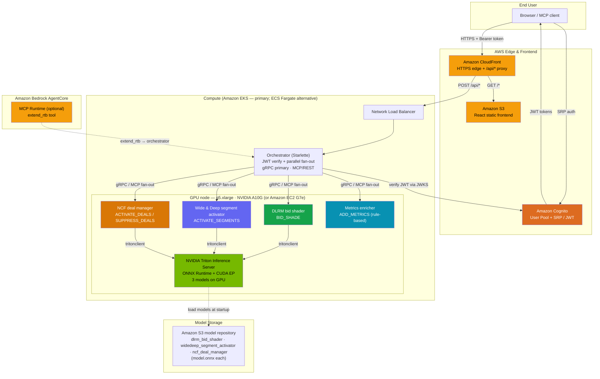

# Architecture — Guidance for Accelerator-Optimized Agentic Bidding on AWS

This document describes the solution architecture and its request flow. It is the
text companion to the architecture visual. The canonical embeddable image for the
top-level `README.md` is **`assets/images/architecture.svg`** (a hand-authored SVG,
not a draw.io export). The Mermaid diagram below renders inline on GitHub and gives
the same picture in a maintainable, text-authored form.

## Solution overview

The solution implements **four** ARTF-compliant (IAB Tech Lab Agentic RTB Framework)
containers that produce real-time bidstream mutations for OpenRTB auctions. Each
container maps to one ARTF intent (or intent pair) and, where it needs a model,
calls **NVIDIA Triton Inference Server** for GPU-accelerated inference:

| Container | ARTF intent(s) | Model served by Triton |
|-----------|----------------|------------------------|
| DLRM bid shader (`dlrm_bid_shader`) | `BID_SHADE` | DLRM → predicted CTR |
| Wide & Deep segment activator (`widedeep_segment_activator`) | `ACTIVATE_SEGMENTS` | Wide & Deep → segment scores |
| NCF deal manager (`ncf_deal_manager`) | `ACTIVATE_DEALS`, `SUPPRESS_DEALS` | NCF / NeuMF → per-deal relevance |
| Metrics enricher (`metrics_enricher`) | `ADD_METRICS` | Rule-based (no Triton) |

Triton serves **three ONNX models** (DLRM, Wide & Deep, NCF) on a single NVIDIA
**A10G GPU** (`g5.xlarge`) using ONNX Runtime with the CUDA Execution Provider; for
higher throughput, the more powerful Amazon EC2 **G7e** instances are an
alternative. The metrics enricher is rule-based and needs no GPU model.

> **Note on the models.** These three models are *reference architectures* following
> the published NVIDIA DeepLearningExamples (DLRM, NeuMF/NCF) and NVIDIA Merlin
> (Wide & Deep) designs. They are defined in `source/triton/export_models.py` and
> exported to ONNX with **randomly initialized (seeded) weights** — they are **not
> pretrained or production-trained**. They exist to demonstrate the GPU inference path
> and the ARTF container/Triton integration; train the architectures on your own data
> (or supply your own ONNX models) before relying on their predictions. The Triton
> Inference Server image (`nvcr.io/nvidia/tritonserver:24.08-py3`) is the genuine
> upstream NVIDIA NGC container.

An **orchestrator** (Starlette) receives the OpenRTB request, verifies the caller's
Amazon Cognito JWT, and **fans out in parallel** to the four containers over gRPC
(primary ARTF protocol) with an MCP/REST path for AI-agent and tool interoperability.
It merges the per-container mutations into a single `RTBResponse`.

A **React frontend** is hosted on Amazon S3 and delivered through Amazon CloudFront;
Amazon Cognito provides user-pool authentication (SRP, admin-created users, no
self-signup). An optional **Amazon Bedrock AgentCore MCP runtime** exposes the same
`extend_rtb` capability to Bedrock-hosted AI agents.

## Architecture diagram (Mermaid)

## Request flow

1. The user authenticates against **Amazon Cognito** (SRP, email + password) and
   receives JWT access and ID tokens.
2. The browser calls **CloudFront** over HTTPS with a `Bearer` token. CloudFront
   serves the React app from **S3** for `GET /*` and proxies `POST /api/*` to the
   **Network Load Balancer**.
3. The **orchestrator** verifies the JWT (RS256, JWKS cached from Cognito) and rejects
   unauthenticated requests.
4. The orchestrator **fans out the OpenRTB request in parallel** to the four
   containers, respecting the OpenRTB `tmax` timeout.
5. The DLRM, Wide & Deep, and NCF containers call **Triton** via `tritonclient` for
   GPU inference; the metrics enricher returns rule-based mutations.
6. **Triton** loads the three ONNX models from the **S3 model repository** at startup
   and runs inference on the A10G GPU (or the more powerful Amazon EC2 G7e).
7. The orchestrator **merges** all mutations into a single `RTBResponse` and returns
   it through the NLB and CloudFront to the caller.

The same fan-out is reachable as an MCP tool (`extend_rtb`) — either through the
orchestrator's `/api/mcp` endpoint or through the optional **Bedrock AgentCore** MCP
runtime.

## Deployment paths

- **Primary — Amazon EKS** via `deployment/deploy.sh`: provisions ECR repositories,
  exports and uploads ONNX models to S3, builds and pushes images, creates/reuses the
  EKS cluster (GPU `g5.xlarge` — or the more powerful Amazon EC2 G7e — + CPU `c5.xlarge` node groups), installs the NVIDIA
  device plugin, applies the manifests under `deployment/eks/`, and deploys the
  frontend (S3 + CloudFront + Cognito).
- **Alternative — Amazon ECS Fargate** via `deployment/scripts/deploy_ecs.py`: an
  alternative compute path for running the same containers without managing a
  Kubernetes cluster.
