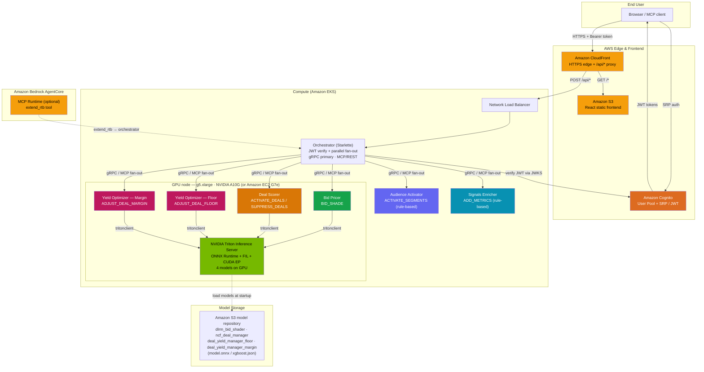

# Architecture — Guidance for Accelerator-Optimized Agentic Bidding on AWS

This document describes the solution architecture and its request flow. It is the
text companion to the architecture visual. The canonical embeddable image for the
top-level `README.md` is **`assets/images/architecture.svg`** (a hand-authored SVG,
not a draw.io export). The Mermaid diagram below renders inline on GitHub and gives
the same picture in a maintainable, text-authored form.

## Solution overview

The solution implements **six** ARTF-compliant (IAB Tech Lab Agentic RTB Framework)
containers, each doing one job in the bidstream. Four run GPU-accelerated inference
on **NVIDIA Triton Inference Server**; two are deterministic and rule-based on CPU:

| Container | What it does | ARTF intent(s) | Model (implementation detail) |
|-----------|--------------|-----------------|--------------------------------|
| **Bid Pricer** (`bid-pricer`) | Prices bids by shading down from a CTR prediction | `BID_SHADE` | DLRM (Triton) |
| **Audience Activator** (`audience-activator`) | Activates audience segments from bid-request signals | `ACTIVATE_SEGMENTS` | Rule-based (no Triton) |
| **Deal Scorer** (`deal-scorer`) | Scores and activates/suppresses PMP deals | `ACTIVATE_DEALS`, `SUPPRESS_DEALS` | NCF / NeuMF (Triton) |
| **Signals Enricher** (`signals-enricher`) | Adds viewability + brand-safety quality signals | `ADD_METRICS` | Rule-based (no Triton) |
| **Yield Optimizer — Floor** (`yield-optimizer-floor`) | SSP/publisher-side: adjusts the floor price on PMP deals | `ADJUST_DEAL_FLOOR` | XGBoost via Triton FIL (Triton) |
| **Yield Optimizer — Margin** (`yield-optimizer-margin`) | SSP/publisher-side: adjusts the margin taken on PMP deals | `ADJUST_DEAL_MARGIN` | XGBoost via Triton FIL (Triton) |

Triton serves **two deep-learning models** (DLRM for the bid pricer, NCF for the
deal scorer) plus **two independent XGBoost tree models** for the yield optimizer
(one for floor, one for margin, each served by its own container — Triton's Forest
Inference Library backend doesn't support multi-output regression, so these were
always two models) on a single NVIDIA **A10G GPU** (`g5.xlarge`) with
the CUDA Execution Provider; for higher throughput, the more powerful Amazon EC2
**G7e** instances are an alternative. The audience activator and signals enricher
are rule-based and need no GPU model. The audience activator previously scored
segments with a Wide & Deep neural network on Triton — that model's ONNX graph
could not be compiled to a TensorRT engine (a `BatchNorm1d` fusion limitation), so
it was replaced with transparent rules over real bid-request signals, and is
slated to be replaced by a partner ISV implementation. See
[RENAME_MAP.md](../../RENAME_MAP.md) for the full old-name → new-name mapping.

> **Serving backend.** The Part 1 baseline serves the exported ONNX models via ONNX
> Runtime. Part 2 is a progression that upgrades Triton serving to compiled **TensorRT
> engine plans** (`tensorrt_plan`), built from the same ONNX by an in-cluster Model
> Optimizer microservice, and rolls new versions out through a Triton-side stable/canary
> router. See the top-level `README.md` (Part 2) for details.

> **Note on the models.** DLRM and NCF are *reference architectures* following the
> published NVIDIA DeepLearningExamples (DLRM, NeuMF/NCF) designs. They are defined
> in `source/triton/export_models.py` and exported to ONNX with **randomly
> initialized (seeded) weights** — they are **not pretrained or production-trained**.
> They exist to demonstrate the GPU inference path and the ARTF container/Triton
> integration; train the architectures on your own data (or supply your own ONNX
> models) before relying on their predictions. The Triton Inference Server image
> (`nvcr.io/nvidia/tritonserver:24.08-py3`) is the genuine upstream NVIDIA NGC
> container.

An **orchestrator** (Starlette) receives the OpenRTB request, verifies the caller's
Amazon Cognito JWT, and **fans out in parallel** to the six containers over gRPC
(primary ARTF protocol) with an MCP/REST path for AI-agent and tool interoperability.
It merges the per-container mutations into a single `RTBResponse`.

A **React frontend** is hosted on Amazon S3 and delivered through Amazon CloudFront;
Amazon Cognito provides user-pool authentication (SRP, admin-created users, no
self-signup). An optional **Amazon Bedrock AgentCore MCP runtime** exposes the same
`extend_rtb` capability to Bedrock-hosted AI agents.

## Architecture diagram (Mermaid)

```mermaid
graph TB
    subgraph User["End User"]
        Browser["Browser / MCP client"]
    end

    subgraph Edge["AWS Edge & Frontend"]
        CF["Amazon CloudFront<br/>HTTPS edge + /api/* proxy"]
        S3F["Amazon S3<br/>React static frontend"]
        COG["Amazon Cognito<br/>User Pool + SRP / JWT"]
    end

    subgraph EKS["Compute (Amazon EKS)"]
        NLB["Network Load Balancer"]
        ORCH["Orchestrator (Starlette)<br/>JWT verify + parallel fan-out<br/>gRPC primary · MCP/REST"]

        subgraph GPU["GPU node — g5.xlarge · NVIDIA A10G (or Amazon EC2 G7e)"]
            TRITON["NVIDIA Triton Inference Server<br/>ONNX Runtime + FIL + CUDA EP<br/>4 models on GPU"]
            DLRM_C["Bid Pricer<br/>BID_SHADE"]
            NCF_C["Deal Scorer<br/>ACTIVATE_DEALS / SUPPRESS_DEALS"]
            YIELD_F["Yield Optimizer — Floor<br/>ADJUST_DEAL_FLOOR"]
            YIELD_M["Yield Optimizer — Margin<br/>ADJUST_DEAL_MARGIN"]
        end

        WD_C["Audience Activator<br/>ACTIVATE_SEGMENTS (rule-based)"]
        MET_C["Signals Enricher<br/>ADD_METRICS (rule-based)"]
    end

    subgraph Models["Model Storage"]
        S3M["Amazon S3 model repository<br/>dlrm_bid_shader · ncf_deal_manager<br/>deal_yield_manager_floor · deal_yield_manager_margin<br/>(model.onnx / xgboost.json)"]
    end

    subgraph Bedrock["Amazon Bedrock AgentCore"]
        AC["MCP Runtime (optional)<br/>extend_rtb tool"]
    end

    Browser -->|"SRP auth"| COG
    COG -->|"JWT tokens"| Browser
    Browser -->|"HTTPS + Bearer token"| CF
    CF -->|"GET /*"| S3F
    CF -->|"POST /api/*"| NLB
    NLB --> ORCH
    ORCH -->|"verify JWT via JWKS"| COG
    ORCH -->|"gRPC / MCP fan-out"| DLRM_C
    ORCH -->|"gRPC / MCP fan-out"| WD_C
    ORCH -->|"gRPC / MCP fan-out"| NCF_C
    ORCH -->|"gRPC / MCP fan-out"| MET_C
    ORCH -->|"gRPC / MCP fan-out"| YIELD_F
    ORCH -->|"gRPC / MCP fan-out"| YIELD_M
    DLRM_C -->|"tritonclient"| TRITON
    NCF_C -->|"tritonclient"| TRITON
    YIELD_F -->|"tritonclient"| TRITON
    YIELD_M -->|"tritonclient"| TRITON
    TRITON -.->|"load models at startup"| S3M
    AC -.->|"extend_rtb → orchestrator"| ORCH

    style TRITON fill:#76b900,color:#000
    style DLRM_C fill:#16a34a,color:#fff
    style WD_C fill:#6366f1,color:#fff
    style NCF_C fill:#d97706,color:#fff
    style MET_C fill:#0891b2,color:#fff
    style YIELD_F fill:#be185d,color:#fff
    style YIELD_M fill:#be185d,color:#fff
    style CF fill:#f59e0b,color:#000
    style S3F fill:#f59e0b,color:#000
    style COG fill:#dd6b20,color:#fff
    style AC fill:#f59e0b,color:#000
```

## Request flow

1. The user authenticates against **Amazon Cognito** (SRP, email + password) and
   receives JWT access and ID tokens.
2. The browser calls **CloudFront** over HTTPS with a `Bearer` token. CloudFront
   serves the React app from **S3** for `GET /*` and proxies `POST /api/*` to the
   **Network Load Balancer**.
3. The **orchestrator** verifies the JWT (RS256, JWKS cached from Cognito) and rejects
   unauthenticated requests.
4. The orchestrator **fans out the OpenRTB request in parallel** to the six
   containers, respecting the OpenRTB `tmax` timeout.
5. The bid pricer, deal scorer, and both yield optimizers call **Triton** via
   `tritonclient` for GPU inference; the audience activator and signals enricher
   return rule-based mutations.
6. **Triton** loads the DLRM/NCF ONNX models and the two yield optimizer XGBoost
   models from the **S3 model repository** at startup and runs inference on the
   A10G GPU (or the more powerful Amazon EC2 G7e).
7. The orchestrator **merges** all mutations into a single `RTBResponse` and returns
   it through the NLB and CloudFront to the caller.

The same fan-out is reachable as an MCP tool (`extend_rtb`) — either through the
orchestrator's `/api/mcp` endpoint or through the optional **Bedrock AgentCore** MCP
runtime.

## Deployment path

- **Amazon EKS** via `deployment/deploy.sh`: provisions ECR repositories,
  exports and uploads ONNX models to S3, builds and pushes images, creates/reuses the
  EKS cluster (GPU `g5.xlarge` — or the more powerful Amazon EC2 G7e — + CPU `c5.xlarge` node groups), installs the NVIDIA
  device plugin, applies the manifests under `deployment/eks/`, and deploys the
  frontend (S3 + CloudFront + Cognito).
