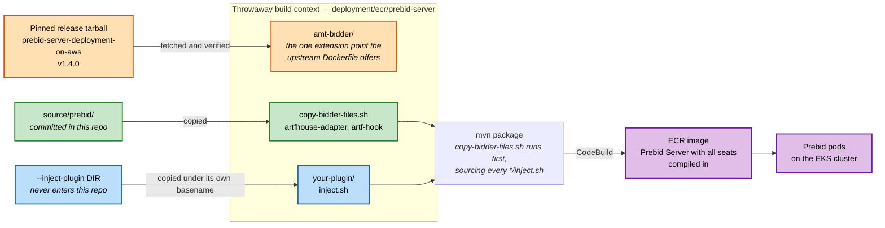
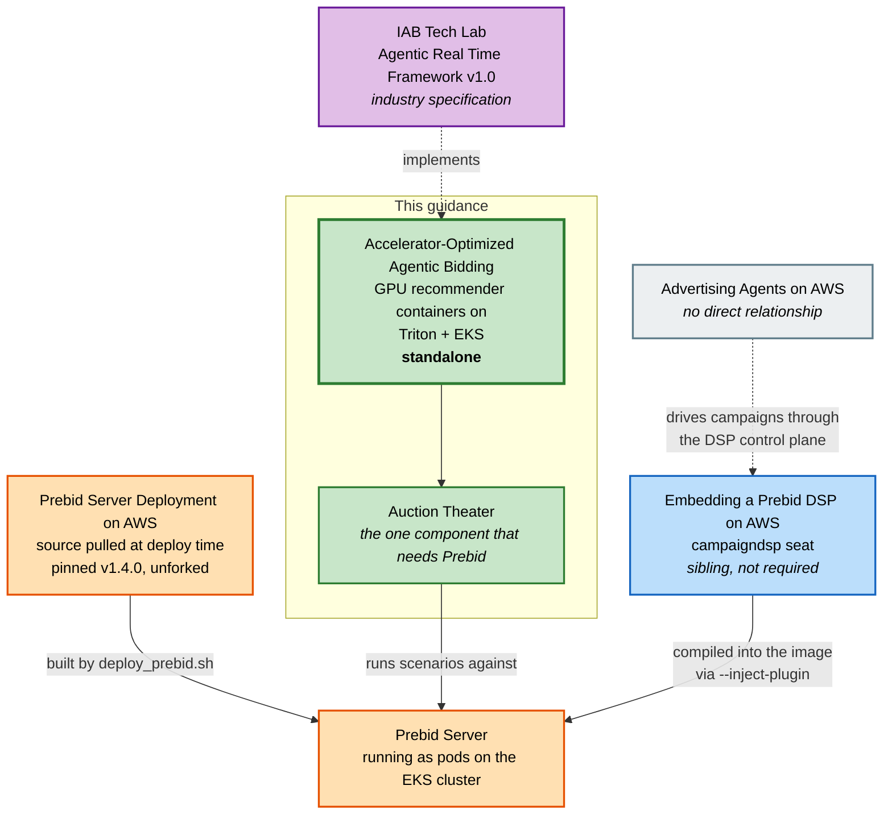

# Integrations

How this guidance composes with the other AWS advertising guidances: what it needs, what it can
host, and what changes when you combine them.

## This guidance

**Guidance for Accelerator-Optimized Agentic Bidding on AWS**

<https://github.com/aws-solutions-library-samples/guidance-for-accelerator-optimized-agentic-bidding-on-aws>

A reference implementation of the IAB Tech Lab **[Agentic Real Time Framework
(ARTF)](https://iabtechlab.com/standards/artf/) v1.0**, in which agent-driven containers receive
an OpenRTB bid request, analyse it, and propose *typed mutations* to the bidstream — adjusting bid
prices, activating audience segments, managing private marketplace deals, adding quality metrics.
The host platform applies approved mutations atomically before the auction continues.

This guidance runs those containers as GPU-accelerated inference on NVIDIA Triton on EKS, within
the OpenRTB response-time budget (`tmax`), with a closed-loop retraining and model governance
path. Entry point: `deployment/deploy.sh`.

"ARTF" below means this guidance's implementation of that specification.

## Standalone: yes

`./deploy.sh` deploys a complete stack in five phases, with no dependency on any other guidance:

| Phase | What it creates |
|---|---|
| 1/5 | ECR repositories, ONNX model export, S3 model bucket |
| 2/5 | Container images (CodeBuild) and an EKS cluster with GPU and CPU node groups |
| 3/5 | Triton, the ARTF containers, the orchestrator, Cognito |
| 4/5 | React frontend on S3 and CloudFront, demo admin user |
| 5/5 | AgentCore MCP runtime, and by default the closed-loop retraining stack |

## Optional dependency: Prebid Server, for the Auction Theater

One component needs another guidance. The **Auction Theater** runs end-to-end auction scenarios
against a real OpenRTB auction with real seats, and ARTF does not implement a Prebid Server.

**Guidance for Prebid Server Deployment on AWS**
<https://github.com/aws-solutions-library-samples/prebid-server-deployment-on-aws>

Every other part of ARTF works without it.

### How it is consumed

ARTF fetches that guidance's source at deploy time as a **pinned, unforked release**, builds it,
and deploys Prebid Server as pods on the EKS cluster the ARTF containers already occupy.

```
Release:  v1.4.0, pinned in deployment/scripts/prebid_release.py
Fetched:  github.com/aws-solutions-library-samples/prebid-server-deployment-on-aws
          archive/refs/tags/v1.4.0.tar.gz
```

Nothing from that repository is vendored here. The release is downloaded, verified, built, and
discarded.

```bash
./deploy.sh --with-prebid --prefix YOURPREFIX   # as part of a full deploy
./deploy_prebid.sh --prefix YOURPREFIX          # on its own, against an existing cluster
```

### The topology differs from upstream, and that changes what you operate

**Upstream runs Prebid Server on ECS Fargate. ARTF runs it as pods on the EKS cluster.**

ARTF exists to remove a network hop by placing its containers inside the host platform's own
infrastructure. A Prebid host outside the cluster would reinstate that hop and would need VPC
peering or an RTB Fabric link to reach the orchestrator at all.

What follows from that:

- **The upstream CDK application is not deployed.** No ECS service, ALB, CloudFront
  distribution, EFS, DataSync, or RTB Fabric link exists in this topology.
- **Availability and scaling of the Prebid pods are yours**, not the upstream stack's.
- **The upstream cost figure does not apply.** It describes upstream's deployment.
  `deploy_prebid.sh` discloses the idle cost of *this* topology before provisioning anything.

### How ARTF's own bidder code reaches the Prebid build

A Prebid bidder is compiled in; there is no runtime bidder registration. ARTF adds its code
without editing any upstream file:

1. `deploy_prebid.sh` copies `source/prebid/` into the fetched release's build context at
   `deployment/ecr/prebid-server/amt-bidder/`.
2. The upstream `Dockerfile` offers one extension point: with `INCLUDE_AMT_BIDDER=true` it runs
   `amt-bidder/copy-bidder-files.sh` before `mvn package`. That script is ARTF's.
3. Maven compiles the injected sources as part of PBS-Core.

| In `source/prebid/` | Purpose |
|---|---|
| `artfhouse-adapter/` | the `artfhouse` bidder seat — ARTF's demand in the auction |
| `artf-hook/` | a `processed-auction-request` hook that calls the ARTF orchestrator |
| `amt-simulator/` | a second in-cluster seat, so the auction has competing demand |
| `copy-bidder-files.sh` | the injection script the upstream Dockerfile invokes |
| `verify_symbols.py`, `verify_auction.py`, `fixtures/` | upgrade tripwire and auction checks |

Images build in CodeBuild, not locally.

## Hosting a third-party bidder seat: `--inject-plugin`

`deploy_prebid.sh` can compile any third-party bidder seat into the Prebid image it builds. The
flag is repeatable, so one image can carry several seats.

```bash
./deployment/deploy_prebid.sh --prefix YOURPREFIX \
  --inject-plugin /path/to/some-plugin/injection-bundle
```

No plugin is named anywhere in this repository. A seat is attached by putting a directory in the
slot, and the slot finds it by convention:

1. `--inject-plugin DIR` places `DIR` in the build context's injection slot under its own
   basename.
2. `copy-bidder-files.sh` globs `*/inject.sh` in the slot and **sources** each one with the
   plugin's own absolute directory as `$1`, before Maven runs.
3. The plugin's `inject.sh` adds its files to the Prebid checkout.



### What a plugin must provide

An `inject.sh` at the root of the directory, which must add files to the checkout, never modify
or remove an upstream file, assert its own destinations, and return non-zero if it could not
place them.

Placement is validated before the build starts, because a directory with no `inject.sh` would be
skipped silently by the discovery glob and produce an image missing the seat:

| Requirement | If unmet |
|---|---|
| `DIR` is a directory | fails, naming the path |
| `DIR/inject.sh` exists | fails, describing the contract it must satisfy |
| basename is not `upstream-amt-bidder` | fails; that name belongs to the release's AMT seat |
| basename is not already in the slot | fails, asking you to rename the directory |

### Two properties to design against

- **A plugin is copied into the throwaway build context, never into `source/prebid/`.** That
  directory is this repository's and is committed. Nothing belonging to a plugin enters this
  tree, so the dependency points one way: a plugin depends on this build, and this build depends
  on nothing of a plugin's beyond the `inject.sh` contract.
- **A plugin that cannot place its files fails the build.** `inject.sh` is sourced rather than
  executed, so `set -e` propagates its failure. The alternative is an image that builds, starts,
  serves auctions and is quietly missing a seat — indistinguishable from success until an auction
  returns one fewer bid than expected.

## Guidances that attach to this one

### Guidance for Embedding a Prebid DSP on AWS

A sell-side sibling, also publisher-operated. It provides a Campaign Decision Service that
Prebid Server calls as a bidder, so a publisher's own direct-sold campaigns compete in the same
auction pass as programmatic demand — a unified auction, rather than an ad server deciding by
priority before or after the auction. It also ships an MCP control plane for agent-driven
campaign management.

Repository: not yet published at a public URL.

It deploys no Prebid Server of its own, so it needs one running on EKS. **ARTF is not a
prerequisite for it** — any Prebid Server on EKS will do — but ARTF is a convenient host:
`--with-prebid` produces exactly that topology, and `--inject-plugin` compiles in its seat.

When both are deployed together:

- **Both seats stay live.** Its seat is named `campaigndsp` because ARTF's `artfhouse` seat is
  registered in the same image and two Prebid bidders cannot share a name. Its campaign ids are
  prefixed `cds-`, so a winning bid is still attributable to the service that offered it.
- **ARTF's `artfhouse` seat is the component that guidance is intended to eventually replace.**
  That substitution would be a change in this repository.
- **ARTF's request enrichment is an optional input to it, never a requirement.**

### Guidance for Advertising Agents on AWS

<https://github.com/aws-solutions-library-samples/guidance-for-advertising-agents-on-aws>

No direct relationship with ARTF, and nothing here references it. It reaches this stack only
indirectly, by driving the DSP guidance's MCP control plane to manage campaigns that then compete
in the Prebid auction ARTF hosts.

## Summary



| Guidance | Relationship |
|---|---|
| [Prebid Server Deployment on AWS](https://github.com/aws-solutions-library-samples/prebid-server-deployment-on-aws) | ARTF depends on it, optionally — required only for the Auction Theater. Source pulled at deploy time, pinned at v1.4.0, deployed to ARTF's EKS cluster rather than upstream's ECS Fargate. |
| Embedding a Prebid DSP on AWS | Attaches to ARTF, optionally. ARTF can compile its `campaigndsp` seat alongside `artfhouse` through `--inject-plugin`. ARTF is not required by it. |
| [Advertising Agents on AWS](https://github.com/aws-solutions-library-samples/guidance-for-advertising-agents-on-aws) | No direct relationship. Reaches this stack only through the DSP guidance's control plane. |
